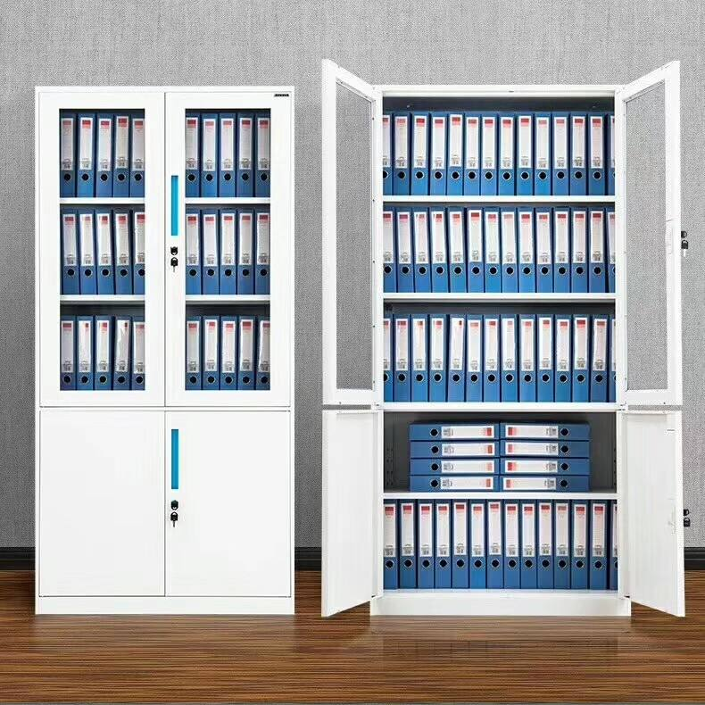

# SQL语言、基本单位

### SQL语言

##### SQL简介

SQL：是结构化查询语言（Structured Query Language）的缩写，**是一种专门用来与数据库通信的语言**。

SQL语言用于存储数据以及查询、更新和管理关系型数据库系统。

SQL由很少的词构成，目的是提供一种从数据库中读写数据的简单有效的方法。

**SQL也是数据库脚本文件的扩展名，例如 `test.sql` 文件。**

##### SQL特点

1. **SQL简单易学**。它的语句全都是由描述性很强的英语单词组成，而且这些单词的数目不多。
2. **SQL不是某个特定数据库供应商专有的语言**。几乎所有重要的DBMS都支持SQL，所以，**学习此语言使你几乎能与所有数据库打交道**。
3. SQL是一种强有力的语言，可以进行非常复杂和高级的数据库操作。
4. **事实上任意两个DBMS实现的SQL都不完全相同。虽多数语法也适用于其他DBMS，但不要认为这些SQL语法是完全可移植的。**

##### SQL语法

1. **命令输入在 `mysql>` 之后；**
2. **命令用 `;` 或 `\g` 结束，结束按Enter执行命令；若语句末尾没有 `;` 或 `\g`，按Enter只是换行。**
3. **输入 `help` 或 `\h` 获得帮助**，也可以输入文本获得特定命令的帮助（输入help select获得使用SELECT语句的帮助）； 
4. **输入 `quit` 或 `exit` 退出MySQL。**
5. **SQL语句不区分大小写，因此SELECT与select是相同的，写成Select也没有关系。**许多开发人员喜欢对SQL关键字使用大写，而对所有列和表名使用小写，这样做使代码更易于阅读和调试。
6. **处理SQL语句时，其中所有空格都被忽略。**SQL语句可以在一行上给出，也可以分成许多行。多数SQL开发人员认为将SQL语句分成多行更容易阅读和调试。
7. **SQL语句中的单行注释使用 `--空格` 或者 `# `，多行注释采用 `/*...*/`。**
8. **因为可能存在着字段名称和关键字重名的情况，所以SQL语句中有时候会使用着重号`，来区分当前是字段名称还是关键字，关键字不带着重号。**

##### SQL语言组成

SQL语言主要由五类语言组成：

数据定义语言(DDL)，例如：CREATE、DROP、ALTER等语句。

数据操作语言(DML)，例如：INSERT、UPDATE、DELETE等语句。

数据查询语言(DQL)，例如：SELECT等语句。

数据控制语言(DCL)，例如：GRANT、REVOKE等语句。

数据事务语言(DTL)，例如：BEGIN、COMMIT、ROLLBACK等语句

##### SQL的执行顺序

–第一步：执行FROM

–第二步：WHERE条件过滤

–第三步：GROUP BY分组

–第四步：执行SELECT投影列

–第五步：HAVING条件过滤

–第六步：执行ORDER BY 排序

### 基本单位

##### 数据库

数据库(database)：**保存有组织的数据的容器（通常是一个文件或一组文件）。**理解数据库的最简单的办法是将数据库想象为一个文件柜。

##### 数据表

往数据库存储数据过程，相当于将资料放入文件柜，**在文件柜中创建文件，然后将相关的资料放入文件中**，这种文件称为**表**。

表(table)：**某种特定类型数据的结构化清单。**理解表最好方法是将表想象为一个网格。

**一个数据库可以有多张表，每张表都有一个唯一的名字，用来标识自己。即表名具有唯一性。**

?> 同一数据库中没有具有相同名字的表，但不同的数据库中可以使用相同的表名。

?> 表中存储的数据应是一种类型的数据，不能将多个类型的数据存储在同一个数据库表中。否则以后的检索和访问很困难。

##### 数据字段

**字段：表中的每一列代表一个字段，所有表都是由一个或多个列组成的。**

| 字段1 | 字段2 | 字段3 |
| :---: | :---: | :---: |
|       |       |       |
|       |       |       |

**字段类型：每个字段都有相应的数据类型，它限制（或容许）该列中存储的数据。如果列的数据类型为数值类型，则该列的存储只能为数字。**

| 字段1（char） | 字段2（int） | 字段3（float） |
| :-----------: | :----------: | :------------: |
|  健康Healthy  |      04      |      50.6      |
|  财富10000￥  |     100      |     78.120     |

**字段约束：字段还可以设置约束条件，例如有的字段不能为空。**

##### 数据行

行(row)：**表中的一条记录**。

表中的数据是**按行存储**的，所有表都是由一个或多个行组成的。**理解列和行的关系最好将表想象为网格，网格中垂直的列为字段，水平行为表行。**

| 姓名 | 性别 | 年龄 |
| :--: | :--: | :--: |
| 小明 |  男  |  20  |
| 小红 |  女  |  18  |

##### 包含关系

数据库系统>>数据库>>数据表>>数据字段(“字段类型”，“字段约束”)>>数据行（从大到小，包含关系）

