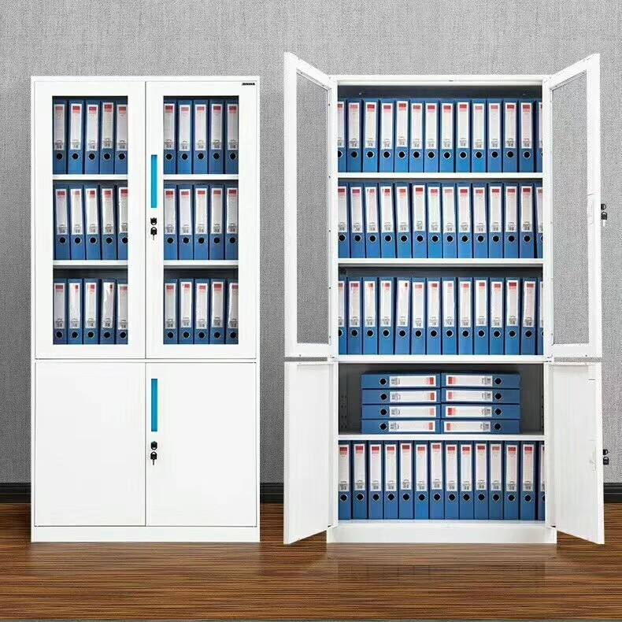

# 基本单位、主键、SQL

### 基本单位

**数据库系统>>数据库>>数据表>>数据字段(“数据类型”，“数据属性”)>>数据行（从大到小，包含关系）**

##### DBMS

DBMS：数据库软件（数据库管理系统）。

人们通常用数据库这个术语来代表他们使用的数据库软件，这是不正确的，因为你并不直接访问数据库；你使用的是DBMS，它替你访问数据库，**MySQL就是一种DBMS，即它是一种数据库软件**。

##### 数据库

理解数据库的最简单的办法是**将数据库想象为一个文件柜**。

数据库(database)：**保存有组织的数据的容器（通常是一个文件或一组文件）**。

##### 数据表

将资料放入文件柜时，**在文件柜中创建文件，然后将相关的资料放入文件中**，这种文件称为**表**。

理解表最好方法是**将数据库表想象为一个网格**。

|      |      |      |
| ---- | ---- | ---- |
|      |      |      |
|      |      |      |

表(table)：某种**特定类型数据**的**结构化清单**。

存储原则：**存储在表中的数据是一种类型的数据或一个清单**，**不能将多个不同的清单存储在同一个数据库表中**。否则以后的检索和访问很困难。应该创建两个表，每个清单一个表。

表名：**数据库中的每个表都有一个名字，用来标识自己。此名字是唯一的，同一数据库中没有具有相同名字的表**。

?> 不同的数据库中可以使用相同的表名。

##### 数据字段

**将数据表想象为一个网格，网格中每一列代表一个字段**。

列(column)：**表中的一个字段，所有表都是由一个或多个列组成的**。

| 字段1 | 字段2 | 字段3 |
| :---: | :---: | :---: |
|       |       |       |
|       |       |       |

##### 数据类型

**每个列都有相应的数据类型，如果列的数据类型为数值类型，则该列的存储只能为数字。**

数据类型(datatype)：**列中所容许的数据的类型，它限制（或容许）该列中存储的数据。**

| 字段1（char） | 字段2（int） | 字段3（float） |
| :-----------: | :----------: | :------------: |
|  健康Healthy  |      04      |      50.6      |
|  财富10000￥  |     100      |     78.120     |

数据类型说明：

|   类型   |   类型字符    |       字节        |                范围                 |
| :------: | :-----------: | :---------------: | :---------------------------------: |
|   整形   |    TINYINT    |       1字节       |              -128~127               |
|   整形   |   SMALLINT    |       2字节       |            -32768~32767             |
|   整形   |   MEDIUMINT   |       3字节       |          -8388608~8388607           |
|   整形   |      INT      |       4字节       |          +-2.14*10的9次方           |
|   整形   |    BIGINT     |       8字节       |          +-9.22*10的18次方          |
|  浮点型  |  FLOAT(m, d)  |       4字节       |      单精度，m总个数，d小数位       |
|  浮点型  | DOUBLE(m, d)  |       8字节       |      双精度，m总个数，d小数位       |
|  浮点型  | DECIMAL(m, d) |                   |     decimal是存储字符串的浮点数     |
|  字符型  |     CHAR      |     0-255字节     |             定长字符串              |
|  字符型  |    VARCHAR    |    0-65535字节    |             变长字符串              |
|  字符型  |   TINYBLOB    |     0-255字节     |    不超过255个字符的二进制字符串    |
|  字符型  |     BLOB      |    0-65535字节    |       二进制形式的长文本数据        |
|  字符型  |  MEDIUMBLOB   |  0-16777215字节   |    二进制形式的中等长度文本数据     |
|  字符型  |   LONGBLOB    | 0-4294967295字节  |      二进制形式的极大文本数据       |
|  字符型  |   TINYTEXT    |     0-255字节     |            短文本字符串             |
|  字符型  |     TEXT      |    0-65535字节    |             长文本数据              |
|  字符型  |  MEDIUMTEXT   |  0-16777215字节   |          中等长度文本数据           |
|  字符型  |   LONGTEXT    | 0-4294 967295字节 |            极大文本数据             |
|  字符型  | VARBINARY(M)  | 允许长度0-M个字节 | 不定长字节字符串，值的长度+1个字节  |
|  字符型  |   BINARY(M)   |         M         |  允许长度0-M个字节的定长字节字符串  |
| 时间类型 |     DATE      |       4字节       |       日期，格式：2014-09-18        |
| 时间类型 |     TIME      |       3字节       |        时间，格式：08:42:30         |
| 时间类型 |   DATETIME    |       8字节       | 日期时间，格式：2014-09-18 08:42:30 |
| 时间类型 |   TIMESTAMP   |       4字节       |       自动存储记录修改的时间        |
| 时间类型 |     YEAR      |       1字节       |            年份1901~2155            |
| 复合类型 |      SET      |     集合类型      |      set(“m1”, “m2″, … ,“m63″)      |
| 复合类型 |     ENUM      |     枚举类型      |    enum(“m1″, “m2″, … ,“m65535″)    |

补充说明：

DECIMAL叫做定点数，在MySQL内部本质上是用字符串存储的。实际使用过程中如果存在金额、钱精度要求比较高的浮点数存储，建议使用DECIMAL类型。

**CHAR类型用于定长字符串，并且必须在圆括号内用一个大小修饰符来定义。这个大小修饰符的范围从 0-255。比指定长度大的值将被截短，而比指定长度小的值将会用空格作填补。**

**VARCHAR把这个大小视为值的大小，长度不足的情况下不用空格补足，只使用存储字符串实际需要的长度，但长于指定的值仍然会被截短。**

**BLOB类型区分大小写，TEXT不区分大小写。**

BINARY声音文件等二进制数据类型。

**SET**：“位”是创建有序元素集合的一种简单而有效的方式。在 SET 元素中值被存储为一个分离的“位”序列，这些“位”表示与它相对应的元素。SET类型可以从预定义的集合中取得任意数量的值。**一个 SET 类型最多可以包含 64 项元素，并且它还去除了重复的元素，所以SET类型中不可能包含两个相同的元素。**任何试图在 SET 类型字段中插入非预定义的值都会使MySQL插入一个空字符串。如果插入一个即有合法的元素又有非法的元素的记录，MySQL 只会保留合法的元素，除去非法的元素。若需从 SET 类型字段中找出非法的记录只需查找包含空字符串或二进制值为 0 的行。

**ENUM**：在系统内部可以存储为数字，并且从1开始用数字做索引。ENUM 类型因为只允许在集合中取得一个值，类似于单选项，即相互排拆的数据，比如性别。**一个 ENUM 类型最多可以包含 65536 个元素，其中一个元素被 MySQL 保留，用来存储错误信息，这个错误值用索引 0 或者一个空字符串表示。**ENUM 类型字段可以从集合中取得一个值或使用null值，除此之外的输入将会使 MySQL 在这个字段中插入一个空字符串。MySQL 认为 ENUM 类型集合中出现的值是合法输入，除此之外其它任何输入都将失败。这说明通过搜索包含空字符串或对应数字索引为 0 的行就可以很容易地找到错误记录的位置。ENUM 类型字段插入值的大小写与集合中值的大小写不匹配，MySQL会自动使用插入值的大小写转换成与集合中大小写一致的值。

##### 数据属性

**UNSIGNED**(无符号)：**即没有负号，所有的数都为正数，主要用于整型和浮点类型，创建时在字段后接上UNSIGNED。无符号存储位数更长**，tinyint整型的取值区间为-128~127，而使用无符号后可存储0-255个长度。

**AUTO_INCREMENT**(自增)：**即自动增加，只用于整型**，可以设置起始值，默认为1，**常与PRIMARY KEY(主键)一起使用，建表时加上：`AUTO_INCREMENT=起始值 PRIMARY KEY`。**

**DEFAULT**(默认值)：**在没有值可用的时，赋予某个常量值**，这个值必须是常量，因为MySQL不允许插入函数或表达式值且无法用于BLOB或TEXT列。

**NULL**(空)：**列指定NULL属性时，该列可以为空，创建时在字段语句后接上：`NULL`**。null精确说法是“无”，而不是空字符串或0。

**NOT NULL**(不能为空)：**列指定NOT NULL属性时，该列不能为空，创建时在字段语句后接上：`NOT NULL`，**建议在重要情况下始终使用NOT NULL属性，因为它提供了一个基本验证，确保已经向查询传递了所有必要的值。

**ZEROFILL**(0填充)：**可以用来增补输出的值。使用这个修饰符可以阻止 MySQL 数据库存储负值。创建时在整型字段语句后接上：ZEROFILL**。

##### 数据行

**将表想象为网格，网格中垂直的列为表列，水平行为表行。**

行(row)：**表中的一个记录**。（表中的数据是**按行存储**的，所保存的**每个记录存储在自己的行内**）

| 姓名 | 性别 | 年龄 |
| :--: | :--: | :--: |
| 小明 |  男  |  20  |
| 小红 |  女  |  18  |

### 主键

##### 了解主键

| 姓名 | 性别 | 年龄 |
| :--: | :--: | :--: |
| 小白 |  男  |  20  |
| 小黑 |  男  |  20  |

如果姓名叫“小黑”的同学改名叫“小白”，那么表中就会有两条一模一样的数据，区别不了谁是谁，因此**表中的每一行都应该有一个唯一的标识**。

| id（主键） | 姓名 | 性别 | 年龄 |
| :--------: | :--: | :--: | :--: |
|    0001    | 小白 |  男  |  20  |
|    0002    | 小黑 |  男  |  20  |

在最左边新增加了一个**id字段**，我们定义它为**主键**。

通过id我们能知道id为0001的是“小白”，id为0002的是“小黑”，**即使“小黑”改名叫“小白”，但他的id没有改变，对比以前的数据，我们也就可以知道id为0002的“小白”原名叫“小黑”**。

这里我们可以得到：

1. **主键是一个字段、一列。**
2. **主键的值具有唯一性。**
3. **主键每个值标识每一行**

##### 主键的定义

主键(primary key)：**一列（或一组列），其值能够唯一区分表中每个行。**

**唯一标识表中每行的这个列（或这组列）称为主键。**

##### 主键使用规则

**表中的任何列都可以作为主键**，只要它满足以下条件：

1. **任意两行都不具有相同的主键值**；
2. **每个行都必须具有一个主键值（主键列不允许NULL值）**。

**主键通常定义在一列上，也可以使用多个列作为主键**，只要它满足以下条件：

1. **任意两行都不具有相同的主键值**；
2. **每个行都必须具有一个主键值（主键列不允许NULL值）**。
3. **单个列的值可以不唯一，但所有列值的组合必须是唯一的。**

##### 主键使用习惯

主键用来表示一个特定的行，使用时最好有以下习惯：

1. **在表中主键不是必需的，但有总比没有好。没有主键，更新或删除表中特定行很困难。**
2. 虽然并不总是都需要主键，但**应保证创建的每个表具有一个主键，以便于以后的数据操纵和管理**。
3. **不更新主键列中的值。**
4. **不要在主键列中用重要的值。**
5. **不要在主键列中使用可能会更改的值。**

### SQL

##### SQL简介

SQL：是结构化查询语言（Structured Query Language）的缩写，**是一种专门用来与数据库通信的语言**。

SQL语言用于存储数据以及查询、更新和管理关系型数据库系统。

SQL由很少的词构成，目的是提供一种从数据库中读写数据的简单有效的方法。

**SQL也是数据库脚本文件的扩展名，例如 `test.sql` 文件。**

##### SQL特点

1. **SQL简单易学**。它的语句全都是由描述性很强的英语单词组成，而且这些单词的数目不多。
2. **SQL不是某个特定数据库供应商专有的语言**。几乎所有重要的DBMS都支持SQL，所以，**学习此语言使你几乎能与所有数据库打交道**。
3. SQL是一种强有力的语言，可以进行非常复杂和高级的数据库操作。
4. **事实上任意两个DBMS实现的SQL都不完全相同。虽多数语法也适用于其他DBMS，但不要认为这些SQL语法是完全可移植的。**

##### SQL语法

1. **命令输入在 `mysql>` 之后；**
2. **命令用 `;` 或 `\g` 结束，结束按Enter执行命令；若语句末尾没有 `;` 或 `\g`，按Enter只是换行。**
3. **输入 `help` 或 `\h` 获得帮助**，也可以输入文本获得特定命令的帮助（输入help select获得使用SELECT语句的帮助）； 
4. **输入 `quit` 或 `exit` 退出MySQL。**
5. **SQL语句不区分大小写，因此SELECT与select是相同的，写成Select也没有关系。**许多开发人员喜欢对SQL关键字使用大写，而对所有列和表名使用小写，这样做使代码更易于阅读和调试。
6. **处理SQL语句时，其中所有空格都被忽略。**SQL语句可以在一行上给出，也可以分成许多行。多数SQL开发人员认为将SQL语句分成多行更容易阅读和调试。
7. **SQL语句中的单行注释使用 `--`，多行注释采用 `/*...*/`。**

##### SQL语言组成

SQL语言主要由五类语言组成：

**数据定义语言(DDL)**，例如：CREATE、DROP、ALTER等语句。

**数据操作语言(DML)**，例如：INSERT、UPDATE、DELETE。

**数据查询语言(DQL)**，例如：SELECT语句。

**数据控制语言(DCL)**，例如：GRANT、REVOKE。

**数据事务语言(DTL)**，例如：BEGIN、COMMIT、ROLLBACK等语句

##### SQL的执行顺序

–第一步：执行FROM

–第二步：WHERE条件过滤

–第三步：GROUP BY分组

–第四步：执行SELECT投影列

–第五步：HAVING条件过滤

–第六步：执行ORDER BY 排序

