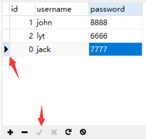

# Navicat图形化管理工具

前面所有MySQL的操作均在命令行中进行，使用命令行有一个特点就是不直观，导致上手就略微有点困难，增加了学习成本。这就是为什么人们讲电脑从命令行界面到图形界面是一次巨大的飞跃，**因为它降低了上手难度**。同样，MySQL也有图形管理工具，来降低上手难度，后面的操作基本全部在图形管理工具上进行。

**工具不在多，精通一个就行了，因为大部分工具是通用的，一通百通。**

Navicat是一套以直觉化的图形用户界面而建的数据库管理工具，能帮助简化数据库的管理、降低系统管理成本。让你可以以安全并且简单的方式创建、组织、访问并共用信息。同时也是目前开发者用的最多的一款mysql图形用户管理工具，界面简洁、功能也非常强大，简单易学，支持中文，提供免费版本。

下载地址：[Navicat官网](http://www.navicat.com.cn/)


##### 连接数据库

完成安装后，点击打开出现用户界面，点击”连接“，选择需要连接的数据库，这里我们安装MySQL，选择第一个MySQL。


选择”常规“，输入”连接名“和”密码“，端口和计算机保持默认即可。

连接名：本次连接的一个名字，可以随便命名。

密码：连接MySQL数据库的密码。


连接成功以后，出现一个名称为”本地“灰色连接。

”本地“就是上一步输入的连接名，灰色代表此连接未激活。


点击”本地“灰色连接，连接变为绿色，出现5个灰色的数据库，代表这些数据库未被打开。


##### 创建数据库

在Navicat当中创建数据库非常简单，只需要在左边侧栏右键选择新建数据库即可：


定义好"数据库名"，选择好"字符集"、"排序规则"点击确定。


操作后，**新的空的数据库**就建好了。


##### 删除数据库

在Navicat当中删除数据库也非常简单，只需要选中数据库，右键点击"删除数据库"即可：


点击"确定"即可成功将该数据库删除：


##### 查看全部表

随便选择一个数据库点击打开，选择”表“，就能看到该数据库里面所有的表了。


##### 详细表操作

选中一张表，右键或者工具栏有常用的功能按钮：

```
打开表：打开表查看当中的内容。
设计表：查看表的字段结构。
新建表：重新建立一张新的数据表。
删除表：将表的全部信息进行删除，包括表本身。
清空表：清空表中的逻辑数据，不清除物理数据，如主键值、索引等，还是原来的值。
截断表：删除表中的所有数据，如果有自动主键的话，会恢复成默认值。
复制表：对选中表进行复制，包括表结构和表中的数据，复制后生成一张"原表名_copy"的新表。
导入向导：可以从Navicat外部导入数据文件，例如sql文件、csv文件等。
导出向导：可以将表中的数据以不同类型的文件导出到外部，例如xls文件、xlsx文件、txt文件等。
转储SQL文件(结构和数据)：将表中结构和数据导出为SQL文件。
转储SQL文件(仅结构)：仅将表中的结构导出为SQL文件，不包含数据。
```


##### 查看表结构

选择一张数据表点击右键，再点击”设计表“即可。


##### 操作表字段

在表结构中，点击右键，通过列表可以自由的对字段进行操作，当操作完成后需要点击”保存“，才能让操作生效。

```
添加栏位：在最下方添加一个新的栏位，即在表的最后面添加一个新字段。
插入栏位：在当前栏位的上方插入一个栏位，即在表的当前字段前面插入一个字段。
复制栏位：将当前栏位复制当前位置的下方，包括字段名称、类型、约束都复制。
上移：将当前栏位上移一个位置，即在表中字段往前移一个位置。
下移：将当前栏位下移一个位置，即在表中字段往前后一个位置。
```


##### 查看表内容

选择一张数据表点击双击打开即可看到里面的内容了。

切换到刚才窗口，点击”对象“即可。

关闭表，点击“×”即可。


##### 增加表内容

增加表内容，可以直接点击下方的”+“按钮，就会出现一条空白的记录，而且最前方有”*“号表示该记录暂未保存。


输入好内容后，点击“√ ”按钮，对记录进行保存。


保存后，前面出现三角符号，“√ ”按钮也变为灰色。



!> 在查看表结构中，发现该张表中三个字段的约束条件都是”不是null“，即不能为空，这就意味着新增的记录三个字段都必须有值，否则不能保存。

##### 修改表内容

修改表内容，可以直接选择一条记录中的一个字段，输入新内容，最后点击“√ ”按钮保存修改内容即可。


##### 删除表内容

删除表内容，先选中需要删除的一条或多条记录，点击”-“按钮，即可删除记录。


删除记录**不需要**点击“√ ”按钮保存，只需确认一下即可。


##### 执行SQL语句

选中数据库，点击”查询“，再点击”新建查询“：


出现”查询编辑器“，即可在空白位置编辑SQL语句：


输入SQL语句，**点击”运行“按钮运行全部的SQL语句**或者**选中右键运行选中的SQL语句**：


在下方就会出现运行的结果：

