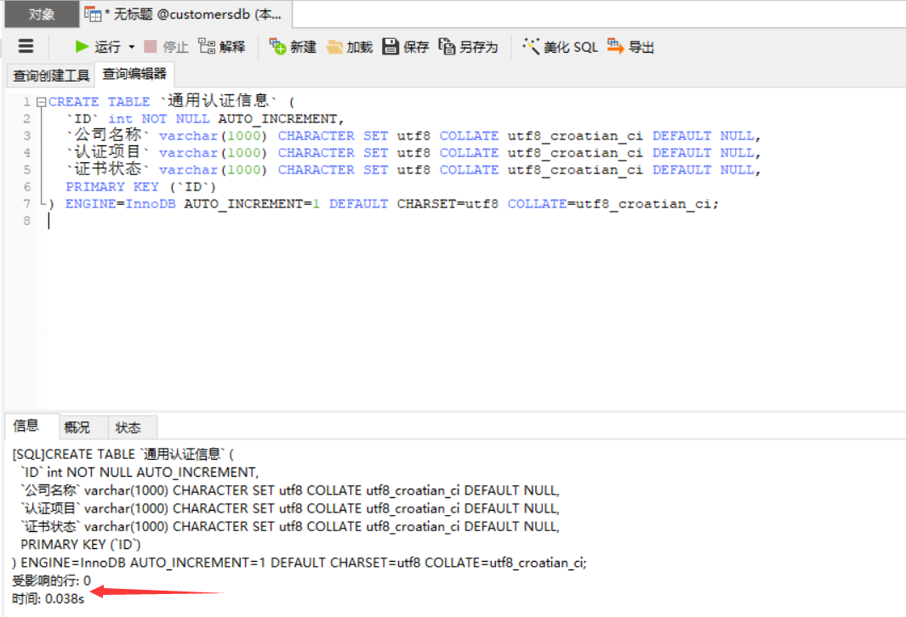
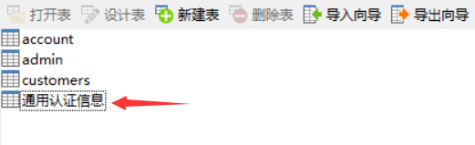
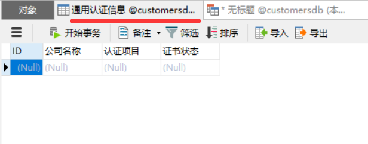
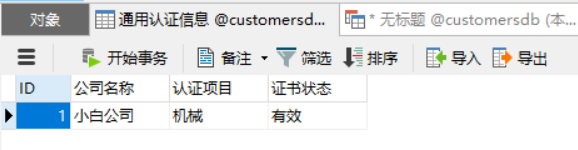
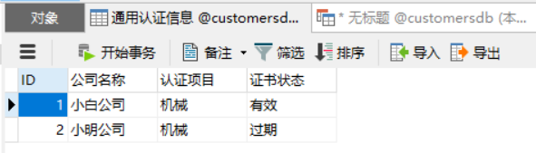
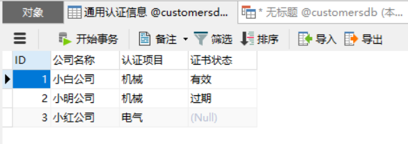

# 主键、创建表、插入数据

### 主键

##### 了解主键

例如下面的一张数据表，表中有两条一模一样的数据：

| 姓名 | 性别 | 年龄 |
| :--: | :--: | :--: |
| 小白 |  男  |  20  |
| 小白 |  男  |  20  |

假如我们想筛选出第二个“小白”的信息，但是每个字段的数据都是一样的，是没办法筛选出来的。假如，增加一个**id字段**给表中的每一行都赋上唯一的标识：

| id（主键） | 姓名 | 性别 | 年龄 |
| :--------: | :--: | :--: | :--: |
|    0001    | 小白 |  男  |  20  |
|    0002    | 小白 |  男  |  20  |

这样我们就可以通过**id等于0002**这个条件，将第二个小白的数据筛选出来。这时我们可以称**“id字段”为主键**，即**唯一标识表中每行的这个列（或这组列）称为主键。**

##### 主键的定义

主键(primary key)：**一列（或一组列），其值能够唯一区分表中每个行。**

1. **主键是一个字段、一列。**
2. **主键的值具有唯一性。**
3. **主键每个值标识每一行**

##### 主键使用规则

**表中的任何列都可以作为主键**，只要它满足以下条件：

1. **任意两行都不具有相同的主键值**；
2. **每个行都必须具有一个主键值（主键列不允许NULL值）**。
3. **主键有且只有一个，最多也只能有一个。**

**主键通常定义在一列上，也可以使用多个列作为主键（即联合主键，还是一个主键）**，只要它满足以下条件：

1. **任意两行都不具有相同的主键值**；
2. **每个行都必须具有一个主键值（主键列不允许NULL值）**。
3. **单个列的值可以不唯一，但所有列值的组合必须是唯一的。**

##### 主键使用习惯

主键用来表示一个特定的行，使用时最好有以下习惯：

1. **在表中主键不是必需的，但有总比没有好。没有主键，更新或删除表中特定行很困难。**
2. 虽然并不总是都需要主键，但**应保证创建的每个表具有一个主键，以便于以后的数据操纵和管理**。
3. **不更新主键列中的值。**
4. **不要在主键列中用重要的值。**
5. **不要在主键列中使用可能会更改的值。**

### 创建表

SQL中利用 `CREATE TABLE` 创建表，必须给出下列信息：

1. 新表的名字，在关键字 `CREATE TABLE` 之后给出；
2. 表列的名字和定义，用逗号分隔。

```sql
CREATE TABLE `通用认证信息` (
  `ID` int NOT NULL AUTO_INCREMENT,
  `公司名称` varchar(1000) CHARACTER SET utf8 COLLATE utf8_croatian_ci DEFAULT NULL,
  `认证项目` varchar(1000) CHARACTER SET utf8 COLLATE utf8_croatian_ci DEFAULT NULL,
  `证书状态` varchar(1000) CHARACTER SET utf8 COLLATE utf8_croatian_ci DEFAULT NULL,
  PRIMARY KEY (`ID`)
) ENGINE=InnoDB AUTO_INCREMENT=1 DEFAULT CHARSET=utf8 COLLATE=utf8_croatian_ci;
/*
CREATE TABLE：创建表；
`通用认证信息`：表名；
`ID`：第一个字段；
int：数值类型；
NOT NULL：不能为空；
AUTO_INCREMENT：自增属性；
`公司名称`：第二个字段；
`认证项目`：第三个字段；
`证书状态`：第四个字段；
DEFAULT NULL：默认NULL，允许空值；
PRIMARY KEY (`ID`)：ID字段为主键；
ENGINE=InnoDB：当前MySQL引擎为InnoDB
AUTO_INCREMENT=1：自增数从1开始自增
CHARACTER SET utf8等同DEFAULT CHARSET=utf8：字符编码为utf8；
COLLATE utf8_croatian_ci等同COLLATE=utf8_croatian_ci：依据utf8_croatian_ci进行排序和比较；
*/
```

运行SQL建表语句：



在数据库就会新出现一张只有结构没有数据且名称为“通用认证信息”的空表：





### 插入数据

把数据插入表中的最简单的方法是使用基本的 `INSERT INTO` 语法。

##### 完整插入

插入完整的行：**存储到每个表列中的数据在VALUES子句中给出，对每个列必须提供一个值。如果某个列没有值，应该使用NULL值，但前提是该列指定空值。**

```sql
-- 不指定字段，则按照value值的顺序给字段赋值
INSERT INTO `通用认证信息`
VALUES
	(
		'1',
		'小白公司',
		'机械',
		'有效'
	);
```



```sql
-- 改变字段插入顺序，完整插入需要指定全部字段，value值的顺序就要和指定字段的顺序一样
INSERT INTO `通用认证信息` (
	`公司名称`,
	`ID`,
	`认证项目`,
	`证书状态`
)
VALUES
	(
		'小明公司',
		'2',
		'机械',
		'过期'
	);
```



##### 不完整插入

插入不完整的行：**前提在表中存在列指定空值的情况下，VALUES子句中只对部分列必须提供一个值。**

```sql
-- 不完整插入的前提是，没有提供值的列允许空值
-- 这里表中的'证书状态'字段允许为空值，可以不提供值
INSERT INTO `通用认证信息` (
	`公司名称`,
	`ID`,
	`认证项目`
)
VALUES
	(
		'小红公司',
		'3',
		'电气'
	);
```

