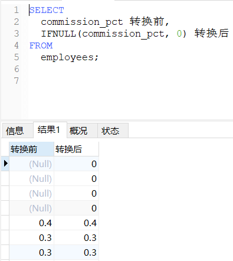

# DQL语言：基础查询

DQL语言：即数据查询语言，主要作用是查询检索数据库中的数据的SQL语言。

### 语法特点

```sql
/*
语法：
SELECT 查询列表 FROM 表名;

特点：
1.查询列表可以是：表中的字段、常量值、表达式、函数。
2.查询的结果是一个虚拟的表格，不是真实存在的。
*/
```

### 字段查询

##### 查询单个字段

检索表中的单个列：`SELECT 字段名称 FROM 表名;`

!> 注意：**查询时，要在表所在的数据库中查询。如果查询的表在其他数据库，需要先指定数据库 `USE 数据库名;`**

```sql
-- 因为Navicat默认指定了表所在的数据库，就不用再次指定数据库了
SELECT last_name FROM employees;
```


##### 查询多个字段

检索表中的多个列：`SELECT 字段名称, 字段名称... FROM 表名;`

!> 注意：**查询时，要在表所在的数据库中查询。如果查询的表在其他数据库，需要先指定数据库 `USE 数据库名;`**

```sql
-- 因为Navicat默认指定了表所在的数据库，就不用再次指定数据库了
SELECT
	last_name,
	salary,
	email
FROM
	employees;
```


##### 查询所有字段

检索表中的所有列：`SELECT * FROM 表名`

?> `*` 表示通配符，匹配所有列。

```sql
SELECT
	*
FROM
	employees;
```


### 其他查询

##### 查询常量值

SQL语句可以查询常量值，只不过查询结果的字段名称和字段内容都是查询值。

```sql
SELECT
	100;
```


```sql
SELECT
	'john';
```


##### 查询表达式

SQL语句还可以执行加减乘除的表达式，字段名称就是查询名称，内容就是计算结果。

```sql
SELECT
	100*98;
```


!> 在SQL语言中"+"号仅仅只有一个功能：运算符。

```sql
-- 两个操作数都为数值型，则做加法运算（下方结果为：190）
SELECT
	100 + 90; 
-- 一方操作数是纯数字字符型，转换成数值型，做加法运算（下方结果为：213）
SELECT
	'123' + 90; 
-- 一方操作数不是纯数字字符型，转换成数值型的0，做加法运算（下方结果为：90）
SELECT
	'john' + 90; 
-- 只要一方操作数为NULL，则结果肯定为NULL（下方结果为：NULL）
SELECT
	NULL + 90; 
```

##### 查询函数

```sql
-- 查询当前数据库版本
SELECT
	VERSION();
```


### 起别名

上面的查询有一个不方便的地方，就是查询结果的字段名称不直观，这里就可以使用“起别名”功能：

1. 方便理解查询字段的意思
2. 查询的字段有重名的情况，使用别名可以区分开来

##### as关键字

`as`关键字：将一个字段或值的名称替换成另一个名称。

```sql
SELECT
	100 * 98 AS 结果;
```


##### 空格替代

**`as`关键字是可以用空格代替的。**

```sql
SELECT
	100 * 98 结果;
```


**需要注意的是，如果更名后的名称中本身带有空格，需要加上单引号或双引号。**

```sql
SELECT
	salary "out put"
FROM
	employees;
```


### 内容处理

##### DISTINCT去重

去重检索表中的单个列：`SELECT DISTINCT 字段名称 FROM 表名;`

```sql
-- 查询员工表中涉及到的所有的部门编号
SELECT DISTINCT
	department_id
FROM
	employees;
```


##### CONCAT函数

`CONCAT()` 函数：**常用函数，作用是将多个值联结到一起构成单个值。**

```sql
-- 查询员工名和姓连接成一个字段
SELECT
	CONCAT(last_name, first_name)
FROM
	employees;
```


中间还可以增加字符，按照一定的格式输出，顺便起别名：

```sql
SELECT
	CONCAT(
		last_name,
		'[',
		first_name,
		']'
	) 姓名
FROM
	employees;
```


##### IFUNLL函数

`IFUNLL(字段, 默认值)`函数：**常用函数，作用是判断值是否为NULL，为NULL返回默认值。**

```sql
-- 把奖金率为NULL的值转换为数值０
SELECT
	commission_pct 转换前,
	IFNULL(commission_pct, 0) 转换后
FROM
	employees;
```


