# DQL语言：条件查询

### 语法特点

```sql
/*
语法：
SELECT
	查询列表
FROM
	表名
WHERE
	筛选条件;

筛选条件分类：
一、按条件表达式筛选
简单条件运算符：> < = != <> >= <=
二、按逻辑表达式筛选
逻辑运算符：&& || ! and or not
三、模糊查询
关键字：LIKE、BETWEEN AND、IN、IS NULL、IS NOT NULL
*/
```

### 条件表达式筛选

数据库表一般包含大量的数据，很少需要检索表中所有行。通常只需要提取表数据的子集，检索所需数据需要指定搜索条件（search criteria），搜索条件也称为过滤条件（filter condition）。

##### 条件表达式含义

|    操作符    |   说明   |
| :----------: | :------: |
|     `=`      |   等于   |
| `<>` 或 `!=` |  不等于  |
|     `<`      |   小于   |
|     `<=`     | 小于等于 |
|     `>`      |   大于   |
|     `>=`     | 大于等于 |

##### 使用条件表达式

使用条件表达式筛选时，若字段类型为int时，比较值不加引号 `''`；若字段类型为str时，比较值要加引号 `''`；

```sql
-- 查询工资大于12000的员工信息
SELECT
	*
FROM
	employees
WHERE
	salary > 12000;
```

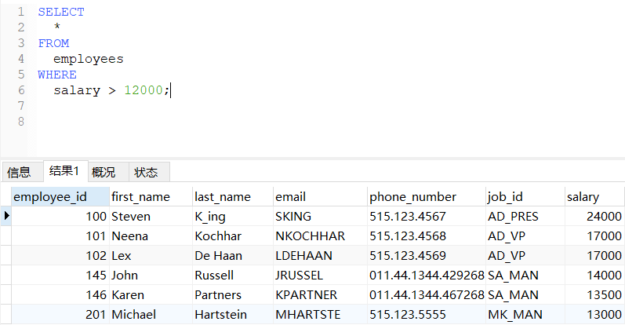

在SQL语句中不等于有两种写法：`<>` 、`!=`，他们的作用都是一样的。

```sql
-- 查询部门编号不等于90号的员工名和部门编号
SELECT
	last_name,
	department_id
FROM
	employees
WHERE
	department_id <> 90;
```

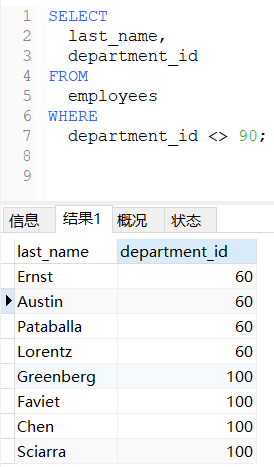

### 逻辑表达式筛选

##### 逻辑表达式含义

```
&&或and：两个条件都为true，结果为true，反之为false
||或or：只要有一个条件为true，结果为true，反之为false
!或not：如果连接的条件本身为false，结果为true，反之为false
```

##### 使用逻辑表达式

使用逻辑表达式筛选时，每添加一条件语句就要增加使用一个逻辑表达式。

```sql
-- 查询工资在10000到20000之间的员工名、工资以及奖金
SELECT
	last_name,
	salary,
	commission_pct
FROM
	employees
WHERE
	salary >= 10000
AND 
	salary <= 20000;
```

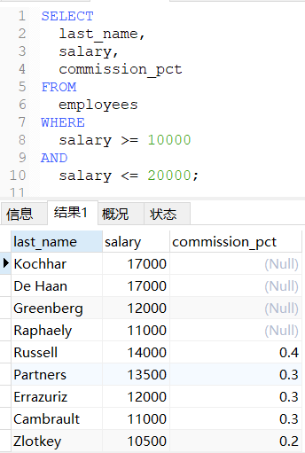

**在SQL语句中 `AND` 的执行次序要高于 `OR` 。**

**在条件句外侧加`()`，可以提高执行次序。**

```sql
-- 查询部门编号不在90到110之间或者工资高于15000的员工信息
-- 写法一
SELECT
	*
FROM
	employees
WHERE
	department_id < 90
OR 
	department_id > 110
OR 
	salary > 15000;

-- 写法二
SELECT
	*
FROM
	employees
WHERE
NOT(
	department_id >= 90
AND
	department_id <= 110
)
OR 
	salary > 15000;
```

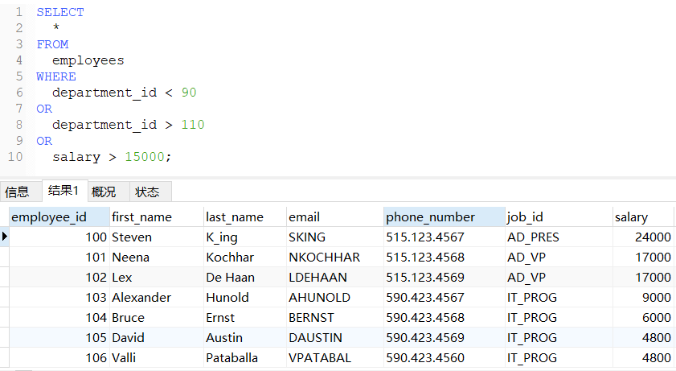

### 模糊查询

前面介绍的所有操作符都是针对已知值进行过滤的。但是，这种过滤方法并不是任何时候都好用。例如，怎样搜索字符串中包含'jet'的所有字符串？用简单的比较操作符肯定不行，必须使用通配符。

##### 模糊查询组成

`LIKE`：**模糊查询关键字，后面跟搜索条件。**

通配符(wildcard)：**结合 `LIKE` 操作符来匹配值的一部分的特殊字符**。

搜索模式(search pattern)：**由字面值、通配符或两者组合构成的搜索条件。**

##### 百分号`%`通配符

百分号`%`：**匹配出现任意次数的任意字符（包含0个字符，但NULL除外）。**

```sql
-- 检索任意以jet起头的字符串，不管后面是什么字符和有多少字符
SELECT * FROM 表名 WHERE 字段名 LIKE 'jet%';

-- 检索任意位置包含jet的字符串，而不论它之前或之后出现什么字符。
SELECT * FROM 表名 WHERE 字段名 LIKE '%jet%';

-- 检索以j起头，以t结尾的字符串，而不论中间出现什么字符。
SELECT * FROM 表名 WHERE 字段名 LIKE 'j%t';
```

!> 字符串尾空格可能会干扰通配符匹配，检索时最好在最后附加一个百分号(%)。

##### 下划线`_`通配符

下划线`_`：**匹配出现任意的单个字符。**

```sql
-- 检索任意以jet起头，长度为4的所有行
SELECT * FROM 表名 WHERE 字段名 LIKE 'jet_';

-- 检索任意以jet结尾，长度为4的所有行
SELECT * FROM 表名 WHERE 字段名 LIKE '_jet';

-- 检索第一个、最后一个字符为任意字符，中间字符为jet，长度为5的所有行
SELECT * FROM 表名 WHERE 字段名 LIKE '_jet_';
```

!> 下划线 `_` 必须要匹配到一个字符，不能多也不能少。

##### 反斜杠`\`转义符

反斜杠`\`：将带有特殊功能的字符转义为普通字符。

```sql
-- 检索字段名中第二个字符为_，第五个字符为%，长度为5的所有信息
SELECT * FROM 表名 WHERE 字段名 LIKE '_\___\%';

-- 自定义转义字符（将$定义为转义字符）
SELECT * FROM 表名 WHERE 字段名 LIKE '_$___$%' ESCAPE '$';
```

##### `BETWEEN AND`

`BETWEEN` 的后面跟2个临界值，临界值之间必须用 `AND` 符连接。

1. 使用 `BETWEEN AND` 可以提高语句简介度。
2. 筛选结果包含两边的临界值。
3. 两个临界值不要调换顺序。

```sql
-- 查询员工编号在100到120之间的员工信息
SELECT
	*
FROM
	employees
WHERE
	employee_id BETWEEN 100 AND 120;
```

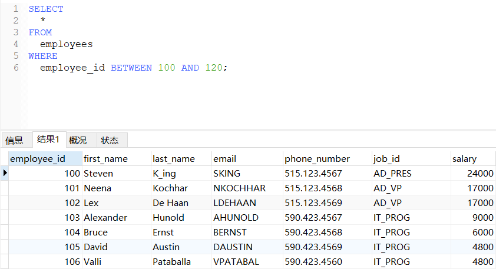

##### `NOT BETWEEN AND`

```sql
-- 查询员工编号不在100到120之间的员工信息
SELECT
	*
FROM
	employees
WHERE
	employee_id NOT BETWEEN 100 AND 120;
```

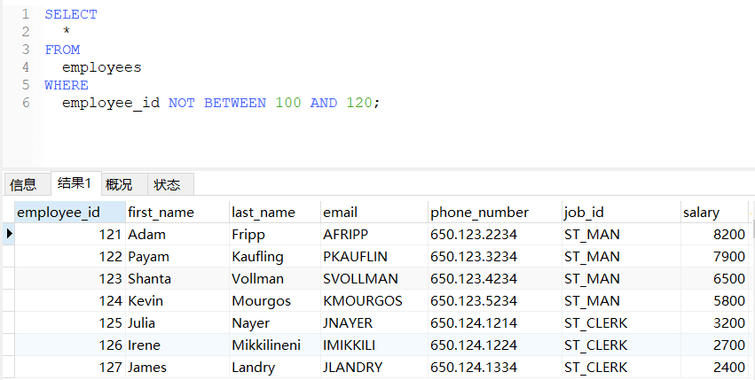

##### `IN`

`IN` 判断某字段的值是否属于 `IN` 列表中的某一项。

1. 使用 `IN` 提高语句的简洁度
2. `IN` 列表的值类型必须一致或者兼容

```sql
-- 查询员工的工种编号是IT_PROG、AD_VP、AD_PRES中的一个员工名和工种编号
SELECT
	last_name,
	job_id
FROM
	employees
WHERE
	job_id IN ('IT_PROG', 'AD_VP', 'AD_PRES');
```

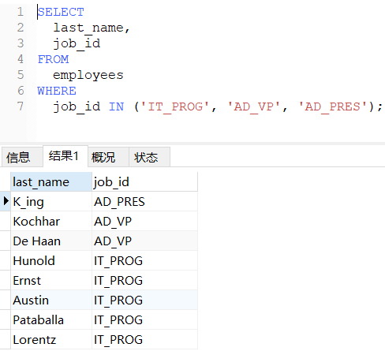

##### `NOT IN`

`NOT IN` 判断某字段的值是否不属于 `IN` 列表中的某一项。

```sql
-- 查询员工的工种编号不是IT_PROG、AD_VP、AD_PRES中的一个员工名和工种编号
SELECT
	last_name,
	job_id
FROM
	employees
WHERE
	job_id NOT IN ('IT_PROG', 'AD_VP', 'AD_PRES');
```

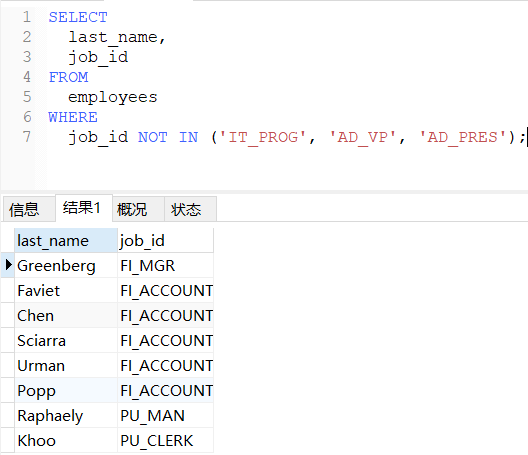

##### `IS NULL`

`IS NULL` 判断值是否为NULL值。

!> 注意：`IS` 不能用于判断普通的数值，`=` 不能用于判断NULL值。

```sql
-- 查询没有奖金的员工名和奖金率
SELECT
	last_name,
	commission_pct
FROM
	employees
WHERE
	commission_pct IS NULL;
```

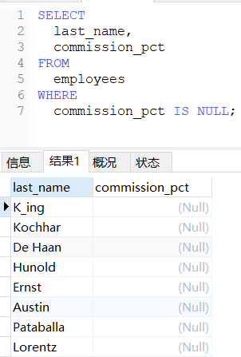

##### `IS NOT NULL`

`IS NOT NULL` 判断值是否不为NULL值。

!> 注意：`IS NOT` 不能用于判断普通的数值，`<>` 不能用于判断NULL值。

```sql
-- 查询有奖金的员工名和奖金率
SELECT
	last_name,
	commission_pct
FROM
	employees
WHERE
	commission_pct IS NOT NULL;
```

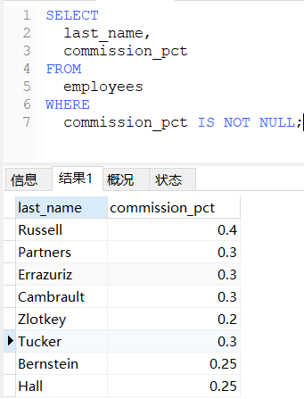

##### 安全等于`<=>`

安全等于`<=>`：既可以判断NULL值，也可以判断普通的数值。

```sql
-- 查询奖金率为NULL或者奖金率为0.4的员工名和奖金率
SELECT
	last_name,
	commission_pct
FROM
	employees
WHERE
	commission_pct <=> NULL 
OR 
	commission_pct <=> 0.4;
```

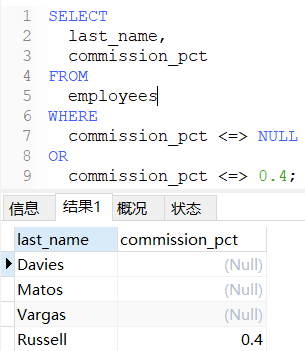

### 正则表达式

> 所有种类的程序设计语言、文本编辑器、操作系统等都支持正则表达式。

用匹配、比较和通配操作符寻找数据，对于基本的过滤，基本就足够了。但随着过滤条件的复杂性的增加，`WHERE` 子句本身的复杂性也增加。这也就是正则表达式变得有用的地方。

`REGEXP`：**正则表达式关键字，后面跟正则表达式。**

!> `LIKE`和`REGEXP`的不同在于，`LIKE`匹配整个串而`REGEXP`匹配子串。

##### 基本字符匹配

```sql
-- 检索字段中包含jet的所有行
SELECT * FROM 表名 WHERE 字段名 REGEXP 'jet';

-- 检索任意以jet起头，长度为4的所有行
SELECT * FROM 表名 WHERE 字段名 REGEXP 'jet.';
```

!> `LIKE 'jet'` 匹配列值中等于 `jet` 所有行，`REGEXP 'jet'` 匹配列值中包含 `jet` 的所有行。

?> MySQL中的正则表达式匹配（自版本3.23.4后）不区分大小写）。需要区分大小写，可使用 `BINARY` 关键字，如 `WHERE 字段名 REGEXP BINARY '正则表达式'`。

##### 或`|`匹配

或`|`：**使用一个或者另一个正则表达式去匹配字符串。**

```sql
-- 检索字段中包含jet或cat或cat的所有行
SELECT * FROM 表名 WHERE 字段名 REGEXP 'jet|cat|hat';
```

##### 单`[]`匹配

单`[]`：**匹配出现在 `[]` 中的任意单个字符。**

```sql
-- 检索字段中包含hao1或hao2或hao3的所有行
SELECT * FROM 表名 WHERE 字段名 REGEXP 'hao[123]';
```

**结合 `|` 匹配，还可以匹配字符串**：

```sql
-- 检索字段中包含hao1或hao23的所有行
SELECT * FROM 表名 WHERE 字段名 REGEXP 'hao[1|23]';
```

**结合 `^` 匹配，还可以匹配不在 `[]` 中的任意单个字符：**

```sql
-- 检索字段中包含hao但除开hao1或hao2或hao3外的所有行
SELECT * FROM 表名 WHERE 字段名 REGEXP 'hao[^123]';
```

**在 `[]` 内匹配范围，简化集合，可使用 `-` 来定义一个范围：**

```
匹配任意数字字符：[0-9]，即[0123456789]
匹配任意字母字符：[a-z]
```

##### 多实例匹配

目前为止使用的所有正则表达式都试图匹配单次出现，如果需要对匹配的数目进行更强的控制，就需要使用重复元字符来进行匹配了。

| 元字符 |             说明             |
| :----: | :--------------------------: |
|   *    |        0个或多个匹配         |
|   +    |  1个或多个匹配（等于{1,}）   |
|   ?    |  0个或1个匹配（等于{0,1}）   |
|  {n}   |        指定数目的匹配        |
|  {n,}  |     不少于指定数目的匹配     |
| {n,m}  | 匹配数目的范围（m不超过255） |

##### 特殊`\\`匹配

正则表达式由具有特定含义的特殊字符构成，例如`.、[]、 |和-`等，如果需要匹配这些字符，就需要在前面加上特殊引导符`\\`。

```sql
-- 检索字段中包含.的所有行
SELECT * FROM 表名 WHERE 字段名 REGEXP '\\.';

-- 检索字段中包含-的所有行
SELECT * FROM 表名 WHERE 字段名 REGEXP '\\-';

-- 检索字段中包含\的所有行
SELECT * FROM 表名 WHERE 字段名 REGEXP '\\\';
```

`\\`也用来引用元字符：

| 元字符 |   说明   |
| :----: | :------: |
|  \\\f  |   换页   |
|  \\\n  |   换行   |
|  \\\r  |   回车   |
|  \\\t  |   制表   |
|  \\\v  | 纵向制表 |

##### 字符类匹配

字符类(character class)：预定义的字符集，可以更方便找出你自己经常使用的数字、所有字母字符或所有数字字母字符等的匹配。

|     类     |                       说明                        |
| :--------: | :-----------------------------------------------: |
| [:alnum:]  |          任意字母和数字（同[a-zA-Z0-9]）          |
| [:alpha:]  |              任意字符（同[a-zA-Z]）               |
| [:blank:]  |               空格和制表（同[\\t]）               |
| [:cntrl:]  |         ASCII控制字符（ASCII 0到31和127）         |
| [:digit:]  |                任意数字（同[0-9]）                |
| [:graph:]  |           与[:print:]相同，但不包括空格           |
| [:lower:]  |              任意小写字母（同[a-z]）              |
| [:print:]  |                  任意可打印字符                   |
| [:punct:]  |    既不在[:alnum:]又不在[:cntrl:]中的任意字符     |
| [:space:]  | 包括空格在内的任意空白字符（同[\\f\\n\\r\\t\\v]） |
| [:upper:]  |              任意大写字母（同[A-Z]）              |
| [:xdigit:] |         任意十六进制数字（同[a-fA-F0-9]）         |

```sql
-- 匹配含有连在一起的4位数字的所有行
SELECT * FROM 表名 WHERE 字段名 REGEXP '[[:digit:]]{4}';
```

##### 定位符

定位符：匹配特定位置的文本。

| 元 字 符 |   说 明    |
| :------: | :--------: |
|    ^     | 文本的开始 |
|    $     | 文本的结尾 |
| [[:<:]]  |  词的开始  |
| [[:>:]]  |  词的结尾  |

```sql
-- 匹配以任意数字或者.开头的文本的所有行
SELECT * FROM 表名 WHERE 字段名 REGEXP '^[0-9\\.]';
```

!> **^**有双重用途：在集合中（用[和]定义），用它来否定该集合，否则，用来指串的开始处。

