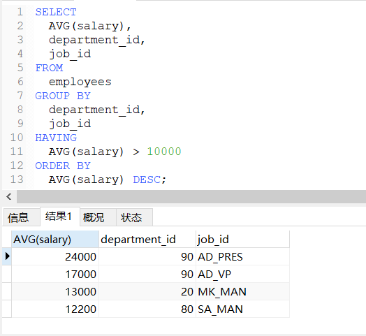

# DQL语言：分组排序

### 分组查询

分组查询：分组允许把数据分为多个逻辑组，以便能对每个组进行聚集计算。

**分组是在SELECT语句的GROUP BY子句中建立的。**

```sql
/*
语法：
    SELECT 分组函数,列（要求出现在GROUP BY的后面）
    FROM 表
    【WHERE 筛选条件】
     GROUP BY 分组的列表
    【HAVING 分组后的筛选】
注意：
    查询列表必须是分组函数和GROUP BY后出现的字段
特点：
    1、分组查询中的筛选条件分为两类
               数据源        　位置       　　　关键字
    分组前筛选  原始表        　GROUP　BY前面　　WHERE
    分组后筛选  分组后的结果集 　GROUP　BY后面    HAVING
    2、分组函数做条件是放在HAVING子句中的。
    3、能用分组前筛选的，优先考虑分组前筛选。
    4、GROUP BY子句支持单个字段分组，多个字段分组（多个字段之间用逗号隔开没有顺序要求），表达式或函数（用的较少）
    5、也可以添加排序（排序放在整个分组查询的最后）
    6、GROUP BY子句中列出的每个列都必须是检索列或有效的表达式（但不能是聚集函数）。
    7、除聚集计算语句外，SELECT语句中的每个列都必须在GROUP BY子句中给出。
    8、在SELECT中使用表达式，则必须在GROUP BY子句中指定相同的表达式，并且不能使用别名。
    9、GROUP BY子句必须出现在WHERE子句之后，ORDER BY子句之前。
    10、如果分组列中具有NULL值，则NULL将作为一个分组返回。如果列中有多行NULL值，它们将分为一组。
*/
```

##### 简单分组查询

```sql
-- 查询每个工种的最高工资
SELECT
	MAX(salary),
	job_id
FROM
	employees
GROUP BY
	job_id;
```


```sql
-- 查询每个位置上的部门个数
SELECT
	COUNT(*),
	location_id
FROM
	departments
GROUP BY
	location_id;
```


##### 简单筛选条件

```sql
-- 查询邮箱中包含a字符的，每个部门的平均工资
SELECT
	AVG(salary),
	department_id
FROM
	employees
WHERE
	email REGEXP 'a'
GROUP BY
	department_id;
```


```sql
-- 查询有奖金的每个领导手下员工的最高工资
SELECT
	MAX(salary),
	manager_id
FROM
	employees
WHERE
	commission_pct IS NOT NULL
GROUP BY
	manager_id;
```


##### 分组后查询

MySQL提供了 `HAVING` 子句。`HAVING` 非常类似于 `WHERE`。**唯一的差别是 `WHERE` 过滤行，而 `HAVING` 过滤分组。**

?> `HAVING` 支持所有 `WHERE` 操作符，所学过的有关 `WHERE` 的所有这些技术和选项都适用于 `HAVING` 。它们的句法是相同的，只是关键字有差别。

```sql
-- 查询员工个数大于2的部门
SELECT
	COUNT(*),
	department_id
FROM
	employees
GROUP BY
	department_id
HAVING
	COUNT(*) > 2;
```


```sql
-- 查询每个工种有奖金的员工的最高工资大于12000的工种编号和最高工资
SELECT
	MAX(salary),
	job_id
FROM
	employees
WHERE
	commission_pct IS NOT NULL
GROUP BY
	job_id
HAVING
	MAX(salary) > 12000;
```


```sql
-- 查询领导编号大于102的领导手下的最低工资大于5000的领导编号和最低工资
SELECT
	MIN(salary),
	manager_id
FROM
	employees
WHERE
	manager_id > 102
GROUP BY
	manager_id
HAVING
	MIN(salary) > 5000;
```


##### 表达式函数

```sql
-- 按员工姓名长度分组，查询每组员工个数，筛选处员工个数大于5的
SELECT
	COUNT(*),
	LENGTH(last_name)
FROM
	employees
GROUP BY
	LENGTH(last_name)
HAVING
	COUNT(*) > 5;
```


##### 多字段分组

```sql
-- 查询每个部门每个工种的员工的平均工资
SELECT
	AVG(salary),
	department_id,
	job_id
FROM
	employees
GROUP BY
	department_id,
	job_id;
```


##### 添加排序

```sql
-- 查询每个部门每个工种的员工的平均工资大于10000，并按平均工资的高低显示
SELECT
	AVG(salary),
	department_id,
	job_id
FROM
	employees
GROUP BY
	department_id,
	job_id
HAVING
	AVG(salary) > 10000
ORDER BY
	AVG(salary) DESC;
```



### 排序查询

##### 语法特点

```sql
/*
语法：
	SELECT 查询列表
	FROM 表
	【WHERE 筛选条件】
	【GROUP BY 分组的列表】
	ORDER BY 排序列表 【ASC|DESC】
特点：
	1.ASC代表升序，DESC代表降序。如果都不写，默认代表升序。
	2.OREDER BY子句中可以支持单个字段、多个字段、表达式、函数、别名
	3.ORDER BY子句一般是放在查询语句的最后面，LIMIT子句除外。
*/
```

##### 单列排序

升序检索：`SELECT 字段名称 FROM 表名 ORDER BY 字段名称;`

降序检索：`SELECT 字段名称 FROM 表名 ORDER BY 字段名称 DESC;`

!> 注意：**检索数据时，若没有排序，其结果是没有特定顺序的。**

!> 注意：**检索数据时，排序的字段可以是表中存在的任意字段。**

```sql
SELECT id, 公司名称 FROM 通用认证信息 ORDER BY id;
/*
# 以'id'字段升序，输出'id', '公司名称'字段。
+----+--------------+
| id | 公司名称     |
+----+--------------+
|  1 | 小白公司     |
|  2 | 小明公司     |
|  3 | 小红公司     |
+----+--------------+
3 rows in set (0.00 sec)
*/

SELECT id, 公司名称 FROM 通用认证信息 ORDER BY id DESC;
/*
# 以'id'字段降序，输出'id', '公司名称'字段。
+----+--------------+
| id | 公司名称     |
+----+--------------+
|  3 | 小红公司     |
|  2 | 小明公司     |
|  1 | 小白公司     |
+----+--------------+
3 rows in set (0.00 sec)
*/
```

##### 多列排序

先字段1升序，后字段2升序检索：`SELECT 字段名称 FROM 表名 ORDER BY 字段1, 字段2;`

先字段2升序，后字段1升序检索：`SELECT 字段名称 FROM 表名 ORDER BY 字段2, 字段1;`

先字段1升序，后字段2降序检索：`SELECT 字段名称 FROM 表名 ORDER BY 字段1, 字段2 DESC;`

先字段1降序，后字段2降序检索：`SELECT 字段名称 FROM 表名 ORDER BY 字段1 DESC, 字段2 DESC;`

!> 注意：**如果想在多个列上进行降序排序，必须对每个列指定DESC关键字。**

```sql
SELECT 公司名称,证书状态 FROM 通用认证信息 ORDER BY 公司名称,证书状态;
/*
# 以'公司名称'升序，再以'证书状态'升序，输出'公司名称','证书状态'字段
+--------------+--------------+
| 公司名称     | 证书状态     |
+--------------+--------------+
| 小明公司     | 过期         |
| 小白公司     | 有效         |
| 小红公司     | 过期         |
+--------------+--------------+
3 rows in set (0.00 sec)
*/

SELECT 公司名称,证书状态 FROM 通用认证信息 ORDER BY 证书状态,公司名称;
/*
# 以'证书状态'升序，再以'公司名称'升序，输出'公司名称','证书状态'字段
+--------------+--------------+
| 公司名称     | 证书状态     |
+--------------+--------------+
| 小白公司     | 有效         |
| 小明公司     | 过期         |
| 小红公司     | 过期         |
+--------------+--------------+
3 rows in set (0.00 sec)
*/

SELECT 公司名称,证书状态 FROM 通用认证信息 ORDER BY 证书状态,公司名称 DESC;
/*
# 以'证书状态'升序，再以'公司名称'降序，输出'公司名称','证书状态'字段
+--------------+--------------+
| 公司名称     | 证书状态     |
+--------------+--------------+
| 小白公司     | 有效         |
| 小红公司     | 过期         |
| 小明公司     | 过期         |
+--------------+--------------+
3 rows in set (0.00 sec)
*/
```

##### 表达式排序

```sql
-- 按年薪的高低降序显示员工的信息和年薪（没有年薪字段，需要表达式计算）
SELECT
	*, salary * 12 * (1 + IFNULL(commission_pct, 0)) 年薪
FROM
	employees
ORDER BY
	salary * 12 * (1 + IFNULL(commission_pct, 0)) DESC;

-- ORDER BY 同样支持使用别名排序，上面语句重写为
SELECT
	*, salary * 12 * (1 + IFNULL(commission_pct, 0)) 年薪
FROM
	employees
ORDER BY
	年薪 DESC;
```


##### 函数排序

`LENGTH(字段值)`：获取该字段的长度函数。

```sql
-- 按姓名的长度降序显示员工的姓名和工资
SELECT
	LENGTH(last_name) 姓名长度, last_name, salary
FROM
	employees
ORDER BY
	姓名长度 DESC;
```


### 分组排序总结

##### 分组和排序

虽然 `GROUP BY` 和 `ORDER BY` 经常完成相同的工作，但它们是非常不同的。

|             `ORDER BY`             |                       `GROUP BY`                       |
| :--------------------------------: | :----------------------------------------------------: |
|                排序                |                          分组                          |
| 任意列（包括非选择的列）都可以使用 | 只能使用选择列或表达式列，而且必须使用每个选择列表达式 |
|             不一定需要             |       与聚集函数一起使用列（或表达式），必须使用       |

##### SELECT子句顺序

回顾一下SELECT语句中子句的顺序：

|   子 句    |       说 明        |        必须使用        |
| :--------: | :----------------: | :--------------------: |
|  `SELECT`  | 要返回的列或表达式 |           是           |
|   `FROM`   |  从中检索数据的表  | 仅在从表选择数据时使用 |
|  `WHERE`   |      行级过滤      |           否           |
| `GROUP BY` |      分组说明      | 仅在按组计算聚集时使用 |
|  `HAVING`  |      组级过滤      |           否           |
| `ORDER BY` |    输出排序顺序    |           否           |
|  `LIMIT`   |    要检索的行数    |           否           |
