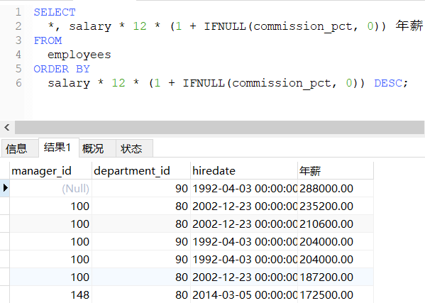

# DQL语言：排序查询

### 语法特点

```sql
/*
语法：
	SELECT 查询列表
	FROM 表
	【WHERE 筛选条件】
	ORDER BY 排序列表 【ASC|DESC】
特点：
	1.ASC代表升序，DESC代表降序。如果都不写，默认代表升序
*/
```

### 排序查询

##### 单列排序

升序检索：`SELECT 字段名称 FROM 表名 ORDER BY 字段名称;`

降序检索：`SELECT 字段名称 FROM 表名 ORDER BY 字段名称 DESC;`

!> 注意：**检索数据时，若没有排序，其结果是没有特定顺序的。**

!> 注意：**检索数据时，排序的字段可以是表中存在的任意字段。**

```sql
SELECT id, 公司名称 FROM 通用认证信息 ORDER BY id;
/*
# 以'id'字段升序，输出'id', '公司名称'字段。
+----+--------------+
| id | 公司名称     |
+----+--------------+
|  1 | 小白公司     |
|  2 | 小明公司     |
|  3 | 小红公司     |
+----+--------------+
3 rows in set (0.00 sec)
*/

SELECT id, 公司名称 FROM 通用认证信息 ORDER BY id DESC;
/*
# 以'id'字段降序，输出'id', '公司名称'字段。
+----+--------------+
| id | 公司名称     |
+----+--------------+
|  3 | 小红公司     |
|  2 | 小明公司     |
|  1 | 小白公司     |
+----+--------------+
3 rows in set (0.00 sec)
*/
```

##### 多列排序

先字段1升序，后字段2升序检索：`SELECT 字段名称 FROM 表名 ORDER BY 字段1, 字段2;`

先字段2升序，后字段1升序检索：`SELECT 字段名称 FROM 表名 ORDER BY 字段2, 字段1;`

先字段1升序，后字段2降序检索：`SELECT 字段名称 FROM 表名 ORDER BY 字段1, 字段2 DESC;`

先字段1降序，后字段2降序检索：`SELECT 字段名称 FROM 表名 ORDER BY 字段1 DESC, 字段2 DESC;`

!> 注意：**如果想在多个列上进行降序排序，必须对每个列指定DESC关键字。**

```sql
SELECT 公司名称,证书状态 FROM 通用认证信息 ORDER BY 公司名称,证书状态;
/*
# 以'公司名称'升序，再以'证书状态'升序，输出'公司名称','证书状态'字段
+--------------+--------------+
| 公司名称     | 证书状态     |
+--------------+--------------+
| 小明公司     | 过期         |
| 小白公司     | 有效         |
| 小红公司     | 过期         |
+--------------+--------------+
3 rows in set (0.00 sec)
*/

SELECT 公司名称,证书状态 FROM 通用认证信息 ORDER BY 证书状态,公司名称;
/*
# 以'证书状态'升序，再以'公司名称'升序，输出'公司名称','证书状态'字段
+--------------+--------------+
| 公司名称     | 证书状态     |
+--------------+--------------+
| 小白公司     | 有效         |
| 小明公司     | 过期         |
| 小红公司     | 过期         |
+--------------+--------------+
3 rows in set (0.00 sec)
*/

SELECT 公司名称,证书状态 FROM 通用认证信息 ORDER BY 证书状态,公司名称 DESC;
/*
# 以'证书状态'升序，再以'公司名称'降序，输出'公司名称','证书状态'字段
+--------------+--------------+
| 公司名称     | 证书状态     |
+--------------+--------------+
| 小白公司     | 有效         |
| 小红公司     | 过期         |
| 小明公司     | 过期         |
+--------------+--------------+
3 rows in set (0.00 sec)
*/
```

##### 表达式排序

```sql
-- 按年薪的高低降序显示员工的信息和年薪（没有年薪字段，需要表达式计算）
SELECT
	*, salary * 12 * (1 + IFNULL(commission_pct, 0)) 年薪
FROM
	employees
ORDER BY
	salary * 12 * (1 + IFNULL(commission_pct, 0)) DESC;
```




### 限制

返回结果前m行数据：`SELECT 字段名称 FROM 通用认证信息 LIMIT m;`

返回结果第m行后n行数据：`SELECT 字段名称 FROM 通用认证信息 LIMIT m,n;`

```sql
SELECT id, 公司名称 FROM 通用认证信息 LIMIT 1;
/*
返回结果第1行数据（包括第1行）
+----+--------------+
| id | 公司名称     |
+----+--------------+
|  1 | 小白公司     |
+----+--------------+
1 row in set (0.00 sec)
*/

SELECT id, 公司名称 FROM 通用认证信息 LIMIT 1,2;
/*
# 返回结果第1行的后2行数据（不包括第1行）
+----+--------------+
| id | 公司名称     |
+----+--------------+
|  2 | 小明公司     |
|  3 | 小红公司     |
+----+--------------+
2 rows in set (0.00 sec)
*/
```

