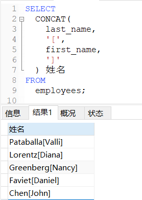

# 常见函数

与其他大多数计算机语言一样，SQL支持利用函数来处理数据。函数一般是在数据上执行的，它给数据的转换和处理提供了方便。

!> 能运行在多个系统上的代码称为可移植的（portable）。相对于SQL来说，函数可移植性差些，如果你决定使用函数，应该保证做好代码注释，以便以后你（或其他人）能确切地知道所编写SQL代码的含义。

### 常见函数

```sql
/*
概念：将一组逻辑语句封装在方法体中，对外暴露方法名
好处：1、隐藏了实现细节。
     2、提高代码的重用性。
调用：SELECT 函数名(实参列表)【FROM 表】;
分类：1、单行函数：针对单个数据进行处理判断，结果返回一个值。
        如CONCAT、LENGTH、IFNULL等
     2、聚合函数：针对一组数据进行处理判断，结果返回一个值。
        如SUM求和、AVG平均值、MAX最大值、MIN最小值、COUNT计算个数
        聚合函数都忽略NULL值，都可以和DISTINCT搭配实现去重的运算
        和聚合函数一同查询的字段要求是GROUP BY后的字段
*/
```

### 文本处理函数

##### 字节长度

`LENGTH(参数)`：获取参数值的**字节个数**。

```sql
-- 一个字母占1个字节，一个汉字占3个字节
SELECT LENGTH('张三丰hahaha');
```


##### 字符串拼接

`CONCAT(字符串1, 字符串2...)`：将多个字符串拼接为一个字符串输出。

```sql
-- 查询员工名和姓连接成一个字段
SELECT
	CONCAT(last_name, first_name)
FROM
	employees;
```


中间还可以增加字符，按照一定的格式输出，顺便起别名：

```sql
SELECT
	CONCAT(
		last_name,
		'[',
		first_name,
		']'
	) 姓名
FROM
	employees;
```



##### 大写小写

`UPPER(字符串)`：将字符串中所有字母转为大写。

`LOWER(字符串)`：将字符串中所有字母转为小写。

```sql
-- 将姓变为大写，名变为小写，然后拼接
SELECT
	CONCAT(
		UPPER(last_name),
		'_',
		LOWER(first_name)
	) 姓名
FROM
	employees;
```


##### 字符串截取

`SUBSTR(字符串, 索引)`：截取从指定索引处后面的**所有字符**。

`SUBSTR(字符串, 索引, 长度)`：截取从索引处**指定长度的字符**。

!> 注意：SQL语句中的索引是从1开始的。

```sql
-- 下面输出：'人上人'
SELECT SUBSTR('打工都是人上人', 5);
-- 下面输出：'打工'
SELECT SUBSTR('打工都是人上人', 1, 2);
```

##### 初次索引位置

`INSTR(字符串, 字串)`：返回字串第一次出现的索引，如果找不到返回0.

```sql
-- 下面输出：'1'
SELECT INSTR('打工人打工魂', '打工');
-- 下面输出：'0'
SELECT INSTR('打工人打工魂', '人上人');
```

##### 去除首尾

`TRIM(字符串)`：去除字符串中**首尾**的空格，也可以去除指定的字符。

`RTRIM(字符串)`：去除字符串中**最右边**的空格，也可以去除指定的字符。

`LTRIM(字符串)`：去除字符串中**最左边**的空格，也可以去除指定的字符。

```sql
-- 下面输出：'花 果 山'
SELECT TRIM('  花 果 山  ');
-- 下面输出：'花a果a山'(指定除去首尾的字符'a')
SELECT TRIM('a' FROM 'aa花a果a山aa');
```

##### 左右填充

`LPAD(字符串, 长度, 字符)`：用指定的字符实现左填充指定的长度。

`RPAD(字符串, 长度, 字符)`：用指定的字符实现右填充指定的长度。

```sql
-- 下面输出：**西游记
SELECT LPAD('西游记', 5, '*')
-- 下面输出：西游
SELECT LPAD('西游记', 2, '*')
-- 下面输出：西游记**
SELECT RPAD('西游记', 5, '*')
-- 下面输出：西游
SELECT RPAD('西游记', 2, '*')
```

##### 替换

`REPLACE(字符串1, 字符串2, 字符串3)`：将所有字符串1中出现字符串2替换为字符串3。

```sql
-- 下面输出：'上班人上班魂'
SELECT REPLACE('打工人打工魂', '打工', '上班');
```

##### 其他文本函数

|     函 数     |       说 明       |
| :-----------: | :---------------: |
|  `Length()`   |   返回串的长度    |
|  `Locate()`   | 找出串的一个子串  |
|   `Left()`    | 返回串左边的字符  |
|   `Right()`   | 返回串右边的字符  |
| `SubString()` |  返回子串的字符   |
|  `Soundex()`  | 返回串的SOUNDEX值 |

这里的SOUNDEX需要做进一步的解释：**SOUNDEX是一个将任何文本串转换为描述其语音表示的字母数字模式的算法，考虑了类似的发音字符和音节，使得能对串进行发音比较而不是字母比较。**

```sql
-- 表中有一个顾客其联系名为Y.Lee。但如果这是输入错误，此联系名实际应该是Y.Lie，怎么办？
SELECT * FROM 表名 WHERE 字段='Y.Lie';
/*
0 rows in set (0.00 sec)
*/
-- 显然，按正确的联系名搜索不会返回数据。
-- 现在试一下使用Soundex()函数进行搜索，它匹配所有发音类似于Y.Lie的联系名。
SELECT * FROM 表名 WHERE Soundex(字段)=Soundex('Y.Lie');
/*
+-------------+
|    字段      |
+-------------+
|    Y.Lee    |
+-------------+
1 rows in set (0.00 sec)
*/
```

### 数值处理函数

数值处理函数仅处理数值数据。这些函数一般主要用于代数、三角或几何运算。在主要DBMS的函数中，数值函数是最一致最统一的函数。

##### 常用数值处理函数

|  函 数   |       说 明        |
| :------: | :----------------: |
| `Abs()`  | 返回一个数的绝对值 |
| `Cos()`  | 返回一个角度的余弦 |
| `Exp()`  | 返回一个数的指数值 |
| `Mod()`  |  返回除操作的余数  |
|  `Pi()`  |     返回圆周率     |
| `Rand()` |   返回一个随机数   |
| `Sin()`  | 返回一个角度的正弦 |
| `Sqrt()` | 返回一个数的平方根 |
| `Tan()`  | 返回一个角度的正切 |

##### 四舍五入

`ROUND(小数, 保留位数)`：将小数进行四舍五入，保留位数。

```sql
-- 下面输出：-2
SELECT ROUND(-1.65);
-- 下面输出：-1.7
SELECT ROUND(-1.65, 1);
```

##### 小数截断

`TRUNCATE(小数, 保留位数)`：将小数进行截断，保留位数。

```sql
-- 下面输出：-1.6
SELECT TRUNCATE(-1.65, 1);
```

##### 上下取整

`CEIL(小数)`：返回小数向上取整数。

`FLOOR(小数)`：返回小数向下取整数。

```sql
-- 下面输出：-1
SELECT CEIL(-1.65);
-- 下面输出：-2
SELECT FLOOR(-1.65);
```

##### 取余

`MOD(除数, 被除数)`：返回除数除以被除数的余数，作用和 `%` 一样。

```sql
-- 下面输出：1
SELECT MOD(10, 3);
-- 下面输出：1
SELECT 10%3;
```

### 日期时间处理函数

**日期和时间采用相应的数据类型和特殊的格式存储，以便能快速和有效地排序或过滤，并且节省物理存储空间。**

##### 日期时间函数表

|      函 数      |             说 明              |
| :-------------: | :----------------------------: |
|   `AddDate()`   |    增加一个日期（天、周等）    |
|   `AddTime()`   |    增加一个时间（时、分等）    |
|   `CurDate()`   |          返回当前日期          |
|   `CurTime()`   |          返回当前时间          |
|    `Date()`     |     返回日期时间的日期部分     |
|  `DateDiff()`   |        计算两个日期之差        |
|  `Date_Add()`   |     高度灵活的日期运算函数     |
| `Date_Format()` |  返回一个格式化的日期或时间串  |
|    `Day() `     |     返回一个日期的天数部分     |
|  `DayOfWeek()`  | 对于一个日期，返回对应的星期几 |
|    `Hour()`     |     返回一个时间的小时部分     |
|   `Minute()`    |     返回一个时间的分钟部分     |
|    `Month()`    |     返回一个日期的月份部分     |
|     `Now()`     |       返回当前日期和时间       |
|   `Second()`    |      返回一个时间的秒部分      |
|    `Time()`     |   返回一个日期时间的时间部分   |
|    `Year()`     |     返回一个日期的年份部分     |

##### 获取日期时间

`NOW()`：返回当前日期时间。

```sql
-- 下面输出：2020-11-29 01:57:13
SELECT NOW();
```

`CURDATE()`：返回当前日期，不包含时间。

```sql
-- 下面输出：2020-11-29
SELECT CURDATE();
```

`CURTIME()`：返回当前时间，不包含日期。

```sql
-- 下面输出：01:59:37
SELECT CURTIME();
```

`DATEDIFF(日期数值1，日期数值2)`：返回日期数值1减去日期数值2的天数。

```sql
SELECT DATEDIFF(NOW(), '1995-01-01');
```

`YEAR(日期数值)`：获取日期中的年份。

```sql
-- 下面输出：2020
SELECT YEAR(NOW());
-- 下面输出：1995
SELECT YEAR('1995-01-01');
```

`MONTH(日期数值)`：获取日期中的月份。

```sql
-- 下面输出：11
SELECT MONTH(NOW());
-- 下面输出：1
SELECT MONTH('1995-01-01');
```

`DAY(日期数值)`：获取日期中的日份。

```sql
-- 下面输出：29
SELECT DAY(NOW());
-- 下面输出：1
SELECT DAY('1995-01-01');
```

`HOUR(日期数值)`：获取时间中的小时。

```sql
-- 下面输出：2
SELECT HOUR(NOW());
-- 下面输出：12
SELECT HOUR('12:13:14');
-- 下面输出：12
SELECT HOUR('1995-01-01 12:13:14');
```

`MINUTE(日期数值)`：获取日期中的分钟。

```sql
-- 下面输出：8
SELECT MINUTE(NOW());
-- 下面输出：13
SELECT MINUTE('12:13:14');
-- 下面输出：13
SELECT MINUTE('1995-01-01 12:13:14');
```

`SECOND(日期数值)`：获取日期中的秒数。

```sql
-- 下面输出：0
SELECT SECOND(NOW());
-- 下面输出：14
SELECT SECOND('12:13:14');
-- 下面输出：14
SELECT SECOND('1995-01-01 12:13:14');
```

##### 字符日期转换

| 格式符 | 功能                      |
| :----- | :------------------------ |
| %Y     | 四位年份                  |
| %y     | 两位年份                  |
| %m     | 月份（01，02，...11，12） |
| %c     | 月份（1，2，...11，12）   |
| %d     | 日（01，02，...）         |
| %H     | 小时（24小时制）          |
| %h     | 小时（12小时制）          |
| %i     | 分钟（00，01，...59）     |
| %s     | 秒（00，01，...59）       |

STR_TO_DATE(日期格式的字符, 日期)：将日期格式的字符转换为指定格式的日期。

```sql
-- 下面输出：1999-09-13
SELECT STR_TO_DATE('9-13-1999', '%m-%d-%Y');
```

DATE_FORMAT(日期格式的字符, 日期)：将日期转换为字符。

```sql
-- 下面输出：2018年06月06日
SELECT DATE_FORMAT('2018/6/6', '%Y年%m月%d日');
```

##### 日期筛选

之前我们都是用比较数值和文本的WHERE子句过滤数据，但数据经常需要用日期进行过滤。

!> MySQL使用的日期格式。无论你什么时候指定一个日期，日期必须为格式yyyy-mm-dd，因为它排除了多义性。例如：2005年9月1日，给出为2005-09-01。

```sql
-- 筛选日期为2005年9月1日的所有行
SELECT * FROM 表名 WHERE 日期字段='2005-09-01';
```

但是还有一种情况，假如日期存储的数据类型为datetime，即日期全都有时间值`00:00:00`，如果只匹配日期 `2005-09-01` ，则不会把它检索出来，匹配失败。

解决办法是：**使用 `Date()` 函数，仅提取列的日期部分进行比较，而不是将给出的日期与整个列值进行比较。**

```sql
-- 筛选日期为2005年9月1日的所有行
SELECT * FROM 表名 WHERE Date(日期字段)='2005-09-01';
```

检索出2005年9月下的所有行，有几种解决办法：

```sql
-- 筛选日期范围在2005年9月1号至2005年9月30号之间的所有行
SELECT * FROM 表名 WHERE Date(日期字段) BETWEEN '2005-09-01' AND '2005-09-30';

-- 筛选日期范围在2005年9月的所有行
SELECT * FROM 表名 WHERE Year(日期字段)='2005' AND Month(日期字段)='9';
```

### 流程控制函数

##### IF函数

IF(表达式，字符串1， 字符串2)：表达式为True，返回字符串1；表达式为False，返回字符串2。

```sql
-- 下面输出：'大'
SELECT IF(10>5, '大', '小');
-- 下面输出：'是'
SELECT IF(NULL is NULL, '是', '不是');
-- 下面输出：'不等于'（NULL与任何值都不相等，包括其本身）
SELECT IF(NULL = NULL, '等于', '不等于');
```

##### IFUNLL函数

`IFUNLL(字段, 默认值)`函数：**常用函数，作用是判断值是否为NULL，为NULL返回默认值。**

```sql
-- 把奖金率为NULL的值转换为数值０
SELECT
	commission_pct 转换前,
	IFNULL(commission_pct, 0) 转换后
FROM
	employees;
```


##### CASE函数

CASE函数使用方式：

```sql
/*
CASE 要判断的字段或表达式
WHEN 常量1 THEN 要显示的值1或语句1;
WHEN 常量2 THEN 要显示的值2或语句2;
...
ELSE 要显示的值n或语句n;
END
*/

/*
CASE 
WHEN 条件1 THEN 要显示的值1或语句1;
WHEN 条件2 THEN 要显示的值2或语句2;
...
ELSE 要显示的值n或语句n;
END
*/
```

?> 如果没有其他的情况，可以省略ELSE，结果自动填充为NULL。

案例一：

```sql
/*
查询员工工资，要求：
部门号为30，显示的工资为1.1倍
部门号为40，显示的工资为1.2倍
部门号为50，显示的工资为1.3倍
其他部门，显示的工资为原工资
*/
SELECT
  department_id,
  salary 原始工资,  
CASE department_id
WHEN 30 THEN salary * 1.1
WHEN 40 THEN salary * 1.2
WHEN 50 THEN salary * 1.3
ELSE salary
END 新工资
FROM employees;
```


案例二：

```sql
/*
查询员工的工资情况：
工资大于20000，显示级别A
工资大于15000，显示级别B
工资大于10000，显示级别C
否则，显示级别D
*/
SELECT
	salary,
CASE
WHEN salary>20000 THEN 'A'
WHEN salary>15000 THEN 'B'
WHEN salary>10000 THEN 'C'
ELSE 'D'
END 
FROM employees;
```


### 聚合函数

聚集函数(aggregate function)：**运行在行组上，计算和返回单个值的函数。**

|   函 数   |      说 明       |
| :-------: | :--------------: |
|  `AVG()`  | 返回某列的平均值 |
| `COUNT()` |  返回某列的行数  |
|  `MAX()`  | 返回某列的最大值 |
|  `MIN()`  | 返回某列的最小值 |
|  `SUM()`  |  返回某列值之和  |

##### AVG函数

`AVG()函数`：通过对表中行数计数并计算特定列值之和，求得该列的平均
值，也可以用来返回特定列或行的平均值。

```sql
-- 使用AVG()返回字段中所有行的平均值
SELECT AVG(字段) AS AVG_字段 FROM 表名;

-- 使用AVG()返回字段中ID为1的平均值
SELECT AVG(字段) AS AVG_字段 FROM 表名 WHERE ID=1;
```

?> `AVG()函数` 忽略列值为 `NULL` 的行。

!> `AVG()函数` 只能用来确定特定数值列的平均值，而且列名必须作为函数参数给出。获取多个列的平均值，就必须使用多个 `AVG()函数`。

##### COUNT函数

`COUNT()函数`：**通过计数确定表中行的数目或符合特定条件的行的数目。**

1. 使用 `COUNT(*)` 对表中行的数目进行计数，不管表列中包含的是空值（`NULL`）还是非空值。
2. 使用 `COUNT(column)` 对特定列中具有值的行进行计数，忽略 `NULL` 值。

```sql
-- 利用COUNT(*)对所有行计数，计数值在'COUNT_字段'中返回。
SELECT COUNT(*) AS COUNT_字段 FROM 表名;

-- 只针对字段的所有行进行计数，排除NULL值。
SELECT COUNT(字段) AS COUNT_字段 FROM 表名;
```

##### MAX函数

`MAX()函数`：**返回指定列中的最大值（数值或日期值）。**

```sql
-- 字段中最大的值在'MAX_字段'返回。
SELECT MAX(字段) AS MAX_字段 FROM 表名;
```

?> `MAX()函数` 忽略列值为 `NULL` 的行。

##### MIN函数

`MIN()函数`：**返回指定列中的最小值（数值或日期值）。**

```sql
-- 字段中最小的值在'MIN_字段'返回。
SELECT MIN(字段) AS MIN_字段 FROM 表名;
```

?> `MIN()函数` 忽略列值为 `NULL` 的行。

##### SUM函数

`SUM()函数`：**用来返回指定列值的和（总计）。**

```sql
-- 字段中所有行的和在'SUM_字段'返回。
SELECT SUM(字段) AS SUM_字段 FROM 表名;
```

?> `SUM()函数` 忽略列值为 `NULL` 的行。

### 其他函数

VERSION()：查看当前数据库版本。

```sql
SELECT VERSION();
```

DATABASE()：查看当前所在数据库。

```sql
SELECT DATABASE();
```

USER()：查看当前用户。

```sql
-- root@localhost：当前用户为root
SELECT USER();
```
