# DQL语言：连接查询

### 语法特点

```sql
/*
含义：又称多表查询，当查询的字段来自多个表时，就会用到连接查询。

笛卡尔乘积现象：表1有m行，表2有n行，结果=m*n行
发生原因：没有有效的连接条件
如何避免：添加有效的连接条件

分类：
   按年代分类：
           SQL92标准：仅仅支持内连接
           SQL99标准【推荐】：支持内连接+外连接（左外和右外）+交叉连接
   按功能分类：
           内连接：
                等值连接
                非等值连接
                自连接
           外连接：
                左外连接
                右外连接
                全外连接
           交叉连接
   语法：
           SELECT 查询列表
           FROM 表1 别名 【连接类型】
           JOIN 表2 别名
           ON 连接条件
          【WHERE 筛选条件】
          【GROUP BY 分组】
          【HAVING 筛选条件】
          【ORDER BY 排序列表】
    分类：
          内连接：INNER
          外连接：
            左外：LEFT 【OUTER】
            右外：RIGHT 【OUTER】
            全外：FULL 【OUTER】
          交叉连接：CROSS
*/
```

### SQL92内连接

##### 等值连接

```sql
/*
等值连接：
1、多表等值连接的结果为多表的交集部分
2、n个表连接，至少需要n-1个连接条件
3、多表的顺序没有要求
4、一般需要为表起别名
5、可以搭配任意子句使用，比如：排序、分组、筛选
*/
```

等值连接联系案例：

```sql
-- 查询girls库中beauty表中女生名对应的boys表中男生名
SELECT
	`name`,
	`boyName`
FROM
	beauty,
	boys
WHERE
	beauty.boyfriend_id = boys.id;
```

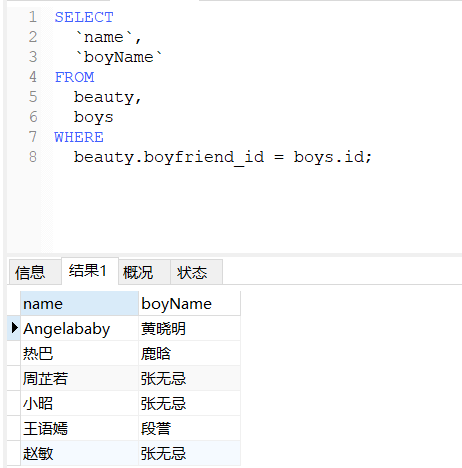

```sql
-- 查询employees表中员工名和对应的部门名
SELECT
	last_name,
	department_name
FROM
	employees,
	departments
WHERE
	employees.department_id = departments.department_id;
```

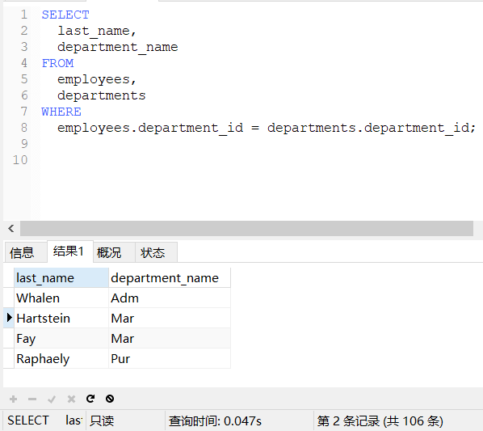

```sql
/*
为表起别名：
1、提高语句的简洁度
2、区分多个重名的字段
3、两个表的顺序可以调换
注意：如果为表起了别名，则查询的字段就不能使用原来的表名去限定
*/
-- 查询员工名、工种号、工种名
SELECT
	last_name,
	-- 因为两个表都有job_id字段，所以需要指定表名
	e.job_id,
	job_title
FROM
	employees e,
	jobs j
WHERE
	e.job_id = j.job_id;
```

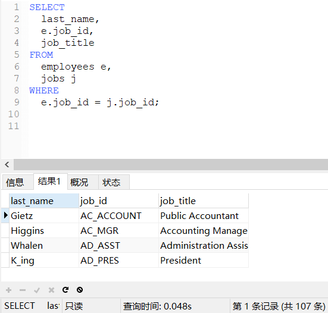

```sql
-- 添加筛选条件
-- 查询有奖金的员工名、部门名、奖金率
SELECT
	last_name,
	department_name,
	commission_pct
FROM
	employees e,
	departments d
WHERE
	e.department_id = d.department_id
AND 
	commission_pct IS NOT NULL;
```

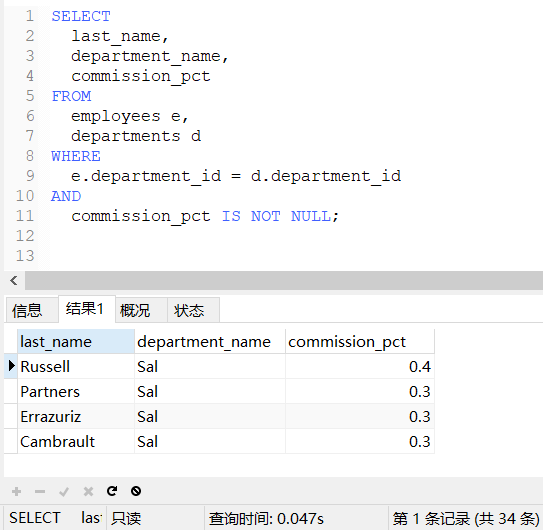

```sql
-- 三表连接
-- 查询员工名、部门名和所在的城市
SELECT
	last_name,
	department_name,
	city
FROM
	employees e,
	departments d,
	locations l
WHERE
	e.department_id = d.department_id
AND 
	d.location_id = l.location_id;
```

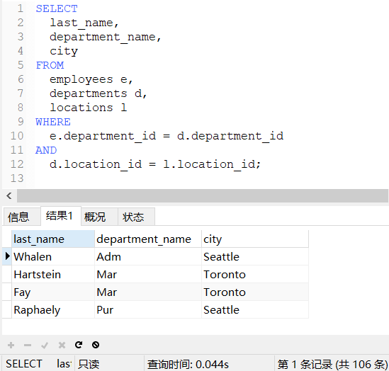

##### 非等值连接

```sql
-- 查询员工的工资和工资级别
SELECT
	salary,
	grade_level
FROM
	employees e,
	job_grades g
WHERE
	salary BETWEEN g.lowest_sal
AND 
  g.highest_sal;
```

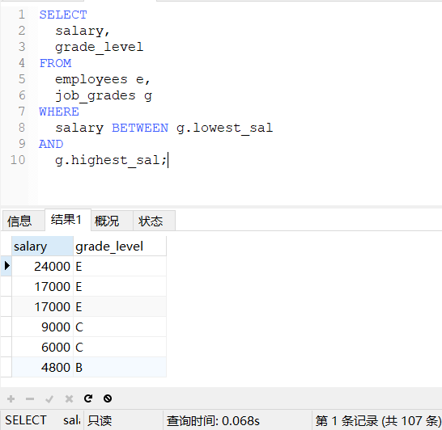

##### 自连接

自连接：两次查询使用的是同一张表。

```sql
-- 查询员工名和上级的名称
SELECT
	e.employee_id,
	e.last_name,
	m.employee_id,
	m.last_name
FROM
	employees e,
	employees m
WHERE
	e.manager_id = m.employee_id;
```

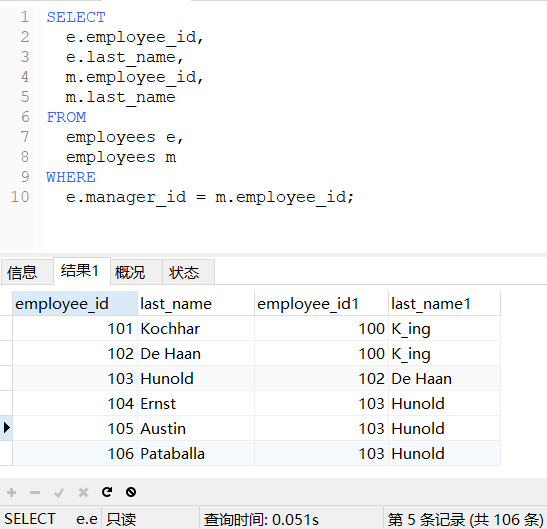

### SQL99内连接

##### 语法特点

```sql
/*
语法：
    SELECT 查询列表
    FROM 表1 别名
    INNER JOIN 表2 别名
    ON 连接条件;
分类：
    等值
    非等值
    自连接
特点：
    1、添加排序、分组、筛选
    2、INNER可以省略
    3、筛选条件放在WHERE后面，连接条件放在ON后面，提高分离性，便于阅读
    4、INNER JOIN连接和SQL92中的等值连接效果是一样的，都是查询多表的交集
*/
```

##### 等值连接

```sql
-- 查询员工名、部门名
SELECT
	last_name,
	department_name
FROM 
	employees e
INNER JOIN 
	departments d
ON
	e.department_id = d.department_id;
```

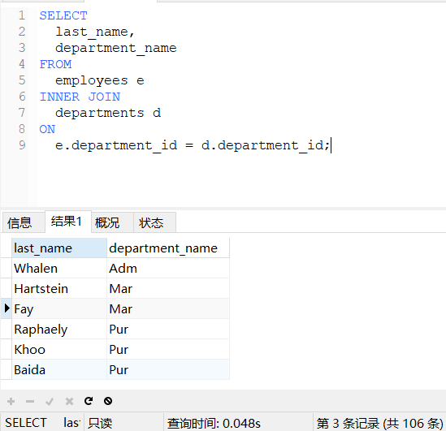

```sql
-- 查询部门个数大于3的城市名和部门个数（分组筛选）
SELECT
	city,
	COUNT(*) 部门个数
FROM 
	departments d
INNER JOIN 
	locations l
ON d.location_id = l.location_id
GROUP BY city
HAVING COUNT(*) > 3;
```

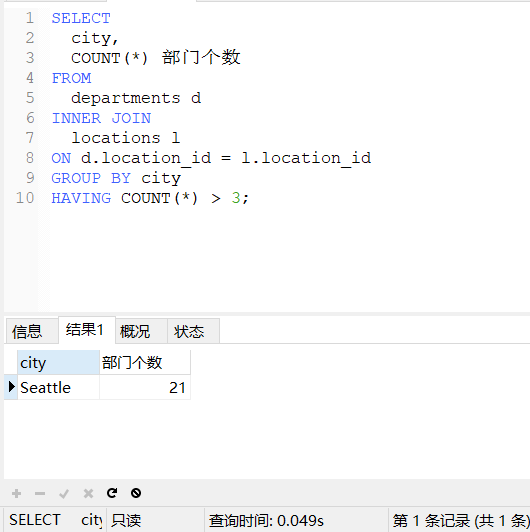

```sql
-- 查询员工名、部门名、工种名，并按部门名降序（三表连接）
SELECT
	last_name,
	department_name,
	job_title
FROM employees e
INNER JOIN departments d ON e.department_id = d.department_id
INNER JOIN jobs j on e.job_id = j.job_id
ORDER BY department_name DESC;
```

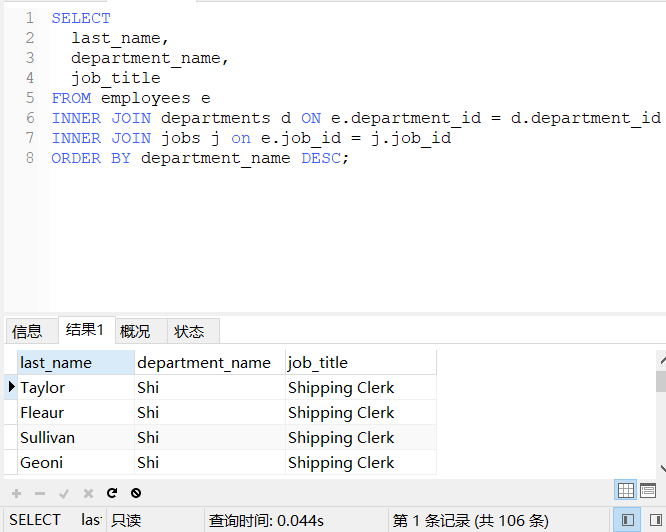

##### 非等值连接

```sql
-- 查询员工的工资级别
SELECT
	salary,
	grade_level
FROM employees e
JOIN job_grades j
ON e.salary BETWEEN j.lowest_sal AND j.highest_sal;
```

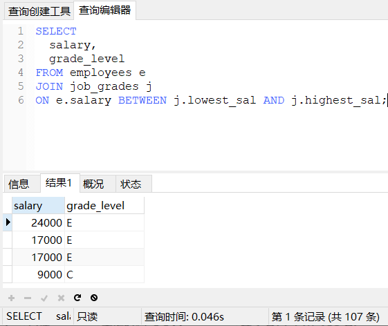

```sql
-- 查询工资级别的个数大于20的个数，并按工资级别降序
SELECT
	COUNT(*),
	grade_level
FROM employees e
JOIN job_grades j
ON e.salary BETWEEN j.lowest_sal AND j.highest_sal
GROUP BY grade_level
HAVING COUNT(*)>20
ORDER BY grade_level DESC;
```

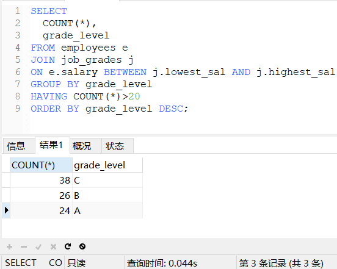

##### 自连接

```sql
-- 员工的名字、上级的名字
SELECT
	e.last_name,
	m.last_name
FROM employees e
JOIN employees m
ON e.manager_id = m.employee_id;
```

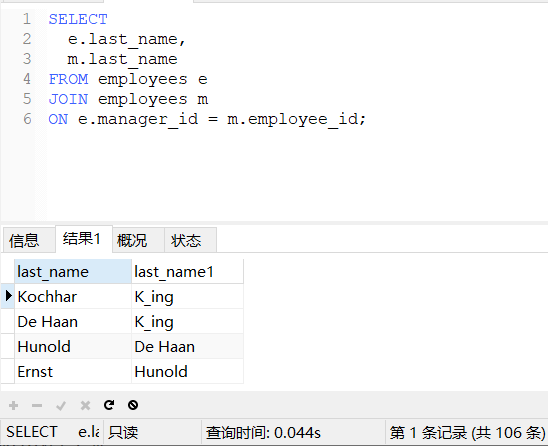

### 外连接

##### 语法特点

```sql
/*
应用场景：用于查询一个表中有，另一个表没有的记录
特点：
   1、外连接的查询结果为主表中的所有记录
      如果从表中有和它匹配的，则显示匹配的值
      如果从表中没有和它匹配的，则显示NULL
      外连接查询结果=内连接结果+主表中有而从表没有的记录
   2、左外连接，LEFT JOIN左边的是主表
      右外连接，RIGHT JOIN右边的是主表
   3、左外和右外交换两个表的顺序，可以实现同样的效果
*/ 
```

##### 左外连接

```sql
-- 查询没有男朋友的女神
SELECT
   b.`name`,
   -- bo.*代表boys表中的全部字段
   bo.*
FROM beauty b
LEFT OUTER JOIN boys bo
ON b.boyfriend_id = bo.id
WHERE bo.id IS NULL;
```

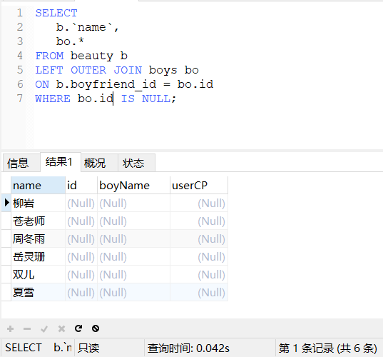

##### 右外连接

```sql
-- 查询没有男朋友的女神
SELECT
   b.`name`,
   bo.*
FROM boys bo
RIGHT OUTER JOIN beauty b
ON b.boyfriend_id = bo.id
WHERE bo.id IS NULL;
```

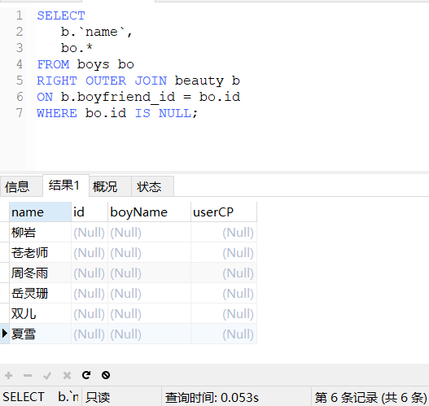