# DQL语言：子查询

### 语法特点

```sql
/*
含义：
SQL允许创建子查询（subquery），即嵌套在其他查询中的查询。
外查询：外部的查询语句，称为主查询或外查询。
子查询：出现在其他语句中的SELECT语句，称为子查询或内查询。
执行顺序：在SELECT语句中，子查询总是从内向外处理。
分类：
   按子查询出现的位置：
      SELECT后面：
          仅仅支持标量子查询
      FROM后面：
          支持表子查询
      WHERE或HAVING后面：
          标量子查询（单行）
          列子查询（多行）
          行子查询
      EXISTS后面（相关子查询）：
          表子查询
按结果集的行列数不同：
      标量子查询（结果集只有一列一行）
      列子查询（结果集只有一列多行）
      行子查询（结果集只有多列一行）
      表子查询（结果集一般为多列多行）
*/
```

!> 在 `WHERE` 子句中使用子查询能够编写出功能很强并且很灵活的SQL语句。对于能嵌套的子查询的数目没有限制，不过在实际使用时由于性能的限制，不能嵌套太多的子查询。

### WHERE或HAVING后面

##### 语法特点

```sql
/*
特点：
1、子查询放在小括号内
2、子查询一般放在条件的右侧
3、标量子查询结果必须是一列一行，一般搭配着单行操作符使用
      >、<、>=、<=、=、<>
4、列子查询结果必须是一列多行，一般搭配着多行操作符使用
      IN/NOT IN：等于列表中的任意一个
      ANY/SOME：和子查询返回的某一个值比较
      ALL：和子查询返回的所有值比较
5、子查询的执行优先于主查询执行，主查询的条件用到了子查询的结果
*/
```

##### 标量子查询

```sql
-- 查询工资比Abel高的人
SELECT
	*
FROM
	employees e
WHERE
	e.salary > (
		SELECT
			salary
		FROM
			employees
		WHERE
			last_name = 'Abel'
	);
```


```sql
-- 查询job_id与141号员工相同，salary比143号员工多的员工姓名、job_id和工资
SELECT
	last_name,
	job_id,
	salary
FROM employees
WHERE job_id = (
		SELECT job_id
		FROM employees
		WHERE employee_id = 141
	)
AND salary > (
	SELECT salary
	FROM employees
	WHERE employee_id = 143
);
```

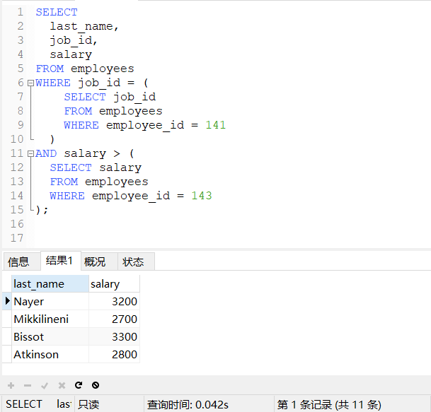

```sql
-- 查询公司工资最少的员工的last_name,job_id和salary
SELECT last_name, job_id, salary
FROM employees
WHERE salary = (
	SELECT MIN(salary)
	FROM employees
);
```

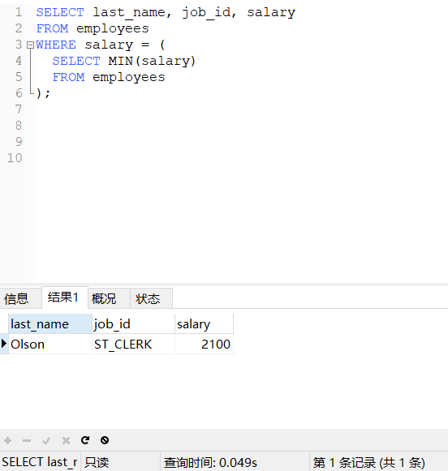

```sql
-- 查询最低工资大于50号部门最低工资的部门id和其最低工资
SELECT MIN(salary),department_id
FROM employees
GROUP BY department_id
HAVING MIN(salary) > (
	SELECT MIN(salary)
	FROM employees
	WHERE department_id=50
);
```

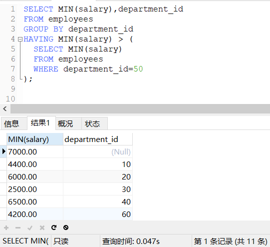

##### 列子查询

```sql
-- 查询location_id是1400或1700的部门中的所有员工姓名
SELECT last_name
FROM employees
WHERE department_id IN (
	SELECT DISTINCT department_id
	FROM departments
	WHERE location_id IN (1400, 1700)
); 
```

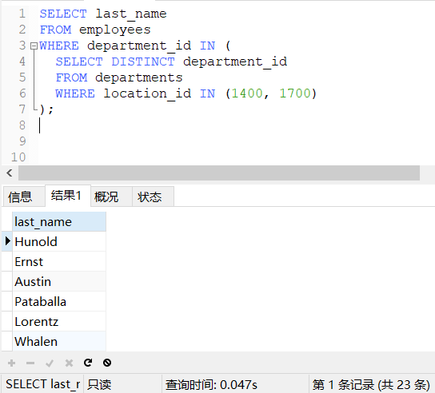

```sql
-- 查询其他部门比job_id为'IT_PROG'部门任一工资低的员工号、姓名、job_id以及salary
SELECT employee_id, last_name, job_id, salary
FROM employees
WHERE salary < ANY(
	SELECT DISTINCT salary
	FROM employees
	WHERE job_id='IT_PROG'
)
AND job_id <>'IT_PROG';
```

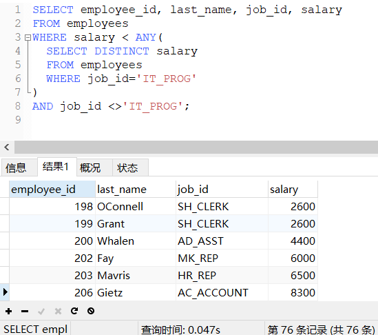

```sql
-- 查询其他部门比job_id为'IT_PROG'部门所有工资低的员工号、姓名、job_id以及salary
SELECT employee_id, last_name, job_id, salary
FROM employees
WHERE salary < ALL(
	SELECT DISTINCT salary
	FROM employees
	WHERE job_id='IT_PROG'
)
AND job_id <>'IT_PROG';
```

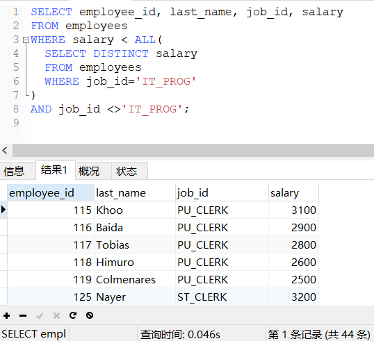

##### 行子查询

```sql
-- 查询员工编号最小并且工资最高的员工信息
-- 普通子查询
SELECT *
FROM employees
WHERE employee_id = (
	SELECT MIN(employee_id)
	FROM employees
)
AND salary = (
	SELECT MAX(salary)
	FROM employees
);
-- 行子查询
SELECT *
FROM employees
WHERE (employee_id, salary) = (
	SELECT MIN(employee_id), MAX(salary)
	FROM employees
);
```

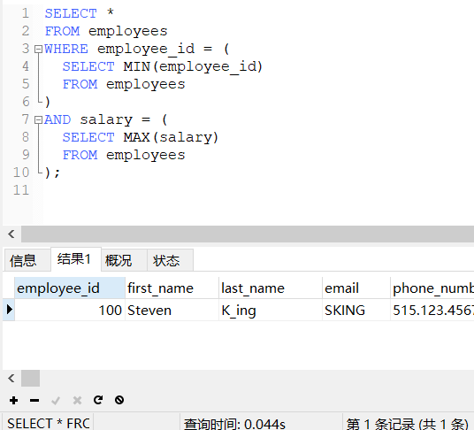

### SELECT后面

##### 语法特点

```sql
/*
SELECT后面后面的子查询仅仅支持标量子查询。
*/
```

##### 标量子查询

```sql
-- 查询每个部门的员工个数
SELECT
	d.*, (
		SELECT
			COUNT(*)
		FROM
			employees e
		WHERE
			e.department_id = d.department_id
	) 员工个数
FROM
	departments d;
```

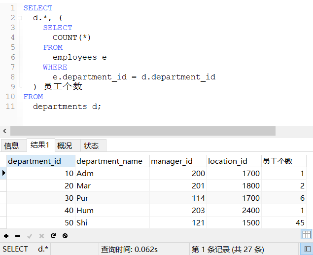

```sql
-- 查询员工编号为102的部门名
SELECT
	(
		SELECT d.department_name
		FROM departments d
		JOIN employees e ON d.department_id = e.department_id
		WHERE e.employee_id = 102
	) 部门名;
```

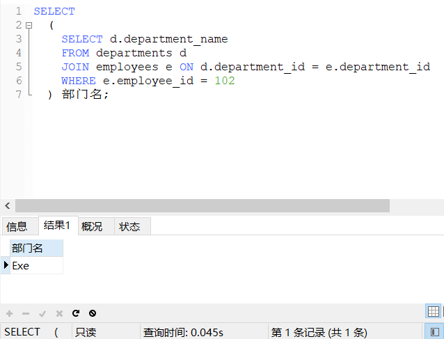

### FROM后面

##### 语法特点

```sql
/*
FROM后面子查询为表子查询，将子查询的结果充当为一张新表，要求必须要起别名。
*/
```

##### 表子查询

```sql
-- 查询每个部门的平均工资等级
SELECT
	department_id,
	new.平均工资,
	j.grade_level
FROM
	(   SELECT
			department_id,
			AVG(salary) 平均工资
		FROM
			employees e
		GROUP BY
			department_id
	) new, job_grades j
WHERE new.`平均工资` BETWEEN j.lowest_sal AND j.highest_sal;
```

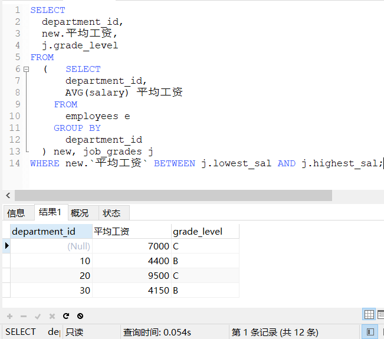

### EXISTS后面

##### 语法特点

```sql
/*
EXISTS后面子查询也叫相关子查询。
语法：
   EXISTS(完整的查询语句)
结果：
   0：查询语句的结果为NULL
   1：查询语句的结果有值（值可以是一行多行一列多列）
*/
```

##### EXISTS使用

```sql
-- 下面结果输出：1
SELECT EXISTS(SELECT salary FROM employees);

-- 下面结果输出：0
SELECT EXISTS(SELECT salary FROM employees WHERE salary=30000);

-- 查询有员工的部门名
SELECT
	department_name
FROM
	departments d
WHERE EXISTS (
		SELECT
			e.employee_id
		FROM
			employees e
		WHERE
			d.department_id = e.department_id
	);
```

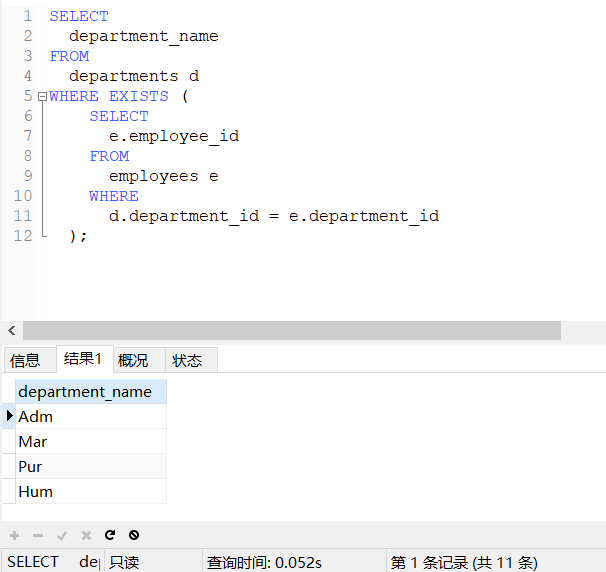