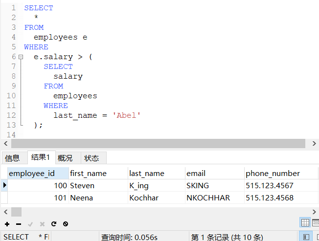

# DQL语言：子查询

### 语法特点

```sql
/*
含义：
外部的查询语句，称为主查询或外查询
出现在其他语句中的SELECT语句，称为子查询或内查询
分类：
   按子查询出现的位置：
      SELECT后面：
          仅仅支持标量子查询
      FROM后面：
          支持表子查询
      WHERE或HAVING后面：
          标量子查询（单行）
          列子查询（多行）
          行子查询
      EXISTS后面（相关子查询）：
          表子查询
按结果集的行列数不同：
      标量子查询（结果集只有一列一行）
      列子查询（结果集只有一列多行）
      行子查询（结果集只有多列一行）
      表子查询（结果集一般为多列多行）
*/
```

### WHERE或HAVING后面

##### 语法特点

```sql
/*
特点：
1、子查询放在小括号内
2、子查询一般放在条件的右侧
3、标量子查询结果必须是一列一行，一般搭配着单行操作符使用
      >、<、>=、<=、=、<>
4、列子查询结果必须是一列多行，一般搭配着多行操作符使用
      IN/NOT IN：等于列表中的任意一个
      ANY/SOME：和子查询返回的某一个值比较
      ALL：和子查询返回的所有值比较
5、子查询的执行优先于主查询执行，主查询的条件用到了子查询的结果
*/
```

##### 标量子查询

```sql
-- 查询工资比Abel高的人
SELECT
	*
FROM
	employees e
WHERE
	e.salary > (
		SELECT
			salary
		FROM
			employees
		WHERE
			last_name = 'Abel'
	);
```



```sql
-- 查询job_id与141号员工相同，salary比143号员工多的员工姓名、job_id和工资
SELECT
	last_name,
	job_id,
	salary
FROM employees
WHERE job_id = (
		SELECT job_id
		FROM employees
		WHERE employee_id = 141
	)
AND salary > (
	SELECT salary
	FROM employees
	WHERE employee_id = 143
);
```


```sql
-- 查询公司工资最少的员工的last_name,job_id和salary
SELECT last_name, job_id, salary
FROM employees
WHERE salary = (
	SELECT MIN(salary)
	FROM employees
);
```


```sql
-- 查询最低工资大于50号部门最低工资的部门id和其最低工资
SELECT MIN(salary),department_id
FROM employees
GROUP BY department_id
HAVING MIN(salary) > (
	SELECT MIN(salary)
	FROM employees
	WHERE department_id=50
);
```


##### 列子查询

```sql
-- 查询location_id是1400或1700的部门中的所有员工姓名
SELECT last_name
FROM employees
WHERE department_id IN (
	SELECT DISTINCT department_id
	FROM departments
	WHERE location_id IN (1400, 1700)
); 
```


```sql
-- 查询其他部门比job_id为'IT_PROG'部门任一工资低的员工号、姓名、job_id以及salary
SELECT employee_id, last_name, job_id, salary
FROM employees
WHERE salary < ANY(
	SELECT DISTINCT salary
	FROM employees
	WHERE job_id='IT_PROG'
)
AND job_id <>'IT_PROG';
```


```sql
-- 查询其他部门比job_id为'IT_PROG'部门所有工资低的员工号、姓名、job_id以及salary
SELECT employee_id, last_name, job_id, salary
FROM employees
WHERE salary < ALL(
	SELECT DISTINCT salary
	FROM employees
	WHERE job_id='IT_PROG'
)
AND job_id <>'IT_PROG';
```


##### 行子查询

```sql
-- 查询员工编号最小并且工资最高的员工信息
-- 普通子查询
SELECT *
FROM employees
WHERE employee_id = (
	SELECT MIN(employee_id)
	FROM employees
)
AND salary = (
	SELECT MAX(salary)
	FROM employees
);
-- 行子查询
SELECT *
FROM employees
WHERE (employee_id, salary) = (
	SELECT MIN(employee_id), MAX(salary)
	FROM employees
);
```


### 子查询

**SQL允许创建子查询（subquery），即嵌套在其他查询中的查询。**

##### 子查询过滤

```sql
-- 1.查询'字段2'的值为year的所有行其中字段1的值(假如查询结果为：2008,2020)
SELECT 字段1 FROM 表名 WHERE 字段2 = 'year';
-- 2.根据上面的查询结果，查询'字段1'的值为'2008'和'2020'的所有行的字段3的值
SELECT 字段3 FROM 表名 WHERE 字段1 IN ('2008', '2020');

-- 将上面两次查询写成一个子查询
SELECT 字段3 FROM 表名 WHERE 字段1 IN (SELECT 字段1 FROM 表名 WHERE 字段2 = 'year');
```

?> 在 `SELECT` 语句中，子查询总是从内向外处理。

?> 虽然子查询一般与IN操作符结合使用，但也可以用于测试等于（=）、不等于（<>）等。

!> 在 `WHERE` 子句中使用子查询能够编写出功能很强并且很灵活的SQL语句。对于能嵌套的子查询的数目没有限制，不过在实际使用时由于性能的限制，不能嵌套太多的子查询。

##### 子查询计算

```sql
-- SELECT COUNT(*)对表中的行进行计数
-- GROUP BY 字段是对字段进行分组
-- 'NEW_字段'是一个计算字段，它是由圆括号中的子查询建立的。该子查询对检索出的每行各执行一次。
SELECT 字段 (SELECT COUNT(*) FROM 表名 WHERE 字段 = '1') AS NEW_字段 FROM 表名 GROUP BY 字段; 
```

### 