# DML语言：插入修改删除

**DML语言：数据操作语言，涉及到插入（INSERT）、修改（UPDATE）、删除（DELETE）。**

### 插入语句

##### 语法特点

```sql
/*
经典插入：
语法：
   INSERT INTO 表名(列名1, 列名2...) VALUE(值1, 值2)
特点：
   1、插入的值的类型要与列的类型一致或者兼容
   2、不可以为NULL的列必须插入值，可以为NULL的列可以插入值也可以不插入值
   3、列的顺序可以调换，插入的值的顺序也要跟随列的位置调换
   4、列数和值的个数必须一致
   5、可以省略列名，默认是所有列，而且列的顺序和表中列的顺序一致
   6、支持一条语句插入多行数据
   7、支持后面增加子查询
SET插入：
语法：
    INSERT INTO 表名 SET 列名=值,列名=值...
*/
```

##### 经典插入

```sql
-- 向beauty表中插入数据
INSERT INTO beauty(id,name,sex,borndate,phone,photo,boyfriend_id)
VALUES(13,'唐艺昕','女','1990-4-23','18988888888',NULL,2);

INSERT INTO beauty(id,name,sex,borndate,phone,boyfriend_id)
VALUES(14,'金星','女','1990-4-23','13888888888',9);

INSERT INTO beauty(id,name,sex,phone)
VALUES(15,'娜扎','女','13888888888');

INSERT INTO beauty(name,sex,id,phone)
VALUES('蒋欣','女',16,'110');

INSERT INTO beauty(name,sex,id,phone)
VALUES('关晓彤','女',17,'110');

INSERT INTO beauty
VALUES(18,'张飞','男',NULL,'119',NULL,NULL);
```

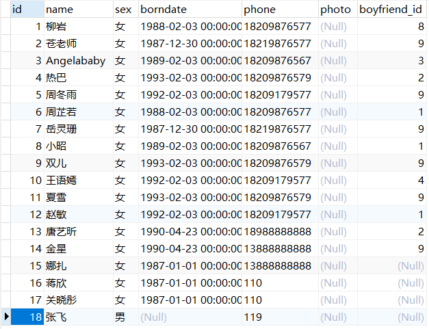

##### SET插入

```sql
-- 向beauty表中插入数据
INSERT INTO beauty
SET id=19,name='刘涛',phone='999';
```

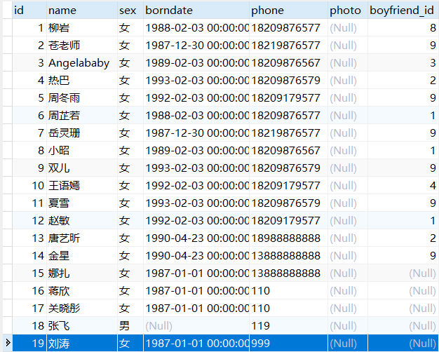

### 修改语句

##### 语法特点

```sql
/*
1.修改单表记录
语法：
   UPDATE 表名 SET 列=新值,列=新值... WHERE 筛选条件;

2.修改多表记录
SQL92语法：
   UPDATE 表1 别名,表2 别名
   SET 列=值...
   WHERE 连接条件
   AND 筛选条件;
SQL99语法：
  UPDATE 表1 别名
  INNER|LEFT|RIGHT JOIN 表2 别名
  ON 连接条件
  SET 列=值
  WHERE 筛选条件;
*/
```

##### 修改单表记录

```sql
-- 修改beauty表中的姓唐的女神的电话为13899888899
UPDATE beauty
SET phone='13899888899'
WHERE `name` LIKE '唐%';
```

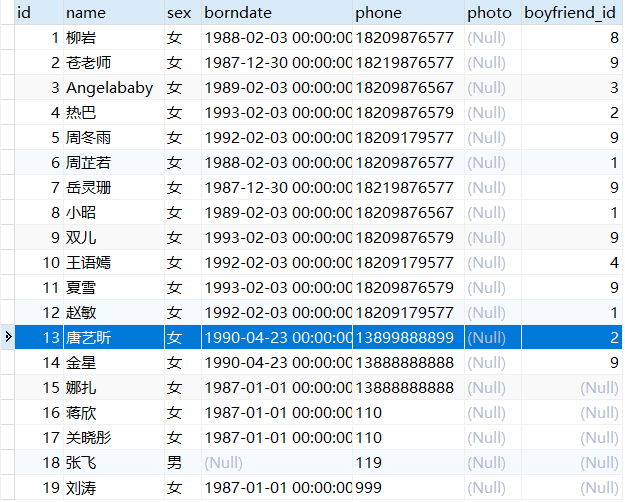

```sql
-- 修改boys表中id号为2的名称为张飞，魅力值为10
UPDATE boys
SET boyName='张飞',userCP=10
WHERE id=2;
```

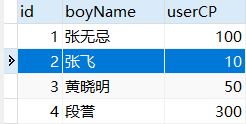

##### 修改多表记录

```sql
-- 修改张无忌的女朋友的手机号为114
UPDATE boys bo
JOIN beauty b
ON bo.id = b.boyfriend_id
SET b.phone='114'
WHERE bo.boyName='张无忌';
```

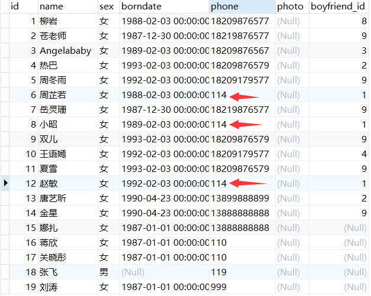

### 删除语句

##### 语法特点

```sql
/*
方式一：DELETE删除
语法：
   1.单表的删除
   DELETE FROM 表名 【WHERE 筛选条件】;
   2.多表的删除
   SQL92语法：（同时删除表1和表2中信息，若只写一张表则只删除一张表中信息）
      DELETE 表1的别名,表2的别名
      FROM 表1 别名,表2 别名
      WHERE 连接条件
      AND 筛选条件;
   SQL99语法：（同时删除表1和表2中信息，若只写一张表则只删除一张表中信息）
      DELETE 表1的别名,表2的别名
      FROM 表1 别名
      INNER|LEFT|RIGHT JOIN 表2 别名 ON 连接条件
      WHERE 筛选条件;

方式二：TRUNCATE清空
语法：TRUNCATE TABLE 表名;
特点：清空表中所有数据

方式一和方式二区别：
   1.DELETE后面可以添加筛选条件，TRUNCATE不可以。
   2.TRUNCATE效率比DELETE要高。
   3.假如删除的表中有自增列，DELETE删除后，再插入数据，自增列的值从断点开始；TRUNCATE删除后，再插入数据，自增列的值从1开始。
   4.DELETE删除有返回值，TRUNCATE删除没有返回值。（返回值即多少行受影响）
   5.DELETE删除可以回滚，TRUNCATE删除不能回滚。
*/
```

##### 单表的删除

```sql
-- 删除手机尾号为9的女神信息
DELETE FROM beauty
WHERE phone LIKE '%9';
```

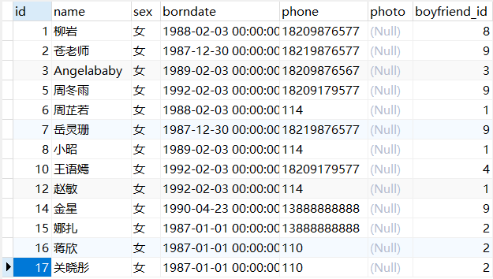

##### 多表删除

```sql
-- 删除张无忌的女朋友信息
DELETE b
FROM beauty b
JOIN boys bo
ON b.boyfriend_id=bo.id
WHERE bo.boyName='张无忌';
```

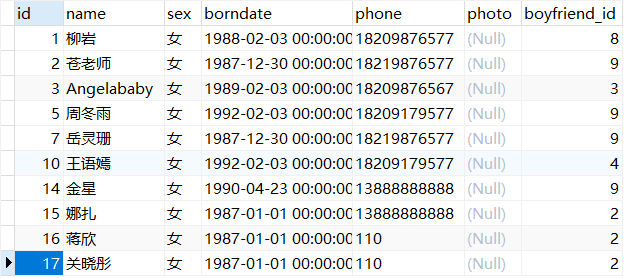

```sql
-- 删除黄晓明的信息以及他女朋友的信息
DELETE b,bo
FROM beauty b
JOIN boys bo
ON b.boyfriend_id=bo.id
WHERE bo.boyName='黄晓明';
```

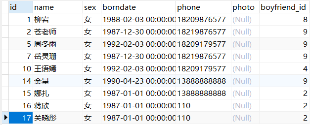

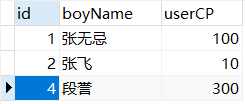

##### 清空表

```sql
-- 拷贝boys表生成新的boys_copy表，清空该表
TRUNCATE TABLE boys_copy;
```

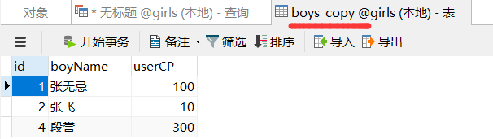

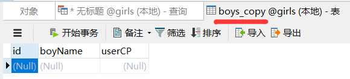