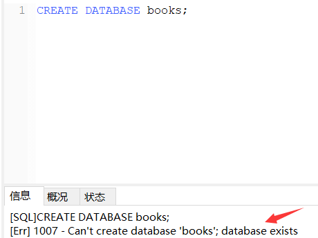
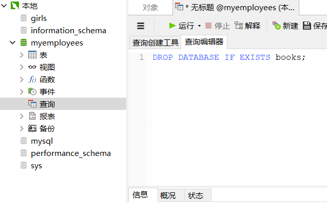

# DDL语言：库表管理

**DDL语言：数据定义语言，针对库和表结构的管理。**

### 语法特点

```sql
/*
库的管理
创建、修改、删除

表结构的管理
创建、修改、删除

创建：CREATE
修改：ALTER
删除：DROP
*/
```

### 库的管理

##### 库的创建

```sql
/*
语法：CREATE DATABASE【IF NOT EXISTS】库名;
说明：IF NOT EXISTS判断后面要新建的库是否已经存在。
*/
```

| 分类     | 详解                             |
| -------- | -------------------------------- |
| 基本语法 | `CREATE DATABASE 库名;`          |
| 示例     | `CREATE DATABASE test;`          |
| 示例说明 | 创建一个数库，数据库的名字为test |

```sql
-- 创建一个名称为books的数据库
CREATE DATABASE books;
```


如果再次运行上面SQL的建库语句会报错，因为books数据库已经存在，不能再次新建。



为了提高SQL的容错度，在新建库时，需要判断该库是否已经存在：

```sql
-- 如果books数据库不存在就新建，已存在就警告
CREATE DATABASE IF NOT EXISTS books;
```

##### 库的修改

库一旦建立以后建议不要再修改库，因为部分操作可能会导致库中数据的丢失。

```sql
-- 修改库的字符集
ALTER DATABASE books CHARACTER SET gbk;
```


刷新一下数据库，再次查看数据库字符集：


##### 库的删除

```sql
/*
语法：DROP DATABASE【IF EXISTS】库名;
说明：IF EXISTS判断后面的删除的数据库是否存在
*/
```

| 分类     | 详解                               |
| -------- | ---------------------------------- |
| 基本语法 | `DROP DATABASE 库名;`              |
| 示例     | `DROP DATABASE test;`              |
| 示例说明 | 删除一个数据库，数据库的名字为test |

```sql
-- 删除books数据库
DROP DATABASE IF EXISTS books;
```

运行后刷新，books书库已被删除，再次运行该SQL语句不会报错，因为在删除库前 `IF EXISTS` 会判断该库是否存在。

