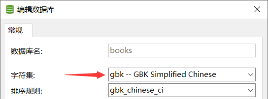

# DDL语言：库表管理

**DDL语言：数据定义语言，针对库和表结构的管理。**

### 语法特点

```sql
/*
库的管理
创建、修改、删除

表结构的管理
创建、修改、删除

创建：CREATE
修改：ALTER
删除：DROP
*/
```

### 库的管理

##### 库的创建

```sql
/*
语法：CREATE DATABASE【IF NOT EXISTS】库名;
说明：IF NOT EXISTS判断后面要新建的库是否已经存在。
*/
```

| 分类     | 详解                             |
| -------- | -------------------------------- |
| 基本语法 | `CREATE DATABASE 库名;`          |
| 示例     | `CREATE DATABASE test;`          |
| 示例说明 | 创建一个数库，数据库的名字为test |

```sql
-- 创建一个名称为books的数据库
CREATE DATABASE books;
```


如果再次运行上面SQL的建库语句会报错，因为books数据库已经存在，不能再次新建。


为了提高SQL的容错度，在新建库时，需要判断该库是否已经存在：

```sql
-- 如果books数据库不存在就新建，已存在就警告
CREATE DATABASE IF NOT EXISTS books;
```

##### 库的修改

库一旦建立以后建议不要再修改库，因为部分操作可能会导致库中数据的丢失。

```sql
-- 修改库的字符集
ALTER DATABASE books CHARACTER SET gbk;
```


刷新一下数据库，再次查看数据库字符集：



##### 库的删除

```sql
/*
语法：DROP DATABASE【IF EXISTS】库名;
说明：IF EXISTS判断后面的删除的数据库是否存在
*/
```

| 分类     | 详解                               |
| -------- | ---------------------------------- |
| 基本语法 | `DROP DATABASE 库名;`              |
| 示例     | `DROP DATABASE test;`              |
| 示例说明 | 删除一个数据库，数据库的名字为test |

```sql
-- 删除books数据库
DROP DATABASE IF EXISTS books;
```

运行后刷新，books书库已被删除，再次运行该SQL语句不会报错，因为在删除库前 `IF EXISTS` 会判断该库是否存在。


### 表的管理

##### 表的创建

| **分类** | **详解**                                                     |
| -------- | ------------------------------------------------------------ |
| 基本语法 | `CREATE TABLE 表名(字段名1 字段类型,....字段名n 字段类型n);` |
| 示例     | `CREATE TABLE user(username varchar(20),password char(32));` |
| 示例说明 | 创建一个表名叫user的表，第一个字段为username、字段类型为varchar，字符长度最大为20。第二个字段为password，类型为char，字符长度最大为32。 |

```sql
/*
语法：
CREATE TABLE【IF NOT EXISTS】表名(
    列名 列的类型【（长度） 约束】,
    列名 列的类型【（长度） 约束】,
    列名 列的类型【（长度） 约束】,
    ...
    列名 列的类型【（长度） 约束】
);


创建表的示例及说明：
create table user(
    id int auto_increment,
    name varchar(50) not null,
    money float not null, 
    province varchar(20) default null, 
    age tinyint unsigned not null, 
    sex tinyint not null, 
    primary key (id)
) engine= InnoDB default charset=utf8;
创建表user（
    id字段（int，自增类型）
    name字段（字符串（最大长度50），不能为空（必须有值））
    money字段（float，不能为空）
    province字段（字符串（最大长度20），默认为空（可以无值））
    age字段（int，无符号（没有负号即为正数），不能为空）
    sex字段（int，不能为空）
    主键索引id
）存储引擎 engine=InnoDB，指定字符集default charset=utf8
*/
```

表的创建案例：

```sql
-- 创建一张名称为book的表
CREATE TABLE book(
    id INT,
    bName VARCHAR(20),
    price DOUBLE,
    authorId INT,
    publishDate DATETIME
);

-- 创建一张名称为author的表
CREATE TABLE author(
    id INT,
    au_name VARCHAR(20),
    nation VARCHAR(10)
);
```


##### 表的修改

```sql
/*
ALTER TABLE 表名 ADD|DROP|MODIFY|CHANG COLUMN 列名 【列类型 约束】;
*/
```

表的修改案例：

```sql
-- 将book表中列名publishDate改为pubDate
ALTER TABLE book CHANGE COLUMN publishDate pubDate DATETIME;
```


```sql
-- 修改pubDate列的类型或约束
ALTER TABLE book MODIFY COLUMN pubDate DATE;
```


| **分类** | **详解**                                       |
| -------- | ---------------------------------------------- |
| 基本语法 | `ALTER TABLE 表名 ADD COLUMN 字段名 字段类型;` |
| 示例     | `ALTER TABLE user ADD COLUMN age INT;`         |
| 示例说明 | 添加一个字段为age，类型为整型                  |

| **分类** | **详解**                                                     |
| -------- | ------------------------------------------------------------ |
| 基本语法 | `ALTER TABLE 表名 ADD COLUMN 字段名 字段类型 AFTER 字段名;`  |
| 示例     | `ALTER TABLE user ADD COLUMN email varchar(60) AFTER createip;` |
| 示例说明 | user表中，在createip后增加一个字段为email，类型为varchar，长度为60 |

```sql
-- 给author表添加一个annual列
ALTER TABLE author ADD COLUMN annual DOUBLE;
```


```sql
-- 给author表删除一个annual列
ALTER TABLE author DROP COLUMN annual;
```


| **分类** | **详解**                              |
| -------- | ------------------------------------- |
| 基本语法 | `ALTER TABLE 旧表名 RENAME 新的表名;` |
| 示例     | `ALTER TABLE user RENAME new_user;`   |
| 示例说明 | 将user表名改为new_user                |

```sql
-- 修改author表名为book_author
ALTER TABLE author RENAME TO book_author;
```


##### 表的删除

| **分类** | **详解**           |
| -------- | ------------------ |
| 基本语法 | `DROP TABLE 表名;` |
| 示例     | `DROP TABLE user;` |
| 示例说明 | 删除user表         |

```sql
/*
DROP TABLE【IF EXISTS】表名;
IF EXISTS：如果存在
*/
```

表的删除案例：

```sql
-- 删除book_author表
DROP TABLE IF EXISTS book_author;
```


##### 表的复制

```sql
/*
表主要有两部分组成：表结构、表数据
*/
```

完整的表结构、表数据：

```sql
-- 创建一张名称为author的表
CREATE TABLE author(
    id INT,
    au_name VARCHAR(20),
    nation VARCHAR(10)
);

-- 向author表插入数据
INSERT INTO author VALUES
(1,'村上春树','日本'),
(2,'莫言','中国'),
(3,'冯唐','中国'),
(4,'金庸','中国');
```


```sql
-- 复制表结构
CREATE TABLE author_copy LIKE author;
```


```sql
-- 复制表的结构+表数据
CREATE TABLE author_copy2 SELECT * FROM author;
```


```sql
-- 复制表的部分结构+部分数据
CREATE TABLE author_copy3 SELECT au_name,nation FROM author;
```


```sql
-- 复制表的部分结构
CREATE TABLE author_copy4 SELECT au_name,nation FROM author WHERE 0;
```

