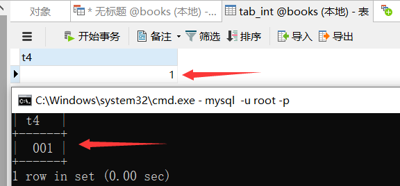

# DDL语言：类型约束

### 综合说明

##### 字段类型表

**字段类型：每个字段都有相应的数据类型，它限制（或容许）该列中存储的数据。如果列的数据类型为数值类型，则该列的存储只能为数字。**

类型说明：

|   类型   |   类型字符    |       字节        |                范围                 |
| :------: | :-----------: | :---------------: | :---------------------------------: |
|   整形   |    TINYINT    |       1字节       |              -128~127               |
|   整形   |   SMALLINT    |       2字节       |            -32768~32767             |
|   整形   |   MEDIUMINT   |       3字节       |          -8388608~8388607           |
|   整形   |      INT      |       4字节       |          +-2.14*10的9次方           |
|   整形   |    BIGINT     |       8字节       |          +-9.22*10的18次方          |
|  浮点型  |  FLOAT(m, d)  |       4字节       |      单精度，m总个数，d小数位       |
|  浮点型  | DOUBLE(m, d)  |       8字节       |      双精度，m总个数，d小数位       |
|  浮点型  | DECIMAL(m, d) |                   |     decimal是存储字符串的浮点数     |
|  字符型  |     CHAR      |     0-255字节     |             定长字符串              |
|  字符型  |    VARCHAR    |    0-65535字节    |             变长字符串              |
|  字符型  |   TINYBLOB    |     0-255字节     |    不超过255个字符的二进制字符串    |
|  字符型  |     BLOB      |    0-65535字节    |       二进制形式的长文本数据        |
|  字符型  |  MEDIUMBLOB   |  0-16777215字节   |    二进制形式的中等长度文本数据     |
|  字符型  |   LONGBLOB    | 0-4294967295字节  |      二进制形式的极大文本数据       |
|  字符型  |   TINYTEXT    |     0-255字节     |            短文本字符串             |
|  字符型  |     TEXT      |    0-65535字节    |             长文本数据              |
|  字符型  |  MEDIUMTEXT   |  0-16777215字节   |          中等长度文本数据           |
|  字符型  |   LONGTEXT    | 0-4294 967295字节 |            极大文本数据             |
|  字符型  | VARBINARY(M)  | 允许长度0-M个字节 | 不定长字节字符串，值的长度+1个字节  |
|  字符型  |   BINARY(M)   |         M         |  允许长度0-M个字节的定长字节字符串  |
| 时间类型 |     DATE      |       4字节       |       日期，格式：2014-09-18        |
| 时间类型 |     TIME      |       3字节       |        时间，格式：08:42:30         |
| 时间类型 |   DATETIME    |       8字节       | 日期时间，格式：2014-09-18 08:42:30 |
| 时间类型 |   TIMESTAMP   |       4字节       |   自动存储记录修改的时间，时间戳    |
| 时间类型 |     YEAR      |       1字节       |            年份1901~2155            |
| 复合类型 |      SET      |     集合类型      |      set(“m1”, “m2″, … ,“m63″)      |
| 复合类型 |     ENUM      |     枚举类型      |    enum(“m1″, “m2″, … ,“m65535″)    |

补充说明：

BINARY声音文件等二进制数据类型。

BLOB类型区分大小写，TEXT不区分大小写。

DECIMAL叫做定点数，在MySQL内部本质上是用字符串存储的。实际使用过程中如果存在金额、钱精度要求比较高的浮点数存储，建议使用DECIMAL类型。

CHAR类型用于定长字符串，并且必须在圆括号内用一个大小修饰符来定义。这个大小修饰符的范围从 0-255。比指定长度大的值将被截短，而比指定长度小的值将会用空格作填补。

VARCHAR把这个大小视为值的大小，长度不足的情况下不用空格补足，只使用存储字符串实际需要的长度，但长于指定的值仍然会被截短。

SET：“位”是创建有序元素集合的一种简单而有效的方式。在 SET 元素中值被存储为一个分离的“位”序列，这些“位”表示与它相对应的元素。SET类型可以从预定义的集合中取得任意数量的值。一个 SET 类型最多可以包含 64 项元素，并且它还去除了重复的元素，所以SET类型中不可能包含两个相同的元素。任何试图在 SET 类型字段中插入非预定义的值都会使MySQL插入一个空字符串。如果插入一个即有合法的元素又有非法的元素的记录，MySQL 只会保留合法的元素，除去非法的元素。若需从 SET 类型字段中找出非法的记录只需查找包含空字符串或二进制值为 0 的行。

ENUM：在系统内部可以存储为数字，并且从1开始用数字做索引。ENUM 类型因为只允许在集合中取得一个值，类似于单选项，即相互排拆的数据，比如性别。一个 ENUM 类型最多可以包含 65536 个元素，其中一个元素被 MySQL 保留，用来存储错误信息，这个错误值用索引 0 或者一个空字符串表示。ENUM 类型字段可以从集合中取得一个值或使用null值，除此之外的输入将会使 MySQL 在这个字段中插入一个空字符串。MySQL 认为 ENUM 类型集合中出现的值是合法输入，除此之外其它任何输入都将失败。这说明通过搜索包含空字符串或对应数字索引为 0 的行就可以很容易地找到错误记录的位置。ENUM 类型字段插入值的大小写与集合中值的大小写不匹配，MySQL会自动使用插入值的大小写转换成与集合中大小写一致的值。

##### 字段约束说明

**字段约束：字段还可以设置约束条件，例如有的字段不能为空。**

**UNSIGNED**(无符号)：**即没有负号，所有的数都为正数，主要用于整型和浮点类型，创建时在字段后接上UNSIGNED。无符号存储位数更长**，tinyint整型的取值区间为-128~127，而使用无符号后可存储0-255个长度。

**AUTO_INCREMENT**(自增)：**即自动增加，只用于整型**，可以设置起始值，默认为1，**常与PRIMARY KEY(主键)一起使用，建表时加上：`AUTO_INCREMENT=起始值 PRIMARY KEY`。**

**DEFAULT**(默认值)：**在没有值可用的时，赋予某个常量值**，这个值必须是常量，因为MySQL不允许插入函数或表达式值且无法用于BLOB或TEXT列。

**NULL**(空)：**列指定NULL属性时，该列可以为空，创建时在字段语句后接上：`NULL`**。null精确说法是“无”，而不是空字符串或0。

**NOT NULL**(不能为空)：**列指定NOT NULL属性时，该列不能为空，创建时在字段语句后接上：`NOT NULL`，**建议在重要情况下始终使用NOT NULL属性，因为它提供了一个基本验证，确保已经向查询传递了所有必要的值。

**ZEROFILL**(0填充)：**可以用来增补输出的值。使用这个修饰符可以阻止 MySQL 数据库存储负值。创建时在整型字段语句后接上：ZEROFILL**。

### 字段类型

##### 整形

| 类型 | 类型字符  | 字节  |                           范围                           |
| :--: | :-------: | :---: | :------------------------------------------------------: |
| 整形 |  TINYINT  | 1字节 |             有符号：-128~127   无符号：0~255             |
| 整形 | SMALLINT  | 2字节 |          有符号：-32768~32767   无符号：0~65535          |
| 整形 | MEDIUMINT | 3字节 |       有符号：-8388608~8388607   无符号：0~1677215       |
| 整形 |    INT    | 4字节 |   有符号：+-2.14乘10的9次方   无符号：+4.29乘10的9次方   |
| 整形 |  BIGINT   | 8字节 | 有符号：+-9.22乘10的18次方   无符号：+9.22乘10的9次方乘2 |

```sql
/*
特点：
    1.不设置有符号还是无符号，都默认为有符号。设置无符号需要添加UNSIGNED关键字。
    2.插入的数值超出了整型的范围，会报out of range异常错误。
    3.长度代表了显示的最大宽度，搭配ZEROFILL使用，当长度不够时，会用0在左边填充。不设置长度，会有默认的长度。
    4.当设置了ZEROFILL后，字段会自动添加UNSIGNED无符号属性约束。
    5.int(1)和int(11)表示意思是一样的，加上ZEROFILL后才会表现出不同。
*/
```

案例测试：

```sql
-- INT
INSERT INTO 表名 VALUES(1, -1) --都能插入成功

-- INT UNSIGNED（UNSIGNED属性约束，只能插入范围内的大于等于0的整数）
INSERT INTO 表名 VALUES(1, -1) --1能插入成功，-1插入会报错

-- INT(3) ZEROFILL（ZEROFILL属性约束，数字长度不足3位用0补足）
INSERT INTO 表名 VALUES(1) --实际插入001
```

!> 在Navicat中不会显示零填充。



##### 浮点型

|  类型  |   类型字符    | 字节  |            范围             |
| :----: | :-----------: | :---: | :-------------------------: |
| 浮点型 |  FLOAT(m, d)  | 4字节 |  单精度，m总个数，d小数位   |
| 浮点型 | DOUBLE(m, d)  | 8字节 |  双精度，m总个数，d小数位   |
| 浮点型 | DECIMAL(m, d) |       | decimal是存储字符串的浮点数 |

```sql
/*
分类：
1.浮点型
  FLOAT(M, D)
  DOUBLE(M, D)
2.定点型
  DECIMAL(M, D)

说明：
1.M：整数部位+小数部位，D：小数部位。
2.M和D都可以省略，如果是DECIMAL则M默认是10，D默认为0。
3.插入值的总位数超过M会报错，但如过没有超过M超过了D则会四舍五入后存入。
4.定点型的精度更高，如果插入值的精度较高如货币运算等考虑使用。
*/
```

##### 字符型

|  类型  |   类型字符   |       字节        |                范围                |
| :----: | :----------: | :---------------: | :--------------------------------: |
| 字符型 |     CHAR     |     0-255字节     |             定长字符串             |
| 字符型 |   VARCHAR    |    0-65535字节    |             变长字符串             |
| 字符型 |   TINYBLOB   |     0-255字节     |   不超过255个字符的二进制字符串    |
| 字符型 |     BLOB     |    0-65535字节    |       二进制形式的长文本数据       |
| 字符型 |  MEDIUMBLOB  |  0-16777215字节   |    二进制形式的中等长度文本数据    |
| 字符型 |   LONGBLOB   | 0-4294967295字节  |      二进制形式的极大文本数据      |
| 字符型 |   TINYTEXT   |     0-255字节     |            短文本字符串            |
| 字符型 |     TEXT     |    0-65535字节    |             长文本数据             |
| 字符型 |  MEDIUMTEXT  |  0-16777215字节   |          中等长度文本数据          |
| 字符型 |   LONGTEXT   | 0-4294 967295字节 |            极大文本数据            |
| 字符型 | VARBINARY(M) | 允许长度0-M个字节 | 不定长字节字符串，值的长度+1个字节 |
| 字符型 |  BINARY(M)   |         M         | 允许长度0-M个字节的定长字节字符串  |

```sql
/*
较短的文本：
  char
  varchar
较长的文本：
  text
  blob(较大的二进制)

char和varchar区别：
           写法         M含义                      特点     空间占用  效率 
  char     char(M)     最大字符数，默认为1，可以省略  固定长度  耗费      高
  varchar  varchar(M)  最大字符数，不可以省略        可变长度  节省      低
*/
```

##### 日期型

|   类型   | 类型字符  | 字节  |                范围                 |
| :------: | :-------: | :---: | :---------------------------------: |
| 时间类型 |   DATE    | 4字节 |       日期，格式：2014-09-18        |
| 时间类型 |   TIME    | 3字节 |        时间，格式：08:42:30         |
| 时间类型 | DATETIME  | 8字节 | 日期时间，格式：2014-09-18 08:42:30 |
| 时间类型 | TIMESTAMP | 4字节 |   自动存储记录修改的时间，时间戳    |
| 时间类型 |   YEAR    | 1字节 |            年份1901~2155            |

```sql
/*
分类：
date只保存日期
time只保存时间
year只保存年
datetime保存日期+时间
timestamp保存日期+时间

区别：
           字节   范围         时区影响
datetime   8     1000——9999   不受
timestamp  4     1970-2038    受
*/
```

拓展：

```sql
-- 显示当前时间（北京时间，东八区）
SELECT NOW() '当前时间';            -- 2020-12-29 23:38:36

-- 显示当前时区
SHOW VARIABLES LIKE 'time_zone';  -- system

-- 设置东九区时间
SET time_zone='+9:00';     
SHOW VARIABLES LIKE 'time_zone';  -- +9:00

-- 显示当前时间（东九区）
SELECT NOW() '当前时间';           -- 2020-12-30 00:38:36
```

##### 复合型

|   类型   | 类型字符 |   字节   |             范围              |
| :------: | :------: | :------: | :---------------------------: |
| 复合类型 |   SET    | 集合类型 |   set(“m1”, “m2″, … ,“m63″)   |
| 复合类型 |   ENUM   | 枚举类型 | enum(“m1″, “m2″, … ,“m65535″) |

```sql
/*
ENUM类型：又称为枚举类型，要求插入的值必须属于列表中指定的值之一。
  如果列表成员为1~255，则需要1歌字节存储
  如果列表成员为255~65535，则需要2个字节存储，最多需要65535个成员
SET类型：和ENUM类型类似，里面可以保存0~64个成员。

区别：ENUM类型一次只能插入一个成员，SET类型一次能插入多个成员。
*/
```

案例测试：

```sql
DROP TABLE IF EXISTS tab_enum;
CREATE TABLE tab_enum (
  test ENUM('a', 'b', 'c')
);
INSERT INTO tab_enum VALUES('a'); -- 成功插入值'a'
INSERT INTO tab_enum VALUES('A'); -- 成功插入值'a'（不区分大小写）
INSERT INTO tab_enum VALUES('m'); -- 不在枚举列表中，因此不能插入值'm'

DROP TABLE IF EXISTS tab_set;
CREATE TABLE tab_set (
  test SET('a', 'b', 'c')
);
INSERT INTO tab_set VALUES('a'); -- 成功插入值'a'
INSERT INTO tab_set VALUES('A'); -- 成功插入值'a'（不区分大小写）
INSERT INTO tab_set VALUES('a,c'); -- 成功在同一字段同一记录中插入值'a,c'
```

### 字段约束

##### 字段约束简介

```sql
/*
作用：一种用于限制表中的数据规则，为了保证表中的数据的准确性和可靠性。

分类：六大约束
  NOT NULL：非空，保证该字段的值不能为空（例如：姓名）
  DEFAULT：默认值，保证该字段有默认值（例如：性别）
  PRIMARY KEY：主键，保证该字段的值具有唯一性，并且非空（例如：学号）
  UNIQUE：唯一，保证该字段的值具有唯一性，可以为空（例如：座位号）
  CHECK：检查约束【MySQL中不支持】（比如：年龄）
  FOREIGN KEY：外键，用于限制两个表的关系，保证该字段的值必须来自于主表的关联列的值，在从表添加外键约束，用于引用主表中某列的值

主键和唯一的区别：
      唯一性   允许空值   允许多个     允许组合使用
主键    是       否      最多一个     可以，不推荐
唯一    是       是      可以多个     可以，不推荐

添加约束：
  1.创建表时
  2.修改表时

约束的添加分类：
  列级约束：
    六大约束语法上都支持，但外键约束没有效果
  表级约束：
    除了非空、默认，其他的都支持
*/
```

##### 添加约束

```sql
/*
建表添加约束：
语法：直接在字段名和类型后面追加约束类型即可。
只支持：默认、非空、主键、唯一
不支持：外键

添加表级约束：
语法：在各个字段的最下面对字段名添加约束。
CONSTRAINT 约束名 约束类型(字段名)
注意：约束名就是为约束起别名，约束名不能重复。
注意：主键其约束名无效
*/
```

建表添加约束：

```sql
CREATE TABLE IF NOT EXISTS major(
  id INT PRIMARY KEY,
  majorname VARCHAR(20)
);

CREATE TABLE IF NOT EXISTS stuinfo(
  id INT PRIMARY KEY, -- 主键
  stuname VARCHAR(20) NOT NULL, -- 非空
  gender CHAR(1) CHECK(gender='男' OR gender='女'), -- 检查
  seat INT UNIQUE, -- 唯一
  age INT DEFAULT 18, -- 默认
  majorid INT REFERENCES major(id) -- 外键（这里不支持）
);
```

添加表级约束：

```sql
CREATE TABLE IF NOT EXISTS stuinfo(
  id INT,
  id2 INT,
  stuname VARCHAR(20) NOT NULL,
  gender CHAR(1),
  seat INT,
  age INT,
  majorid INT,
    
  CONSTRAINT pk PRIMARY KEY(id, id2), -- 联合主键
  CONSTRAINT uq UNIQUE(seat), -- 唯一键
  CONSTRAINT ck CHECK(gender='男' OR gender='女'), -- 检查
  CONSTRAINT fk_stuinfo_major FOREIGN KEY(majorid) REFERENCES major(id) -- 外键
);
```

##### 外键

```sql
/*
1、要求在从表设置外键关系
2、从表的外键列的类型和主表的关联列的类型要求一致或兼容，名称无要求
3、主表的关联列必须是一个key（一般是主键或唯一）
4、插入数据时，先插入主表，在插入从表；删除数据时，先删除从表，在删除主表
*/
```

