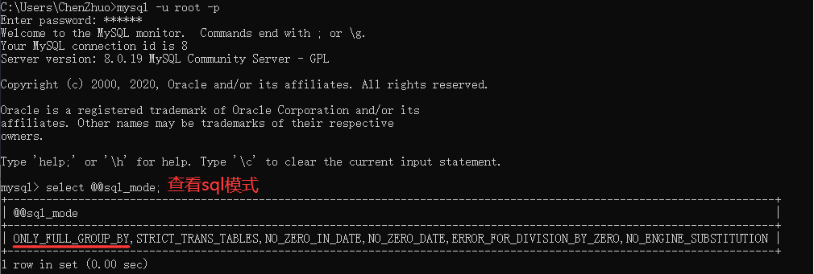
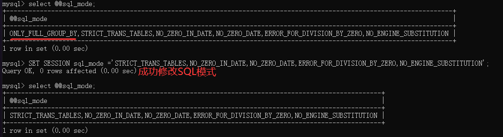
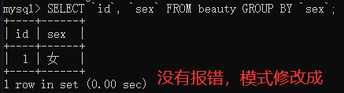

# 常见问题

## 操作卡死

在MySQL当中，如果频繁的执行修改或者删除操作，那么可能会导致表被锁死，造成假死现象。即使用Navicat等连接工具操作，也是卡住无响应。其原因在于：**表被锁死，process被卡住，同时也会导致后面执行命令的process处于waiting状态。**

解决办法：干掉process，重启MySQL服务。

```
# 在命令行中进入MySQL
mysql -u root -p （回车输入密码）
# 输入命令列出当前的操作process
show full processlist;
# 如果有很多waiting的process，说明process卡住了，根据id号杀死这些process！
kill processid;（kill 3301，就会将id为3301的process杀死）
# 停止MySQL服务
net stop mysql
# 启动MySQL服务
net start mysql
```

## 日志占用过大

在MySQL中有一个强大的日志系统，例如UPDATE一个表，或者DELETE一些数据，即使该语句没有匹配的数据，这个命令也会存储到日志文件中，还包括每个语句执行的时间，也会记录进去的。这就会导致一个问题，就是使用MySQL的时间越长日志文件越来越大，如果不定期清理日志文件，就会占用非常多的空间资源。

解决方法一：每隔一段时间清除一次日志文件。

```
# 在命令行中进入MySQL
mysql -u root -p （回车输入密码）
# 清除日志文件
reset master;
```

解决方法二：不生成日志文件（Windows中修改my.ini文件，Linux中修改m.cnf文件）。

```
# 在配置文件中把'log-bin=mysql-bin'这条注释掉即可，即前面加上'#'号，没有则不管
# log-bin=mysql-bin
```

## SQL模式

为了深入理解SQL模式，现有名称为 `beauty` 的表格如下：

|  id  |   name   | sex  |
| :--: | :------: | :--: |
|  1   |   杨幂   |  女  |
|  2   | 迪丽热巴 |  女  |

我们现在按 `sex` 字段来分组，会得到如下结果：

```sql
SELECT `sex` FROM beauty GROUP BY `sex`;
```

| sex  |
| :--: |
|  女  |

我们现在按 `sex` 字段来分组，得到每组最大的 `id` 号，结果如下：

```sql
SELECT MAX(id), `sex` FROM beauty GROUP BY `sex`;
```

|  id  | sex  |
| :--: | :--: |
|  2   |  女  |

假如我们去掉上面 `MAX` 函数，直接输出 `id` 号，执行该语句会报错：

```sql
SELECT id, `sex` FROM beauty GROUP BY `sex`;
/*
1055 - Expression #1 of SELECT list is not in GROUP BY clause and contains nonaggregated column 'girls.beauty.id' which is not functionally dependent on columns in GROUP BY clause; this is incompatible with sql_mode=only_full_group_by
*/
```

同样的，将查询的 `id` 字段修改为 `name` 字段，也会出现同样的错误：

```sql
SELECT `name`, `sex` FROM beauty GROUP BY `sex`;
/*
1055 - Expression #1 of SELECT list is not in GROUP BY clause and contains nonaggregated column 'girls.beauty.id' which is not functionally dependent on columns in GROUP BY clause; this is incompatible with sql_mode=only_full_group_by
*/
```

原因是我们的SQL不规范造成的，因为 `GROUP BY` 之后，返回的一些数据是不确定的，所以才会出现这个错误。在学习分组查询时，我们也讲过**除聚集计算语句外，SELECT语句中的每个列都必须在GROUP BY子句中给出。**

更深层次的原因在于，我们的SQL模式开启了 `ONLY_FULL_GROUP_BY` 状态：

```sql
-- 输入密码登录MySQL
mysql -u root -p
-- 查看sql模式
select @@sql_mode;
```



其实面对这样的错误，解决有许多。

方法一：给不在GROUP BY子句的字段添加 `ANY_VALUE()` 方法。

```sql
SELECT ANY_VALUE(id), `sex` FROM beauty GROUP BY `sex`;
```

|  id  | sex  |
| :--: | :--: |
|  1   |  女  |

```sql
SELECT ANY_VALUE(`name`), `sex` FROM beauty GROUP BY `sex`;
```

| name | sex  |
| :--: | :--: |
| 杨幂 |  女  |

方法二：去掉 `ONLY_FULL_GROUP_BY` 重新设置SQL模式，修改后不用重启MySQL就生效。

```sql
SET SESSION sql_mode ='STRICT_TRANS_TABLES,NO_ZERO_IN_DATE,NO_ZERO_DATE,ERROR_FOR_DIVISION_BY_ZERO,NO_ENGINE_SUBSTITUTION';
```



方法三：配置文件中添加 `sql_mode`（Windows中修改my.ini文件，Linux中修改m.cnf文件），重启MySQL服务后生效。

```
sql_mode='STRICT_TRANS_TABLES,NO_ZERO_IN_DATE,NO_ZERO_DATE,ERROR_FOR_DIVISION_BY_ZERO,NO_ENGINE_SUBSTITUTION';
```


