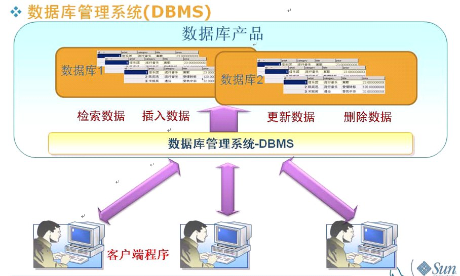
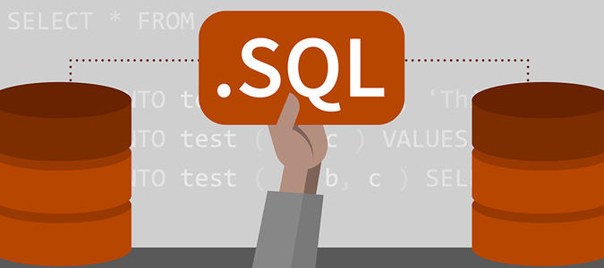
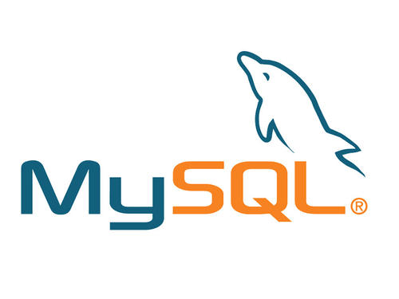
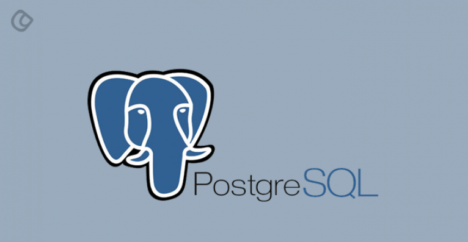
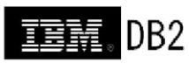
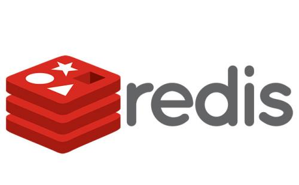

# 数据库

本知识库主要是讲解数据库的基本知识。

### 数据库简介

现代社会，我们生活的方方面面都离不开数据，数据来源于哪？数据来源于我们生活的每时每刻。数据对于互联网企业来说就是生存的土壤，其重要性不言而喻，那么如何保存和管理数据就显得额外重要了。

方案一：通过集合、数组来保存数据。

分析一：**集合、数组来保存数据没有问题，但是这些数据都是在内存当中的，而内存有一个特点，就是断电即丢失，不能持久化保存。**

方案二：通过文件来保存数据。

分析二：**文件能持久化保存数据，但当要进行数据查询、数据管理就不是很方便了。**

方案三：通过数据库保存数据。

分析三：**数据库能持久化保存数据，而且还能通过数据库管理系统来便捷的管理数据。**

而且针对数据还衍生了一系列的互联网岗位，例如：爬虫工程师、数据库管理员、数据分析师...，而这些岗位的一个共同基础就是数据库，可见学好数据库是走向互联网岗位的关键也是基础的一步。

##### 数据库应用

我们所有见到的跟日常生活有关、需要记录的信息基本全部放在数据库里面：

1. 身份证信息放在公安部的系统
2. 银行卡的余额和交易记录、转帐信息
3. 在酒店的开房信息（所以出现了数据库被盗和信息泄漏）
4. 飞机、火车、汽车联网购票记录
5. QQ聊天记录、网上购物、贴吧、喜欢听的音乐、电影的收藏信息
6. 手机电话机录、余额、公交卡余额、水费、电费、彩票的购买记录
7. 打游戏的装备、等级、魔力、力量、攻击能力等信息

##### 专业术语

**数据库(DataBase，简称DB)：能持久化保存有组织的数据的容器。**理解数据库的最简单的办法是将数据库想象为一个文件柜。


**数据库管理系统(数据库软件，简称DBMS)：人们通常用数据库这个术语来代表他们使用的数据库软件，这是不正确的，因为你并不直接访问数据库，你使用的是DBMS，它替你访问数据库。**例如MySQL准确讲就是一种数据库管理系统。



**数据库管理员**(Database Administrator，简称**DBA**)：是从事管理和维护数据库管理系统(DBMS)的相关工作人员的统称，属于运维工程师的一个分支，主要负责业务数据库从设计、测试到部署交付的全生命周期管理。核心目标是保证数据库管理系统的稳定性、安全性、完整性和高性能。


**结构化查询语言(简称SQL)：专门用来与数据库通信的语言。**

1. SQL语言简单易学。
2. SQL语言不是某个特定数据库的专有语言，**几乎所有DBMS都支持SQL**。
3. SQL语言灵活使用其语言元素，可以进行非常复杂和高级的数据库操作。



**ACID特性：指数据库事务正确执行的四个基本要素的缩写。**

​	原子性 - A：要么全做，要么不做

​	一致性 - C：事务前后的系统状态是一致的

​	隔离性 - I：并发执行的事物无法看到彼此的中间状态

​	持久性 - D：事务完成后所做的改变都会被持久化

### 常见及分类

##### 常见数据库

**MySQL**：由瑞典MySQL AB 公司开发一个**关系型数据库管理系统**。由于其体积小、速度快、总体拥有成本低，尤其是开放源码这一特点，一般中小型网站的开发都选择其作为网站数据库，是目前最流行的关系型数据库管理系统之一。



**SqlServer**：由Microsoft开发和推广的**关系型数据库管理系统**。一个可扩展的、高性能的、为分布式客户机/服务器计算所设计的数据库管理系统，实现了与WindowsNT的有机结合，提供了基于事务的企业级信息管理系统方案。注意：只能安装在Windows操作系统上。


**SQLite**：是一款遵守ACID的轻型的**关系型数据库管理系统**，它包含在一个相对小的C库中。它是D.RichardHipp建立的公有领域项目。它的设计目标是嵌入式的，而且已经在很多嵌入式产品中使用了它，它占用资源非常的低，在嵌入式设备中，可能只需要几百K的内存就够了。


**PostgreSQL**：是加州大学计算机系开发的一种特性非常齐全的自由软件的对象-**关系型数据库管理系统**。PostgreSQL支持大部分的SQL标准并且提供了很多其他现代特性，如复杂查询、外键、触发器、视图、事务完整性、多版本并发控制等。同样，PostgreSQL也可以用许多方法扩展，例如通过增加新的数据类型、函数、操作符、聚集函数、索引方法、过程语言等。



**Oracle**：是甲骨文公司的一款**关系型数据库管理系统**。其系统可移植性好、使用方便、功能强、效率高、可靠性好、适应高吞吐量，但总体拥有成本较贵，一般大型企业在使用。


**DB2**：是美国IBM公司开发的一套**关系型数据库管理系统**。主要应用于大型应用系统，具有较好的可伸缩性，可支持从大型机到单用户环境，应用于所有常见的服务器操作系统平台下，主要的运行环境为UNIX（包括IBM自家的AIX）、Linux、IBM i（旧称OS/400）、z/OS，以及Windows服务器版本。



**MongoDB**：是一个由C++语言编写基于分布式文件存储的**非关系数据库**。其功能丰富，支持的数据结构非常松散，是类似json的bson格式，因此可以存储比较复杂的数据类型。而且它支持的查询语言非常强大，其语法有点类似于面向对象的查询语言，几乎可以实现类似关系数据库单表查询的绝大部分功能，而且还支持对数据建立索引。


**Redis**：一个开源的使用C语言编写、支持网络、**可基于内存亦可持久化的日志型、高性能的Key-Value数据库。**由于其数据放在内存，因此读写非常快（辅助存储用作缓存，也可持久存储），但对内存要求高。



##### 关系型数据库

关系型数据库（SQL）： MySQL，SQL server，SQLite，Oracle（收费）

特性：

1. 关系型数据库，是指采用了关系模型来组织数据的数据库； 
2. 关系型数据库的最大特点就是事务的一致性；
3. 关系模型指二维表格模型， 而一个关系型数据库就是由二维表及其之间的联系所组成的一个数据组织。

优点：

1. 容易理解：二维表结构是非常贴近逻辑世界一个概念，关系模型相对网状、层次等其他模型来说更容易理解；
2. 使用方便：通用的SQL语言使得操作关系型数据库非常方便；
3. 易于维护：丰富的完整性大大减低了数据冗余和数据不一致的概率；
4. 支持SQL，可用于复杂的查询。

缺点：

1. 为了维护一致性所付出的巨大代价就是其读写性能比较差；
2. 固定的表结构；
3. 高并发读写需求；
4. 海量数据的高效率读写；

##### 非关系型数据库

非关型数据库（NoSQL）：Redis，MongoDB，HBase

特性：

1. 使用键值对存储数据； 
2. 读写性能高、成本低、分布式； 
3. 一般不支持ACID特性； 
4. 非关系型数据库严格上不是一种数据库，应该是一种数据结构化存储方法的集合。

优点：

1. 无需经过sql层的解析，读写性能很高； 
2. 基于键值对，数据没有耦合性，容易扩展； 
3. 存储数据的格式是key,value形式、文档形式、图片形式等等，而关系型数据库则只支持基础类型。

缺点：

1. 不提供sql支持，学习和使用成本较高；
2. 无事务处理，附加功能bi和报表等支持也不好；

##### 类型区别

关系型数据库和非关系型数据库最大的区别就是能不能使用外键，**能使用外键则是关系型数据库，不能使用外键则是非关系型数据库。**

?> 外键就是关联一个数据集和另一个数据集之间的纽带。

##### 语言区别

在结构化查询语言上的含义区别：

| SQL         | NoSQL       | 解释（SQL/NoSQL）      |
| ----------- | ----------- | ---------------------- |
| database    | database    | 数据库/数据库          |
| table       | collection  | 二维表/集合            |
| row         | document    | 记录（行）/文档        |
| column      | field       | 字段（列）/域          |
| index       | index       | 索引/索引              |
| table joins | ---         | 表连接/嵌套文档        |
| primary key | primary key | 主键/主键（`_id`字段） |

##### 默认端口

```
# MySQL默认端口3306
MYSQL_PORT = 3306

# MongoDB默认端口27017
MONGO_PORT = 27017

# Rrdis默认端口6379
REDIS_PORT = 6379
```

