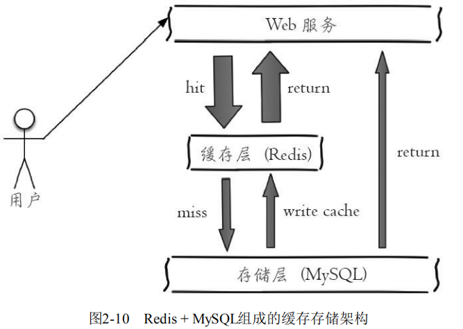

# Redis简介与安装

## Redis简介

**Redis是一种基于键值对[丰富的数据结构]、单线程+内存[高性能]、持久化、分布式、开源的非关系型（NoSQL）数据库。**同时Redis本身非常稳定，已经得到业界的广泛认可和使用。掌握Redis已经逐步成为开发和运维人员的必备技能之一。

### 数据结构

**Redis是一种基于键值对（key-value）格式来存储数据的，即一个键对应一个值**，也正由于这种存储格式，可以让Redis拥有丰富的数据结构，Redis中的值可以是由string（字符串）、hash（哈希）、 list（列表）、set（集合）、zset（有序集合）、Bitmaps（位图）、 HyperLogLog、GEO（地理信息定位）等多种数据结构和算法组成，因此 Redis可以满足很多的应用场景。

### 高性能

**Redis将所有数据都存放在内存中，所以它的读写性能非常惊人**，官方给出的数字是读写性能可以达到10万/秒，当然这也取决于机器的性能。

**Redis使用了单线程架构，避免了多线程可能产生的竞争问题。**

**Redis是用C语言实现的**，一般来说C语言实现的程序“距离”操作系统更近，执行速度相对会更快。

### 持久化

通常看，将数据放在内存中是不安全的，一旦发生断电或者机器故障， 重要的数据可能就会丢失，因此Redis提供了两种持久化方式：RDB（快照）和 AOF（日志），将内存的数据保存到硬盘中，保证数据的可持久性。


### 分布式

**Redis提供了复制功能，实现了多个相同数据的Redis副本，复制功能是分布式Redis的基础。**

Redis从2.8版本正式提供了高可用实现Redis Sentinel，它能够保证Redis 节点的故障发现和故障自动转移。Redis从3.0版本正式提供了分布式实现 Redis Cluster，它是Redis真正的分布式实现，提供了高可用、读写和容量的扩展性。 


### 简单稳定

Redis的简单主要表现在三个方面：

1. Redis的源码很少，大概5万行左右，相对于很多NoSQL数据库来说代码量相对要少很多，也就意味着普通的开发和运维人员完全可以“吃透”它。
2. Redis使用单线程模型，这样不仅使得Redis服务端处理模型变得简单，而且也使得客户端开发变得简单。
3. Redis不需要依赖于操作系统中的类库，自己就实现了事件处理的相关功能。

### 使用场景

**用作缓存**： 合理地使用缓存不仅可以加快数据的访问速度，而且能够有效地降低后端数据源的压力。Redis提供了键值过期时间设置，并且也提供了灵活控制最大内存和内存溢出后的淘汰策略。可以这么说，一个合理的缓存设计能够为一个网站的稳定保驾护航。

**消息队列系统**：消息队列系统可以说是一个大型网站的必备基础组件，因为其具有业务解耦、非实时业务削峰等特性。Redis提供了发布订阅功能和阻塞队列的功能，虽然和专业的消息队列比还不够足够强大，但是对于一般的消息队列功能基本可以满足。

**计数器应用**： 例如视频播放数、网店浏览数，为了保证数据的实时性，每一次播放和浏览都要做加1的操作，如果并发量很大对于传统关系型数据的性能是一种挑战。Redis天然支持计数功能而且计数的性能也非常好，可以说是计数器系统的重要选择。

### 合理运用

实际上和任何一门技术一样，每个技术都有自己的应用场景和边界，Redis并不是万金油，有很多适合它解决的问题，但是也有很多不合适它解决的问题。

**站在数据规模的角度看，数据可以分为大规模数据和小规模数据。**我们知道Redis的数据是存放在内存中的，虽然现在内存已经足够便宜，但是如果数据量非常大，例如每天有几亿的用户行为数据，使用Redis来存储的话，基本上是个无底洞，经济成本相当的高。

**站在数据冷热的角度看，数据分为热数据和冷数据，热数据通常是指需要频繁操作的数据，反之为冷数据。**例如对于视频网站来说，视频基本信息在业务线都是经常要操作的数据，而用户的观看记录不一定是经常需要访问的数据，单纯站在数据冷热的角度上看，视频信息属于热数据，用户观看记录属于冷数据。如果将这些冷数据放在Redis中，基本上是对于内存的一种浪费，但是对于一些热数据可以放在Redis中加速读写，也可以减轻后端存储的负载，可以说是事半功倍。

### 储存服务

**目前大多数公司的存储都是MySQL + Redis：其中MySQL作为主存储，Redis作为辅助存储被用作缓存，加快访问读取的速度，提高性能。**因为Redis对内存要求比较高，而且存储容量肯定要比磁盘少很多，要存储大量数据，只能花更多的钱去购买内存，在一些不需要高性能的地方造成浪费，因此不能把所有数据都放在Redis，MySQL偏向于存数据，Redis偏向于快速取数据，最好把热门数据放Redis，基本数据放MySQL。**由于Redis具有支撑高并发的特性，所以缓存通常能起到加速读写和降低后端压力的作用。**



### Web服务

一个分布式Web服务将用户的Session信息（例如用户登录信息）保存在各自服务器中，这样会造成一个问题，出于负载均衡的考虑，分布式服务会将用户的访问均衡到不同服务器上，用户刷新一次访问可能会发现需要重新登录，这个问题是用户无法容忍的。


为了解决这个问题，可以使用Redis将用户的Session进行集中管理，在这种模式下只要保证Redis是高可用和扩展性的，每次用户更新或者查询登录信息都直接从Redis中集中获取。


## Redis安装

Redis的作者没有开发和维护针对Windows用户的Redis版本，但是Redis作为一款优秀的开源技术吸引到了微软公司的注意，微软公司的开源技术组在GitHub上维护一个Redis的分支：https://github.com/MicrosoftArchive/redis/tags

### zip压缩包安装

下载zip压缩包


打开解压文件


解压到自定义的位置


将解压路径手动添加到“环境变量”


最后**在命令行内进入redis解压目录**，输入下面命令安装Redis服务，完成redis安装

``` 
Redis-server.exe --service-install redis.windows.conf --service-name Redis --loglevel verbose
```

查看Redis服务


### mis文件安装

下载mis文件


双击打开文件


勾选 `I accept...`，点击Next


填写安装路径，勾选 `Add the...` 将路径添加到环境变量中，点击Next


设置 Redis 的服务端口，默认为 **6379**，点击 Next


设置 Max Memory(指定 Redis 最大内存限制)，然后 Next 进入安装

如果 Redis 作为临时缓存那就得看自己的需要设置了。

如果 Redis 作为数据库使用，就不要设置这个选项，因为数据库是不能容忍丢失数据的。


点击Install完成安装


查看Redis服务

