# 启动、连接、配置、关闭

Redis的安装文件如下：

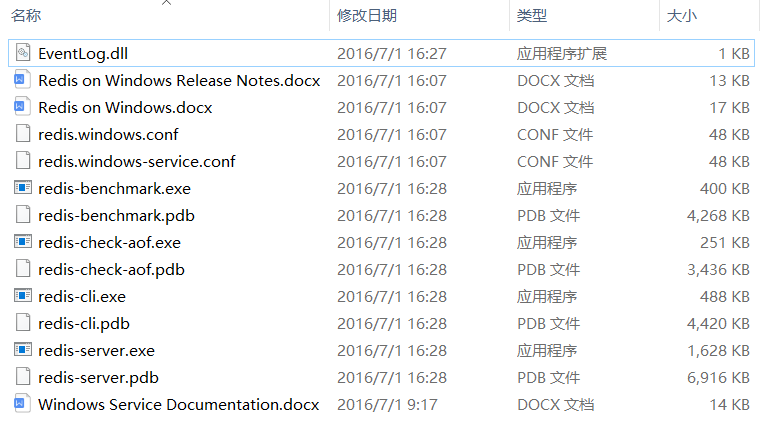

Redis开头可执行文件，称之为Redis Shell，这些可执行文件可以做很多事情，例如：启动和停止Redis、检测和修复Redis的持久化文件，还可以检测Redis的性能。

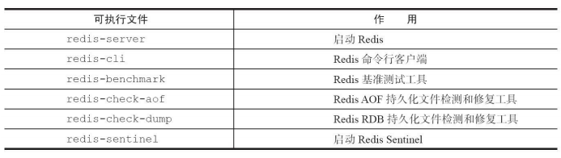

### 启动

有三种方法启动Redis：默认启动、配置启动、文件启动。

##### 默认启动

在命令行输入下面命令采用默认配置来启动Redis：

```
redis-server
```

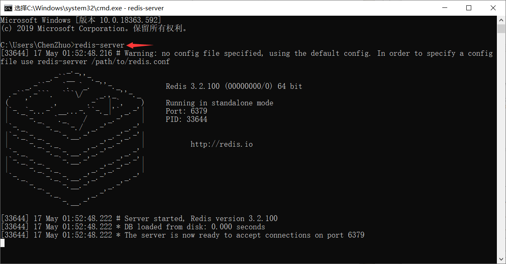

可以看到直接使用redis-server启动Redis后，会打印出一些日志，通过日志可以看到一些信息：

1. 当前的Redis版本的是3.2.100
2. Redis的默认端口是6379
3. 进程ID是33644

!> 因为直接启动无法自定义配置，所以这种方式是不会在生产环境中使用的。

##### 配置启动

redis-server加上要修改配置名和值（可以是多对），没有设置的配置将使用默认配置。

例如，如果要用6380作为端口启动Redis，那么可以执行：

```
redis-server --port 6380
```

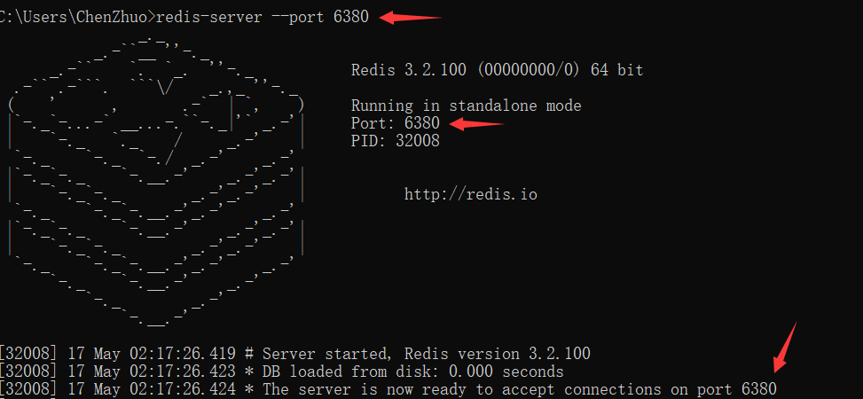

!> 虽然运行配置可以自定义配置，但是如果需要修改的配置较多或者希望将配置保存到文件中，不建议使用这种方式。

##### 文件启动

第一种启动方式的界面有一行提示：`没有读配置文件redis.conf`

```
# Warning: no config file specified, using the default config. In order to specify a config file use redis-server /path/to/redis.conf
```

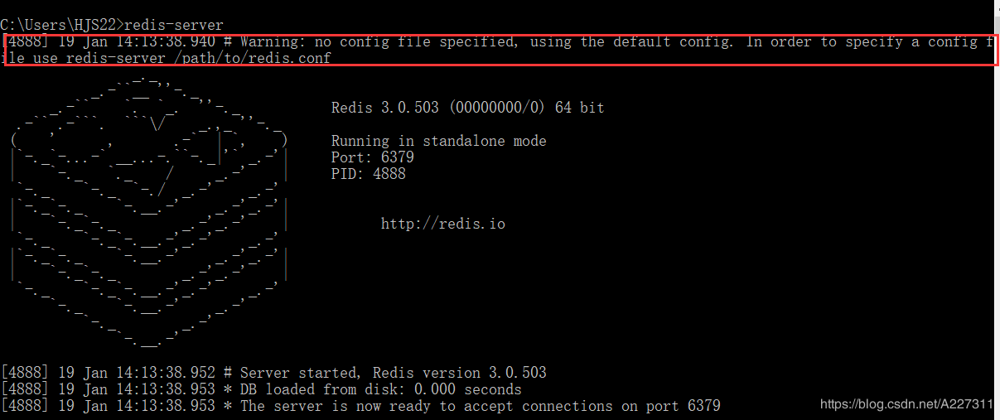

**Redis的配置文件 `redis.conf` 是在Linux系统下名称，在Windows系统下配置文件名称就是 `redis.windows.conf`。**

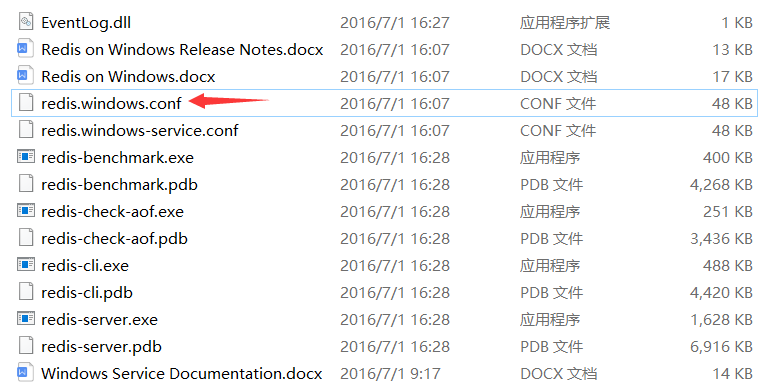

将配置写到指定文件里，例如我们将配置写到了 `redis.windows.conf` 中，那么只需要执行如下命令即可启动Redis：

```
redis-server "路径\redis.windows.conf"
```

!> 注意路径要带上 `"` 双引号。

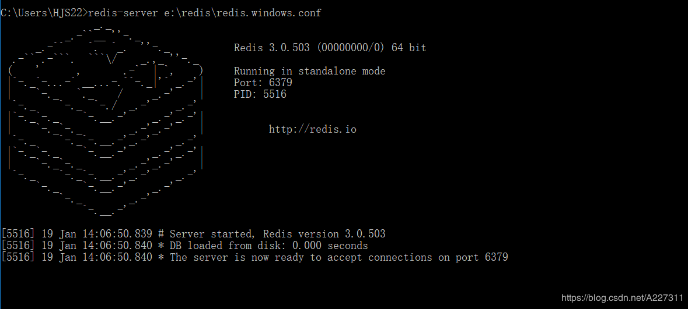

Redis有60多个配置，这里只给出一些重要的配置：


?> 假如一台机器上启动多个Redis，通过配置文件启动的方式提供了更大的灵活性，所以大部分生产环境会使用这种方式启动Redis。

### 连接

##### 交互式方式

现在我们已经启动了Redis服务，**后面要确保Redis服务的窗口一直处于运行状态（不关闭状态），否则后面的操作将无效**，接下来使用 `redis-cli` 连接Redis服务器。

**在Redis服务的窗口处于运行状态下，再启动一个命令行**，输入下面命令连接Redis服务器：

```
redis-cli -h 127.0.0.1 -p 6379 -a password
```

- -h参数：主机地址，默认连接127.0.0.1；

- -p参数：Redis端口，默认6379；
- -a参数：如果Redis配置了密码，就要用这个选项进行密码登录；

**如果-h和-p和-a都没写就是连接 `127.0.0.1:6379` 这个没有密码的Redis实例。**

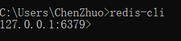

##### 通信测试

 PING命令：通常用于测试与服务器的连接是否仍然生效，或者用于测量延迟值。

使用客户端向 Redis 服务器发送一个 PING ，如果服务器运作正常的话，会返回PONG ，否则返回一个连接错误。

```
127.0.0.1:6379> ping
PONG
```

### 配置

##### 设置密码

设置redis的密码：

```
127.0.0.1:6379> config set requirepass 密码
```

查看设置的密码：

```
127.0.0.1:6379> config get requirepass
```

验证密码和进行身份验证：

```
127.0.0.1:6379> auth 密码
```

示例：

```
127.0.0.1:6379> config set requirepass 123456
OK

127.0.0.1:6379> config get requirepass
1) "requirepass"
2) "123456"

127.0.0.1:6379> auth 111111
(error) ERR invalid password

127.0.0.1:6379> auth 123456
OK
```

这样Redis的密码就设置好了，但是这样的设置方式有一个缺点就是：**当Redis服务重启以后，以前设置的密码就失效了，又变回了没有密码的Redis。**解决这一问题的办法是：**将密码写进配置文件 `redis.windows.conf` 中，启动Redis时，采用文件启动的方式。**

打开 `redis.windows.conf`，修改文件中内容，**将 `# requirepass foobared` 去掉前面的注释 `#` 并将内容修改为 `requirepass 密码`。**

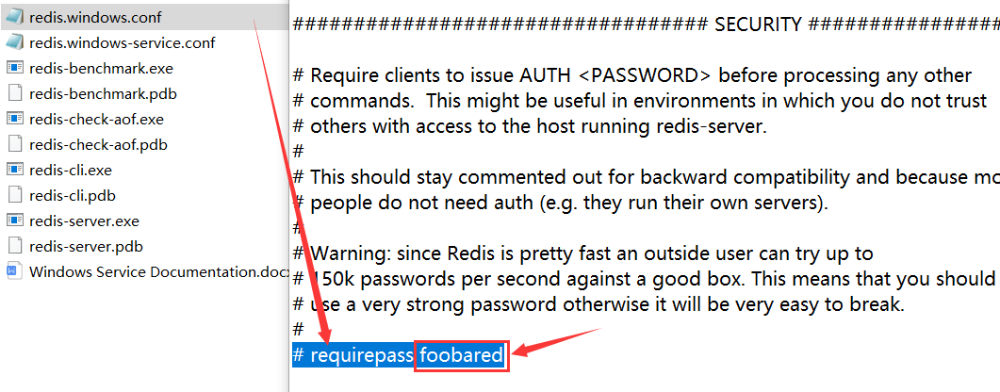

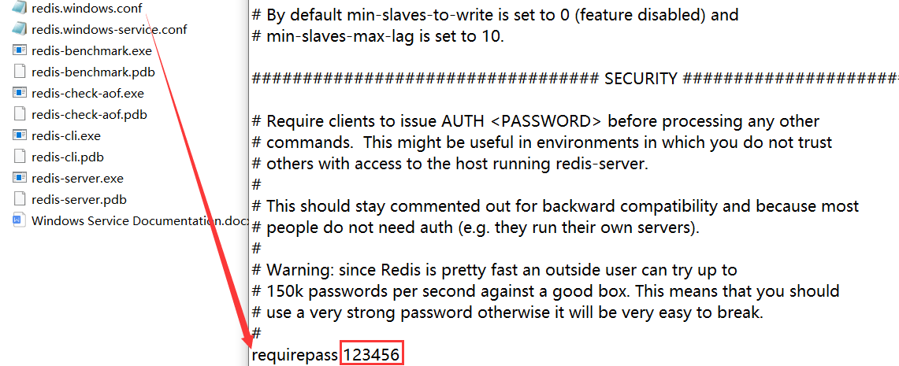

这里用文件启动的方式来启动Reids：

```
redis-server "路径\redis.windows.conf"
```

!> 这里必须时文件启动，否则默认的启动方式是不会使用密码的。

连接Reids，因为是本地就使用默认端口和地址，但密码参数 `-a` 需要加上：

```
redis-cli -a 密码
```

如果直接使用 `redis-cli` 命令连接Redis，也能连上只不过查询不了里面的数据，因为没有身份认证：

```
C:\Users\ChenZhuo>redis-cli

127.0.0.1:6379> keys *
(error) NOAUTH Authentication required.
```

使用 `auth` 命令，通过身份认证后，便可以查询数据了：

```
127.0.0.1:6379> auth 123456
OK

127.0.0.1:6379> keys *
1) "a"
```

##### redis-server参数

- **redis-server--test-memory可以用来检测当前操作系统能否稳定地分配指定容量的内存给Redis，通过这种检测可以有效避免因为内存问题造成Redis崩溃。**

```
redis-server --test-memory 1024
```

​	整个内存检测的时间比较长。当输出passed this test时说明内存检测完毕：

```
Please keep the test running several minutes per GB of memory. 
Also check http:// www.memtest86.com/ and http:// pyropus.ca/software/memtester/ 
................忽略检测细节................ 
Your memory passed this test. 
Please if you are still in doubt use the following two tools: 
1) memtest86: http:// www.memtest86.com/ 
2) memtester: http:// pyropus.ca/software/memtester/
```

?> 通常无需每次开启Redis实例时都执行--test-memory选项，该功能更偏向于调试和测试，例如，想快速占满机器内存做一些极端条件的测试，这个功能是一个不错的选择。 

##### redis-cli参数

redis-cli还有其他的一些参数：

- **-r（repeat）选项代表将命令执行多次，例如下面操作将会执行三次ping命令**：

  ```
  redis-cli -r 3 ping 
  PONG 
  PONG 
  PONG
  ```

- **-i（interval）选项代表每隔几秒执行一次命令，但是-i选项必须和-r选项一起使用**，下面的操作会每隔1秒执行一次ping命令，一共执行5次：

  ```
  redis-cli -r 5 -i 1 ping 
  PONG 
  PONG 
  PONG
  PONG 
  PONG
  ```

- **-x选项代表从标准输入（stdin）读取数据作为redis-cli的最后一个参数**，例如下面的操作会将字符串world作为set hello的值：

  ```
  $ echo "world" | redis-cli -x set hello 
  OK
  ```

- **-c（cluster）选项是连接Redis Cluster节点时需要使用的，可以防止moved和ask异常。**

- **--scan选项和--pattern选项用于扫描指定模式的键，相当于使用scan命令。**

- **--slave选项是把当前客户端模拟成当前Redis节点的从节点，可以用来获取当前Redis节点的更新操作。**开启第一个客户端，使用--slave选项，看到同步已完成：

  ```
  redis-cli --slave 
  SYNC with master, discarding 72 bytes of bulk transfer... 
  SYNC done. Logging commands from master.
  ```

  再开启另一个客户端做一些更新操作：

  ```
  127.0.0.1:6379> set hello world 
  OK
  127.0.0.1:6379> set a b 
  OK
  127.0.0.1:6379> incr count 
  1
  127.0.0.1:6379> get hello 
  "world"
  ```

  第一个客户端会收到Redis节点的更新操作：

  ```
  redis-cli --slave 
  SYNC with master, discarding 72 bytes of bulk transfer... 
  SYNC done. Logging commands from master. 
  "PING" 
  "PING" 
  "PING" 
  "PING" 
  "PING" 
  "SELECT","0" 
  "set","hello","world" 
  "set","a","b" 
  "PING" 
  "incr","count"
  ```

  !> PING命令是由于主从复制产生的。

- **--rdb选项会请求Redis实例生成并发送RDB持久化文件，保存在本地。可使用它做持久化文件的定期备份。**

- **--pipe选项用于将命令封装成Redis通信协议定义的数据格式，批量发送给Redis执行。**

- **--bigkeys选项使用scan命令对Redis的键进行采样，从中找到内存占用比较大的键值，这些键可能是系统的瓶颈。**

- **--eval选项用于执行指定Lua脚本。**

- **--latency选项可以测试客户端到目标Redis的网络延迟**，客户端B和Redis在机房B，客户端A在机房A，机房A和机房B是跨地区的：

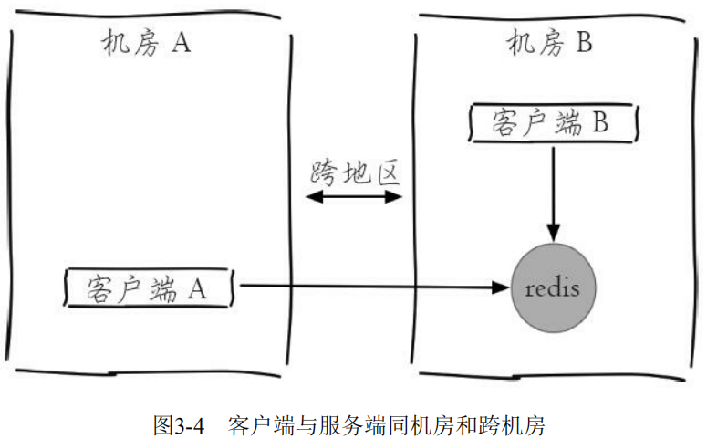

客户端B：

```
redis-cli -h {machineB} --latency 
min: 0, max: 1, avg: 0.07 (4211 samples)
```

客户端A：

```
redis-cli -h {machineB} --latency 
min: 0, max: 2, avg: 1.04 (2096 samples)
```

可以看到客户端A由于距离Redis比较远，平均网络延迟会稍微高一些。

- **--latency-history 选项以分时段每15秒输出一次延迟信息**：

```
redis-cli -h 10.10.xx.xx --latency-history 
min: 0, max: 1, avg: 0.28 (1330 samples) -- 15.01 seconds range… 
min: 0, max: 1, avg: 0.05 (1364 samples) -- 15.01 seconds range
```

- **--stat选项可以实时获取Redis的重要统计信息**：

```
redis-cli --stat 
------- data ------ --------------------- load -------------------- - child - 
keys mem clients blocked requests connections 
2451959 3.43G 1162 0 7426132839 (+0) 1337356 
2451958 3.42G 1162 0 7426133645 (+806) 1337356 … 
2452182 3.43G 1161 0 7426150275 (+1303) 1337356
```

- **--no-raw选项是要求命令的返回结果必须是原始的格式，--raw恰恰相反，返回格式化后的结果。**在Redis中设置一个中文的value：

```
redis-cli set hello "你好" 
OK
```

​	如果正常执行get或者使用--no-raw选项，那么返回的结果是二进制格式：

```
redis-cli get hello 
"\xe4\xbd\xa0\xe5\xa5\xbd" 
redis-cli --no-raw get hello 
"\xe4\xbd\xa0\xe5\xa5\xbd"
```

如果使用了--raw选项，将会返回中文：

```
$redis-cli --raw get hello
你好
```

##### redis-benchmark参数

redis-benchmark可以为Redis做基准性能测试，它提供了很多选项帮助开发和运维人员测试Redis的相关性能。


### 关闭

Redis提供了shutdown命令来停止Redis服务。

停止Redis服务：

```
redis-cli shutdown
```

如果Redis配置有密码：

```
redis-cli -a 密码 shutdown
```

停止Redis服务前，生成持久化文件：

```
redis-cli shutdown nosave|save
```

停止Redis服务后，当使用redis-cli再次连接该Redis服务时，看到Redis已经“失联”。

```
C:\Users\ChenZhuo>redis-cli
Could not connect to Redis at 127.0.0.1:6379: Connection refused
```

?> Redis关闭的过程：断开与客户端的连接、持久化文件生成，是一种相对优雅的关闭方式。

?> 除了可以通过shutdown命令关闭Redis服务以外，还可以通过kill进程号的方式关闭掉Redis。

!>不要粗暴地使用kill-9强制杀死Redis服务，不但不会做持久化操作，还会造成缓冲区等资源不能被优雅关闭，极端情况会造成AOF和复制丢失数据的情况。

