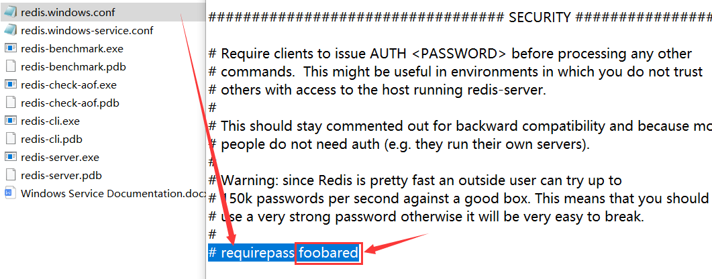
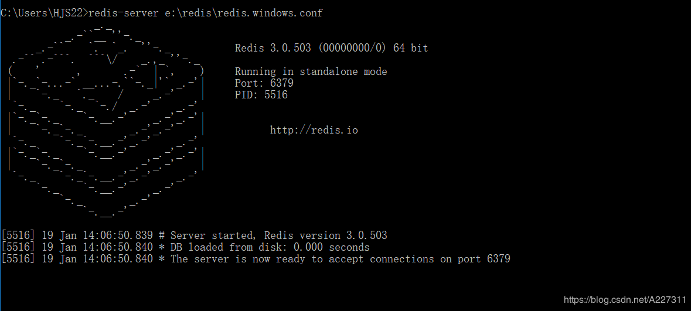

# 配置、启动、交互、关闭

## 配置

Redis的安装文件如下：**Redis的配置文件在Linux系统下名称是 `redis.conf`，在Windows系统下配置文件名称是 `redis.windows.conf`。**


Redis开头可执行文件，称之为Redis Shell，这些可执行文件可以做很多事情，例如：启动和停止Redis、检测和修复Redis的持久化文件，还可以检测Redis的性能。


使用配置文件启动Redis是最保险和主流的方式，因此这里主要讲解Redis的配置文件。Redis有60多个配置，这里只给出一些重要的配置：


### 设置密码

打开 `redis.windows.conf` 修改文件中内容，**将 `# requirepass foobared` 去掉前面的注释符 `#` 并将内容修改为 `requirepass 密码`。**




**这里必须要用文件启动的方式来启动Reids，才会使密码生效**：

```
redis-server 路径\redis.windows.conf
```

连接Reids，因为是本地就使用默认端口和地址，但密码参数 `-a` 需要加上：

```
redis-cli -a 密码
```

如果直接使用 `redis-cli` 命令连接Redis，也能连上只不过查询不了里面的数据，因为没有身份认证：

```
C:\Users\ChenZhuo>redis-cli

127.0.0.1:6379> keys *
(error) NOAUTH Authentication required.
```

使用 `auth` 命令，通过身份认证后，便可以查询数据了：

```
127.0.0.1:6379> auth 123456
OK

127.0.0.1:6379> keys *
1) "a"
```

### 后台运行

在Linux运行起了 `redis-server` 后就没有办法在这个窗口下做任何操作了，因为使用Ctrl+C就直接退出了：


**这时我们可以修改redis的配置文件，将daemonize后面的no改为yes（即后台运行或者叫守护进程方式运行）。**

Windows不支持daemonize即后台运行：


Linux支持daemonize即后台运行：


再通过配置方式启动Redis即可后台运行：


### 允许连接

打开 `redis.windows.conf` 修改文件中内容，**在 `bind 127.0.0.1` 前面加上一个注释，允许其他IP能连接Redis。**


## 启动

有三种方法启动Redis：直接启动、选项启动、文件启动。

### 直接启动

在命令行输入下面命令来直接启动Redis：

```
redis-server
```


可以看到启动Redis后，会打印出一些日志信息：

```
1.当前的Redis版本的是3.2.100
2.Redis的默认端口是6379
3.进程ID是33644
```

!> 注意：因为直接启动使用的都是默认配置，所以这种方式是不会在生产环境中使用的。

### 选项启动

**通过在 `redis-server` 后面加上配置选项和值（可以有多对），使Redis启动时使用该选项配置。**例如，用6380作为端口启动Redis，那么可以执行：

```
redis-server --port 6380
```


?> 提示：虽然运行配置可以自定义配置，但是如果需要修改的配置较多或者希望将配置保存到文件中，不建议使用这种方式。

### 文件启动

第一种直接启动方式的界面有一行警告提示：`没有读配置文件redis.conf，使用的默认配置。`


现在我们将配置文件路径加在后面启动Redis，就会发现警告提示消失了：

```
redis-server 路径\redis.windows.conf
```



?> 提示：假如一台机器上启动多个Redis，通过配置文件启动的方式提供了更大的灵活性，所以大部分生产环境会使用这种方式启动Redis。

### 启动错误

启动Redis时，可能会发生这样的错误：`# Creating Server TCP listening socket *:6379: bind: No such file or directory`


其原因就是：Redis服务已经启动了。

解决办法：输入如下命令即可再次启动成功。

```
1. redis-cli.exe
2. shutdown
3. exit
4. redis-server.exe
```


## 交互

### 连接服务器

现在我们已经启动了Redis服务，**后面要确保Redis服务的窗口一直处于运行状态（不关闭状态），否则后面的操作将无效**，接下来再启动一个命令行，使用 `redis-cli` 命令连接Redis服务器：

```
redis-cli -h 127.0.0.1 -p 6379 -a password
```

- -h参数：主机地址，默认连接127.0.0.1；

- -p参数：Redis端口，默认6379；
- -a参数：如果Redis配置了密码，就要用这个选项进行密码登录；


?> 提示：如果 `-h` 和 `-p` 和 `-a` 都没写就是连接 `127.0.0.1:6379` 这个没有密码的Redis实例。

### 通信测试

**PING命令：用于测试客户端与服务器的连接是否能正常通信或者用于测量延迟值。**

```
127.0.0.1:6379> ping
PONG
注释：客户端向Redis服务器发送一个PING，如果服务器运作正常的话，会返回PONG ，否则返回一个连接错误。
```

### redis-cli参数

redis-cli还有其他的一些参数：

- **-r（repeat）选项代表将命令执行多次，例如下面操作将会执行三次ping命令**：

  ```
  redis-cli -r 3 ping
  PONG
  PONG
  PONG
  ```

- **-i（interval）选项代表每隔几秒执行一次命令，但是-i选项必须和-r选项一起使用**，下面的操作会每隔1秒执行一次ping命令，一共执行5次：

  ```
  redis-cli -r 5 -i 1 ping 
  PONG 
  PONG 
  PONG
  PONG
  PONG
  ```

- **--slave选项是把当前客户端模拟成当前Redis节点的从节点，可以用来获取当前Redis节点的更新操作。**开启第一个客户端，使用--slave选项，看到同步已完成：

  ```
  redis-cli --slave 
  SYNC with master, discarding 72 bytes of bulk transfer... 
  SYNC done. Logging commands from master.
  ```

  再开启另一个客户端做一些更新操作：

  ```
  127.0.0.1:6379> set hello world 
  OK
  127.0.0.1:6379> set a b 
  OK
  127.0.0.1:6379> incr count 
  1
  127.0.0.1:6379> get hello 
  "world"
  ```

  第一个客户端会收到Redis节点的更新操作：

  ```
  redis-cli --slave 
  SYNC with master, discarding 72 bytes of bulk transfer... 
  SYNC done. Logging commands from master. 
  "set","hello","world" 
  "set","a","b" 
  "PING" 
  "incr","count"
  ```
  
  ?> 提示：PING命令是由于主从复制产生的。
  
- **--rdb选项会请求Redis实例生成并发送RDB持久化文件，保存在本地。可使用它做持久化文件的定期备份。**

- **--pipe选项用于将命令封装成Redis通信协议定义的数据格式，批量发送给Redis执行。**

- **--bigkeys选项使用scan命令对Redis的键进行采样，从中找到内存占用比较大的键值，这些键可能是系统的瓶颈。**

- **--eval选项用于执行指定Lua脚本。**

- **--latency选项可以测试客户端到目标Redis的网络延迟**，客户端B和Redis在机房B，客户端A在机房A，机房A和机房B是跨地区的：


客户端B：

```
redis-cli -h {machineB} --latency 
min: 0, max: 1, avg: 0.07 (4211 samples)
```

客户端A：可以看到客户端A由于距离Redis比较远，平均网络延迟会稍微高一些。

```
redis-cli -h {machineB} --latency 
min: 0, max: 2, avg: 1.04 (2096 samples)
```

- **--latency-history 选项以分时段每15秒输出一次延迟信息**：

```
redis-cli -h 10.10.xx.xx --latency-history 
min: 0, max: 1, avg: 0.28 (1330 samples) -- 15.01 seconds range… 
min: 0, max: 1, avg: 0.05 (1364 samples) -- 15.01 seconds range
```

- **--stat选项可以实时获取Redis的重要统计信息**：

```
redis-cli --stat 
------- data ------ --------------------- load -------------------- - child - 
keys mem clients blocked requests connections 
2451959 3.43G 1162 0 7426132839 (+0) 1337356 
2451958 3.42G 1162 0 7426133645 (+806) 1337356 … 
2452182 3.43G 1161 0 7426150275 (+1303) 1337356
```

- **--no-raw选项返回原始格式的结果，--raw选项返回格式化后的结果。**

```
redis-cli set hello "你好" 
OK

redis-cli get hello 
"\xe4\xbd\xa0\xe5\xa5\xbd" 

redis-cli --no-raw get hello 
"\xe4\xbd\xa0\xe5\xa5\xbd"

redis-cli --raw get hello
你好
```

### redis-benchmark参数

redis-benchmark可以为Redis做基准性能测试，它提供了很多选项帮助开发和运维人员测试Redis的相关性能。

- **-c（clients）选项代表客户端的并发数量（默认是50）。**
- **-n（num）选项代表客户端请求总量（默认是100000）。**

例如：`redis-benchmark -c 100 -n 20000` 代表100各个客户端同时请求Redis，一共执行20000次。redis-benchmark会对各类数据结构的命令进行测试，并给出性能指标： 

```
====== GET ====== 
    20000 requests completed in 0.27 seconds 
    100 parallel clients 
    3 bytes payload keep alive: 1 
99.11% <= 1 milliseconds 
100.00% <= 1 milliseconds 
73529.41 requests per second
```

上面一共执行了20000次get操作，在0.27秒完成，每个请求数据量是3个字节，99.11%的命令执行时间小于1毫秒，Redis每秒可以处理 73529.41次get请求。

- **-q选项仅仅显示redis-benchmark的requests per second信息。**
- **-r（random）选项在key、counter键上加一个12位的后缀，向 Redis插入随机键。**`-r 10000`代表只对后四位做随机处理（-r不是随机数的个数）。
- **-P选项代表每个请求pipeline的数据量（默认为1）。**
- **-k选项代表客户端是否使用keepalive，1为使用，0为不使用，默认值为1。**
- **-t选项可以对指定命令进行基准测试。**

```
redis-benchmark -t get,set -q 
SET: 98619.32 requests per second 
GET: 97560.98 requests per second
```

- **--csv选项会将结果按照csv格式输出，便于后续处理，如导出到Excel等。**

```
redis-benchmark -t get,set --csv 
"SET","81300.81" 
"GET","79051.38"
```

## 关闭

**客户端通过 `shutdown` 命令来停止Redis服务器提供服务。**方式如下：

```
# 直接停止Redis服务
redis-cli shutdown

# 停止有密码保护的redis
redis-cli -a 密码 shutdown

# 停止Redis服务前，生成持久化文件
redis-cli shutdown nosave|save
```

?> 提示：断开与客户端的连接、持久化文件生成，是一种相对优雅的关闭方式。

?> 提示：除了通过 `shutdown` 命令关闭Redis服务以外，还可以通过 `kill 进程号` 的方式关闭掉Redis。

!> 注意：不要粗暴地使用 `kill -9` 强制杀死Redis服务，不但不会做持久化操作，还会造成缓冲区等资源不能被优雅关闭，极端情况会造成AOF和复制丢失数据的情况。

**停止Redis服务后，当使用redis-cli再次连接该Redis服务时，看到Redis已经“失联”。**

```
C:\Users\ChenZhuo>redis-cli
Could not connect to Redis at 127.0.0.1:6379: Connection refused
```
