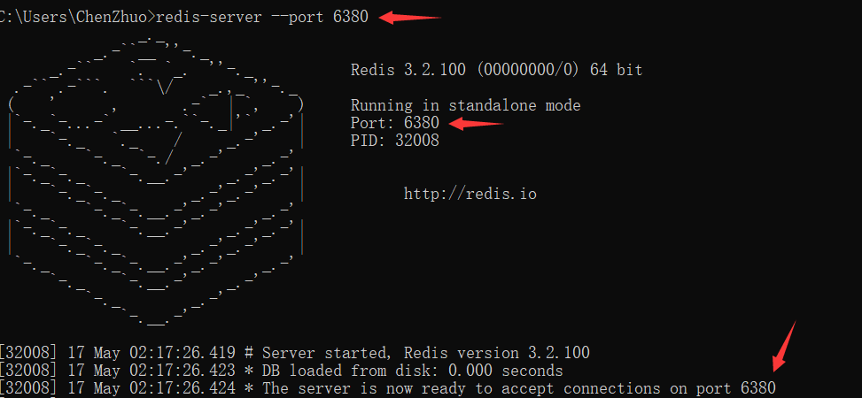
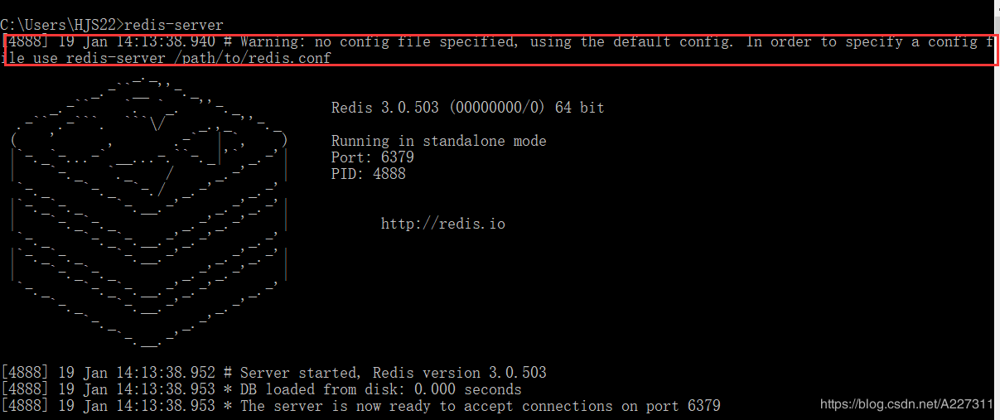
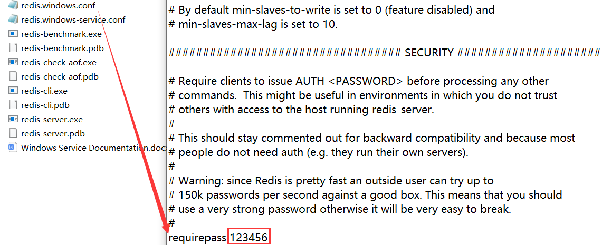
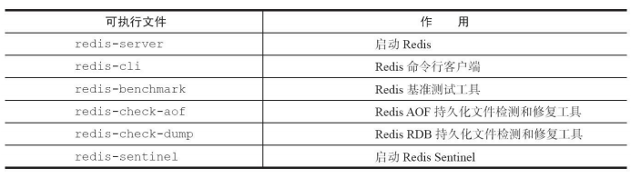
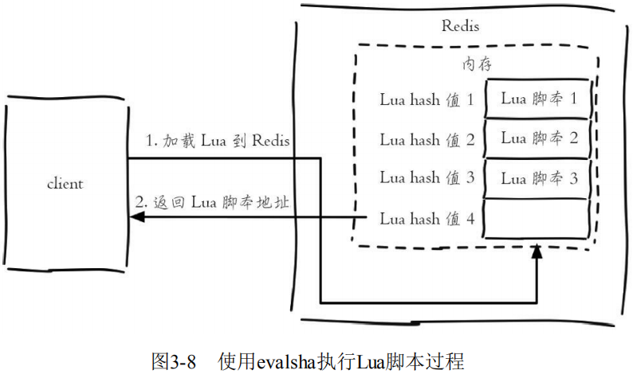
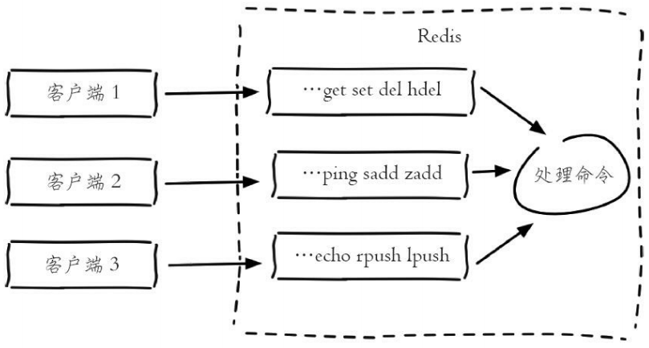

# 配置、启动、交互、关闭

## 启动

Redis有三种启动方式：直接启动、选项启动、文件启动。

### 直接启动

在命令行输入下面命令来直接启动Redis：

```
redis-server
```


可以看到启动Redis后，会打印出一些日志信息：

```
1.当前的Redis版本的是3.2.100
2.Redis的默认端口是6379
3.进程ID是33644
```

!> 注意：因为直接启动使用的都是默认配置，所以这种方式是不会在生产环境中使用的。

### 选项启动

**通过在 `redis-server` 后面加上配置选项和值（可以有多对），使Redis启动时使用该选项配置。**例如，用6380作为端口启动Redis，那么可以执行：

```
redis-server --port 6380
```



?> 提示：虽然运行配置可以自定义配置，但是如果需要修改的配置较多或者希望将配置保存到文件中，不建议使用这种方式。

### 文件启动

前面第一种直接启动的方式，在界面有一行警告提示：`没有读配置文件，使用的默认配置。`



**Redis的配置文件在Linux系统下名称是 `redis.conf`，在Windows系统下配置文件名称是 `redis.windows.conf`。**


现在我们将配置文件路径加在后面启动Redis，就会发现**警告提示消失**了：

```
redis-server 路径\redis.windows.conf
```


?> 提示：假如一台机器上启动多个Redis，通过配置文件启动的方式提供了更大的灵活性，所以大部分生产环境会使用这种方式启动Redis。

### 启动错误

启动Redis时，可能会发生这样的错误：`# Creating Server TCP listening socket *:6379: bind: No such file or directory`


其原因就是：Redis服务已经启动了。

解决办法：输入如下命令即可再次启动成功。

```
1. redis-cli.exe
2. shutdown
3. exit
4. redis-server.exe
```


## 配置

使用配置文件 `redis.conf` 或 `redis.windows.conf` 来启动Redis是最保险和主流的方式，因此这里主要讲解Redis的配置文件。Redis有60多个配置，这里只给出一些重要的配置：


**再次提醒：这里必须要用文件启动的方式来启动Reids，配置才会生效。**

```
redis-server 路径\Redis配置文件
```

### 设置密码

打开 `redis.windows.conf` 修改文件中内容，**将 `# requirepass foobared` 去掉前面的注释符 `#` 并将内容修改为 `requirepass 密码`。**




连接Reids，因为是本地就使用默认端口和地址，但密码参数 `-a` 需要加上：

```
redis-cli -a 密码
```

如果直接使用 `redis-cli` 命令也能连上只不过查询不了里面的数据，因为没有身份认证：

```
C:\Users\ChenZhuo>redis-cli

127.0.0.1:6379> keys *
(error) NOAUTH Authentication required.
```

使用 `auth 密码` 命令，通过身份认证后，便可以查询数据了：

```
127.0.0.1:6379> auth 123456
OK

127.0.0.1:6379> keys *
1) "a"
```

### 后台运行

在Linux运行起了 `redis-server` 后就没有办法在这个窗口下做任何操作了，因为使用Ctrl+C就直接退出了：


**这时我们可以修改redis的配置文件，将daemonize后面的no改为yes（即后台运行或者叫守护进程方式运行）。**

Windows不支持daemonize即后台运行：


Linux支持daemonize即后台运行：


再通过配置方式启动Redis即可后台运行：


### 允许连接

打开 `redis.windows.conf` 修改文件中内容，**在 `bind 127.0.0.1` 前面加上一个注释，允许其他IP能连接Redis。**


## 交互

Redis开头可执行文件，称之为Redis Shell，这些可执行文件可以做很多事情，例如：启动和停止Redis、检测和修复Redis的持久化文件，还可以检测Redis的性能。



### 连接服务器

**前面我们已经启动了Redis服务，要确保Redis服务的窗口一直处于运行状态（不关闭状态），否则后面的操作将无效。**接下来再启动一个命令行，使用 `redis-cli` 命令连接Redis服务器：

```
redis-cli -h 127.0.0.1 -p 6379 -a password
```

- -h参数：主机地址，默认连接127.0.0.1；

- -p参数：Redis端口，默认6379；
- -a参数：如果Redis配置了密码，就要用这个选项进行密码登录；


?> 提示：如果 `-h` 和 `-p` 和 `-a` 都没写就是连接 `127.0.0.1:6379` 这个没有密码的Redis实例。

### 通信测试

**PING命令：用于测试客户端与服务器的连接是否能正常通信或者用于测量延迟值。**

```
127.0.0.1:6379> ping
PONG
注释：客户端向Redis服务器发送一个PING，如果服务器运作正常的话，会返回PONG ，否则返回一个连接错误。
```

### redis-cli参数

redis-cli还有其他的一些参数：

- **-r（repeat）选项代表将命令执行多次，例如下面操作将会执行三次ping命令**：

  ```
  redis-cli -r 3 ping
  PONG
  PONG
  PONG
  ```

- **-i（interval）选项代表每隔几秒执行一次命令，但是-i选项必须和-r选项一起使用**，下面的操作会每隔1秒执行一次ping命令，一共执行5次：

  ```
  redis-cli -r 5 -i 1 ping 
  PONG 
  PONG 
  PONG
  PONG
  PONG
  ```

- **--slave选项是把当前客户端模拟成当前Redis节点的从节点，可以用来获取当前Redis节点的更新操作。**开启第一个客户端，使用--slave选项，看到同步已完成：

  ```
  redis-cli --slave 
  SYNC with master, discarding 72 bytes of bulk transfer... 
  SYNC done. Logging commands from master.
  ```

  再开启另一个客户端做一些更新操作：

  ```
  127.0.0.1:6379> set hello world 
  OK
  127.0.0.1:6379> set a b 
  OK
  127.0.0.1:6379> incr count 
  1
  127.0.0.1:6379> get hello 
  "world"
  ```

  第一个客户端会收到Redis节点的更新操作：

  ```
  redis-cli --slave 
  SYNC with master, discarding 72 bytes of bulk transfer... 
  SYNC done. Logging commands from master. 
  "set","hello","world" 
  "set","a","b" 
  "PING" 
  "incr","count"
  ```
  
  ?> 提示：PING命令是由于主从复制产生的。
  
- **--rdb选项会请求Redis实例生成并发送RDB持久化文件，保存在本地。可使用它做持久化文件的定期备份。**

- **--pipe选项用于将命令封装成Redis通信协议定义的数据格式，批量发送给Redis执行，实际上就是使用Pipeline管道机制，但大部分开发人员更倾向于使用高级语言客户端中的Pipeline。**例如下面操作将 `set hello world` 和 `incr counter` 两条命令组装：

  ```
  echo -en '*3\r\n$3\r\nSET\r\n$5\r\nhello\r\n$5\r\nworld\r\n*2\r\n$4\r\nincr\r\ n$7\r\ncounter\r\n' | redis-cli --pipe
  ```


Redis客户端执行一条命令分为如下四个过程： 


其中过程1和过程4称为Round Trip Time（RTT，往返时间）。例如，要执行n条命令，需要消耗n次RTT。


**Pipeline（流水线）机制能改善上面这类问题，它能将一组Redis命令进 行组装，通过一次RTT传输给Redis，再将这组Redis命令的执行结果按顺序返回给客户端。**


在不同网络环境下非Pipeline和Pipeline执行10000次 `set` 操作的效果，可以得到如下两个结论：

1. Pipeline执行速度一般比逐条执行要快。
2. 客户端和服务端的网络延时越大，Pipeline的效果越明显。 


Pipeline与原生批量命令的区别：

1. 原生批量命令是原子的，Pipeline是非原子的。
2. 原生批量命令是一个命令对应多个key，Pipeline支持多个命令。
3. **原生批量命令是Redis服务端支持实现的，而Pipeline需要服务端和客户端的共同实现。**

!> 注意：Pipeline虽然好用，但是每次Pipeline组装的命令个数不能没有节制，否则一次组装Pipeline数据量过大，一方面会增加客户端的等待时间，另一方面会造成一定的网络阻塞，可以将一次包含大量命令的Pipeline拆分成多次较小的Pipeline来完成。

- **--bigkeys选项使用scan命令对Redis的键进行采样，从中找到内存占用比较大的键值，这些键可能是系统的瓶颈。**

- **--stat选项可以实时获取Redis的重要统计信息**：

```
redis-cli --stat 
------- data ------ --------------------- load -------------------- - child - 
keys mem clients blocked requests connections 
2451959 3.43G 1162 0 7426132839 (+0) 1337356 
2451958 3.42G 1162 0 7426133645 (+806) 1337356 … 
2452182 3.43G 1161 0 7426150275 (+1303) 1337356
```

- **--no-raw选项返回原始格式的结果，--raw选项返回格式化后的结果。**

```
redis-cli set hello "你好"
OK

redis-cli get hello
"\xe4\xbd\xa0\xe5\xa5\xbd"

redis-cli --no-raw get hello
"\xe4\xbd\xa0\xe5\xa5\xbd"

redis-cli --raw get hello
你好
```

- **--eval选项用于执行指定Lua脚本。**Lua脚本功能为Redis开发和运维人员带来如下三个好处： 
  - **Lua脚本在Redis中是原子执行的，执行过程中间不会插入其他命令。** 
  - **Lua脚本可以帮助开发和运维人员创造出自己定制的命令，并可以将这些命令常驻在Redis内存中，实现复用的效果。** 
  - **Lua脚本可以将多条命令一次性打包，有效地减少网络开销。**

Lua语言是在1993年由巴西一个大学研究小组发明，其设计目标是作为嵌入式程序移植到其他应用程序，**它是由C语言实现的**，虽然简单小巧但是功能强大，所以许多应用都选用它作为脚本语言，尤其是在游戏领域，例如大名鼎鼎的暴雪公司将Lua语言引入到“魔兽世界”这款游戏中，Rovio公司将Lua语言作为“愤怒的小鸟”这款火爆游戏的关卡升级引擎，Web服务器Nginx 将Lua语言作为扩展，增强自身功能。**Redis将Lua作为脚本语言可帮助开发者定制自己的Redis命令。**Lua语言提供了如下几种数据类型：**booleans（布尔）、numbers（数值）、strings（字符串）、tables（表格**），和许多高级语言相比，相对简单。

```lua
-- "--"是Lua语言的注释

-- local代表val是一个局部变量，如果没有local代表是全局变量。
local strings val = "world"
print(val)  -- 打印字符串"world" 

-- 在Lua中，如果要使用类似数组的功能，可以用tables类型。
-- 定义了一个tables类型的变量 `myArray`，但和大多数编程语言不同的是，Lua的数组下标从1开始计算。
local tables myArray = {"redis", "jedis", true, 88.0} 
print(myArray[3])  -- 输出true 

-- 使用for和while可以遍历这个数组，关键字for以end作为结束符。
-- 遍历myArray，首先需要知道tables的长度，只需要在变量前加一个 `#` 号即可
for i = 1, #myArray 
do 
    print(myArray[i]) 
end

-- 使用for循环计算1到100的和
local int sum = 0 
for i = 1, 100 
do 
    sum = sum + i 
end 
print(sum)  -- 输出结果为5050

-- 使用while循环计算1到100的和
local int sum = 0 
local int i = 0 
while i <= 100 
do 
    sum = sum +i 
    i = i + 1 
end 
print(sum)  -- 输出结果为5050 

-- Lua还提供了内置函数ipairs可以遍历出所有的索引下标和值
for index,value in ipairs(myArray) 
do 
    print(index) 
    print(value) 
end

-- if判断，then紧跟，end结尾
-- 要确定数组中是否包含了jedis，有则打印true
local tables myArray = {"redis", "jedis", true, 88.0} 
for i = 1, #myArray 
do 
    if myArray[i] == "jedis" 
    then
        print("true") 
        break 
    else
        --do nothing 
    end 
end

-- 哈希，使用类似哈希的功能，同样可以使用tables类型。
-- 定义了一个tables，每个元素包含了key和value，其strings1..string2是将两 个字符串进行连接：
local tables user_1 = {age = 28, name = "tome"} 
print("user_1 age is " .. user_1["age"])  -- user_1 age is 28 

-- 函数定义，在Lua中，函数以 `function` 开头，以 `end` 结尾，`funcName` 是函数名，中间部分是函数体：
function funcName() 
    ... 
end 
contact函数将两个字符串拼接： 
function contact(str1, str2) 
    return str1 .. str2 
end 
print(contact("hello ", "world"))  -- "hello world" 
```

除了使用 `redis-cli --eval` 直接执行Lua脚本文件，在Redis中执行Lua脚本还有有两种方法：`eval` 和 `evalsha`：

```
eval 脚本内容 key个数 key列表 参数列表
```

使用 `key` 列表和参数列表来为Lua脚本提供更多的灵活性：

```
127.0.0.1:6379> eval 'return "hello " .. KEYS[1] .. ARGV[1]' 1 redis world "hello redisworld"
```

此时 `KEYS[1]="redis"`，`ARGV[1]="world"`，所以最终的返回结是 `"hello redisworld"`。 

**`eval` 命令和 `--eval` 参数本质是一样的，客户端如果想执行Lua脚本，首先在客户端编写好Lua脚本代码，然后把脚本作为字符串发送给服务端，服务端会将执行结果返回给客户端。**


Redis还提供了 `evalsha` 命令来执行Lua脚本。首先要将Lua脚本加载到Redis服务端，得到该脚本的SHA1校验和，`evalsha` 命令使用SHA1作为参数可以直接执行对应Lua脚本，避免每次发送Lua脚本的开销。这样客户端就不需要每次执行脚本内容，而脚本也会常驻在服务端，脚本功能得到了复用。



**加载脚本**：`script load` 命令可以将Lua脚本内容加载到Redis内存中。

```
script load script
```

将 `lua_get.lua` 加载到Redis中，得到SHA1 为："7413dc2440db1fea7c0a0bde841fa68eefaf149c" 

```
# redis-cli script load "$(cat lua_get.lua)" 
"7413dc2440db1fea7c0a0bde841fa68eefaf149c"
```

**是否加载**：`script exists` 命令用于判断sha1是否已经加载到Redis内存中。返回结果代表sha1[sha1…]被加载到Redis内存的个数。

```
127.0.0.1:6379> script exists a5260dd66ce02462c5b5231c727b3f7772c0bcc5 
1) (integer) 1
```

**清除脚本**：`script flush ` 命令用于清除Redis内存已经加载的所有Lua脚本。

```
127.0.0.1:6379> script exists a5260dd66ce02462c5b5231c727b3f7772c0bcc5
1) (integer) 1 
127.0.0.1:6379> script flush 
OK
127.0.0.1:6379> script exists a5260dd66ce02462c5b5231c727b3f7772c0bcc5 
1) (integer) 0
```

**执行脚本**：`evalsha` 的使用方法如下，参数使用SHA1值，执行逻辑和 `eval` 一致。

```
evalsha 脚本SHA1值 key个数 key列表 参数列表
```

调用 `lua_get.lua` 脚本：

```
127.0.0.1:6379> evalsha 7413dc2440db1fea7c0a0bde841fa68eefaf149c 1 redis world "hello redisworld"
```

**杀掉脚本**：`script kill` 命令用于杀掉正在执行的Lua脚本。

```
script kill
```

!> 注意：有一点需要注意，如果当前Lua脚本正在执行写操作，那么 `script kill` 将不会生效。要么等待脚本执行结束要么使用 `shutdown save` 停掉Redis服务。可见Lua脚本虽然好用，但是使用不当破坏性也是难以想象的。 

### 客户端管理

#### 连接信息

`client list` 命令：**列出与Redis服务端相连的所有客户端连接信息，结果的每一行代表一个客户端的信息，每行包含了十几个属性，它们是每个客户端的一些执行状态。**

```
127.0.0.1:6379> client list 
id=254487 addr=10.2.xx.234:60240 fd=1311 name= age=8888581 idle=8888581 flags=N db=0 sub=0 psub=0 multi=-1 qbuf=0 qbuf-free=0 obl=0 oll=0 omem=0 events=r cmd=get 
id=7125109 addr=10.10.xx.101:58658 fd=140 name= age=241 idle=1 flags=N db=0 sub=0 psub=0 multi=-1 qbuf=0 qbuf-free=0 obl=0 oll=0 omem=0 events=r cmd=del 
...
```

- id：客户端连接的唯一标识，这个id是随着Redis的连接自增的，重启Redis后会重置为0。

- addr：客户端连接的ip和端口。
- fd：socket的文件描述符，与 `lsof` 命令结果中的fd是同一个，如果 `fd=-1` 代表当前客户端不是外部客户端，而是Redis内部的伪装客户端。

- name：客户端的名字，后面的 `client setName` 和 `client getName` 两个命令会对其进行说明。

- age：当前客户端已经连接的时间。
- idle：当前客户端最近一次的空闲时间。

当前客户端连接Redis的时间为603382秒，其中最近一次空闲了331060秒：

```
id=2232080 addr=10.16.xx.55:32886 fd=946 name= age=603382 idle=331060 flags=N db=0 sub=0 psub=0 multi=-1 qbuf=0 qbuf-free=0 obl=0 oll=0 omem=0 events=r cmd=get
```

#### 最大连接数

Redis提供了 `maxclients` 参数来限制最大客户端连接数，一旦连接数超过 `maxclients`，新的连接将被拒绝。`maxclients` 默认值是10000，可以通过`info clients`来查询当前Redis的连接数

```
127.0.0.1:6379> info clients
# Clients
connected_clients:1414
...
```

通过 `config set maxclients` 对最大客户端连接数进行动态设置：

```
127.0.0.1:6379> config get maxclients 
1) "maxclients" 
2) "10000" 
127.0.0.1:6379> config set maxclients 50 
OK
127.0.0.1:6379> config get maxclients 
1) "maxclients" 
2) "50"
```

#### 最大空闲时间

为了防止存在大量idle(空闲)连接，Redis提供了 timeout（单位为秒）参数来限制连接的最大空闲时间，一旦客户端连接的idle时间超过了 timeout，连接将会被关闭。

```
#Redis默认的timeout是0，也就是不会检测客户端的空闲 
127.0.0.1:6379> config set timeout 30 
OK
```

?> 在实际开发和运维中，需要将timeout设置成大于0，例如可以设置为300秒，同时在客户端使用上添加空闲检测和验证等等措施，例如JedisPool使用common-pool提供的三个属性：`minEvictableIdleTimeMillis`、`testWhileIdle`、`timeBetweenEvictionRunsMillis`。

#### 输入缓冲区

**Redis为每个客户端分配了输入缓冲区，它的作用是将客户端发送的命令临时保存，同时Redis从会输入缓冲区拉取命令并执行，输入缓冲区为客户端发送命令到Redis执行命令提供了缓冲功能。**

Redis没有提供相应的配置来规定每个缓冲区的大小，输入缓冲区会根据输入内容大小的不同动态调整，只是要求**每个客户端缓冲区的大小不能超过1G，超过后客户端将被关闭。**



输入缓冲区不受maxmemory控制，假设maxmemory为4G，已经存储了2G数据，但是如果此时输入缓冲区使用了3G，已经超过maxmemory限制，可能会产生数据丢失、键值淘汰、OOM等情况。


**输入缓冲区过大主要是因为Redis的处理速度跟不上输入缓冲区的输入速度，并且每次进入输入缓冲区的命令包含了大量bigkey，从而造成了输入缓冲区过大的情况。还有一种情况就是Redis发生了阻塞，短期内不能处理命令，造成客户端输入的命令积压在了输入缓冲区，造成了输入缓冲区过大。**

监控输入缓冲区的方法有两种：

定期执行 `client list` 命令，收集qbuf和qbuf-free找到异常的连接记录并分析，最终找到可能出问题的客户端。

- qbuf：缓冲区的总容量。
- qbuf-free：缓冲区的剩余容量。

**`info clients` 命令：输出内容中 `client_biggest_input_buf` 代表最大的输入缓冲区。**可以设置最大的输入缓冲区超过10M就进行报警： 

```
127.0.0.1:6379> info clients 
# Clients 
connected_clients:1414 
client_longest_output_list:0 
client_biggest_input_buf:2097152 
blocked_clients:0
```


#### 输出缓冲区

**Redis为每个客户端分配了输出缓冲区，它的作用是保存命令执行的结果返回给客户端，为Redis和客户端交互返回结果提供缓冲。**


输出缓冲区由两部分组成：**固定缓冲区（16KB）和动态缓冲区，，其中固定缓冲区返回比较小的执行结果，而动态缓冲区返回比较大的结果，例如大的字符串、hgetall、smembers命令的结果等。**

**固定缓冲区使用的是字节数组，动态缓冲区使用的是列表。当固定缓冲区存满后会将Redis新的返回结果存放在动态缓冲区的队列中，队列中的每个对象就是每个返回结果。**


- obl：固定缓冲区的长度。
- oll：动态缓冲区列表的长度。
- omem：使用的字节数

当前客户端的固定缓冲区的长度为0，动态缓冲区有4869个对象，两个部分共使用了133081288字节=126M内存：

```
id=7 addr=127.0.0.1:56358 fd=6 name= age=91 idle=0 flags=O db=0 sub=0 psub=0 multi=-1 qbuf=0 qbuf-free=0 obl=0 oll=4869 omem=133081288 events=rw cmd=monitor
```

**输出缓冲区的容量可以通过参数 `client-output-buffer-limit` 来进行设置**，并且输出缓冲区做得更加细致，按照客户端的不同分为三种：普通客户端、发布订阅客户端、slave客户端。

对应的配置规则是：

```
client-output-buffer-limit <class> <hard limit> <soft limit> <soft seconds>
```

- `<class>`：客户端类型，分为三种。a）normal：普通客户端；b） 

  slave：slave客户端，用于复制；c）pubsub：发布订阅客户端。

- `<hard limit>`：如果客户端使用的输出缓冲区大于`<hard limit>`，客户端会被立即关闭。

- `<soft limit>`和`<soft seconds>`：如果客户端使用的输出缓冲区超过了`<soft limit>`并且持续了`<soft limit>`秒，客户端会被立即关闭。

Redis的默认配置是：

```
client-output-buffer-limit normal 0 0 0 
client-output-buffer-limit slave 256mb 64mb 60 
client-output-buffer-limit pubsub 32mb 8mb 60
```


**输出缓冲区也不会受到maxmemory的限制，如果使用不当同样会造成maxmemory用满产生的数据丢失、键值淘汰、OOM等情况。**

监控输出缓冲区的方法依然有两种：

**通过定期执行 `client list` 命令，收集obl、oll、omem找到异常的连接记录并分析，最终找到可能出问题的客户端。** 

**`info clients`命令：找到输出缓冲区列表最大对象`client_biggest_input_buf`。**

```
127.0.0.1:6379> info clients 
# Clients 
connected_clients:502 
client_longest_output_list:4869
client_biggest_input_buf:0 
blocked_clients:0
```

预防输出缓冲区出现异常：

1. 进行上述监控，设置阀值，超过阀值及时处理。
2. 限制普通客户端输出缓冲区的，把错误扼杀在摇篮中。

```
client-output-buffer-limit normal 20mb 10mb 120
```

3. 适当增大slave的输出缓冲区的，如果master节点写入较大，slave客户端的输出缓冲区可能会比较大，一旦slave客户端连接因为输出缓冲区溢出被kill，会造成复制重连。
4. 限制容易让输出缓冲区增大的命令，例如，高并发下的monitor命令就是一个危险的命令。 
5. 及时监控内存，一旦发现内存抖动频繁，可能就是输出缓冲区过大。

#### 慢查询分析

慢查询分析：**通过慢查询分析，找到有问题的命令进行优化。**

许多存储系统（例如MySQL）提供慢查询日志帮助开发和运维人员定位系统存在的慢操作。所谓慢查询日志就是系统在命令执行前后计算每条命令的执行时间，当超过预设阀值，就将这条命令的相关信息（例如：发生时间，耗时，命令的详细信息）记录下来，Redis也提供了类似的功能。

Redis客户端执行一条命令分为如下4个部分：


**需要注意的是，慢查询只统计步骤3，即命令的执行时间。**

**预设阈值命令 `slowlog-log-slower-than`** ：单位是微秒（1秒=1000毫秒=1000000微秒），默认值是10000，假如执行了一条“很慢”的命令（例如keys*），如果它的执行时间超过了10000微秒，那么它将被记录在慢查询日志中。

?> 提示：如果 `slowlog-log-slower-than=0` 会记录所有的命令，`slowlog-log-slower-than<0` 对于任何命令都不会进行记录，建议配置默认值超过10毫秒判定为慢查询。

**慢查询日志长度 `slowlog-max-len`**：实际上是一个列表来存储慢查询日志，`slowlog-max-len` 就是列表的最大长度。

如果慢查询日志列表已处于其最大长度时，最早插入的一个命令将从列表中移出，这样可能会丢失部分慢查询命令，为了防止这种情况发生，可以定期执行 `slow get` 命令将慢查询日志持久化到其他存储中（例如MySQL）

?> 提示：`slowlog-max-len` 配置建议，设置为1000以上。

使用 `config set` 命令将 `slowlog-log-slower-than` 设置为20000微秒，`slowlog-max-len` 设置为1000，再执行 `config rewrite` 命令将配置持久化到本地配置文件：

```
config set slowlog-log-slower-than 20000
config set slowlog-max-len 1000
config rewrite
```


**获取慢查询日志**

```
slowlog get [n]
```

- 参数n可以指定条数

```
127.0.0.1:6379> slowlog get 
1) 1) (integer) 666
   2) (integer) 1456786500 
   3) (integer) 11615 
   4) 1) "BGREWRITEAOF" 
2) 1) (integer) 665 
   2) (integer) 1456718400 
   3) (integer) 12006 
   4) 1) "SETEX" 
      2) "video_info_200" 
      3) "300" 
      4) "2" ...
```

每个慢查询日志有4个属性组成，分别是**慢查询日志的标识 id、发生时间戳、命令耗时、执行命令和参数**：


**获取慢查询日志列表当前的长度**

```
slowlog len
```

当前Redis中有45条慢查询：

```
127.0.0.1:6379> slowlog len 
(integer) 45
```

**慢查询日志重置**

```
slowlog reset
```

实际是对列表做清理操作：

```
127.0.0.1:6379> slowlog len 
(integer) 45 
127.0.0.1:6379> slowlog reset 
OK
127.0.0.1:6379> slowlog len 
(integer) 0
```

## 关闭

**客户端通过 `shutdown` 命令来停止Redis服务器提供服务。**方式如下：

```
# 直接停止Redis服务
redis-cli shutdown

# 停止有密码保护的redis
redis-cli -a 密码 shutdown

# 停止Redis服务前，生成持久化文件
redis-cli shutdown nosave|save
```

?> 提示：断开与客户端的连接、持久化文件生成，是一种相对优雅的关闭方式。

?> 提示：除了通过 `shutdown` 命令关闭Redis服务以外，还可以通过 `kill 进程号` 的方式关闭掉Redis。

!> 注意：不要粗暴地使用 `kill -9` 强制杀死Redis服务，不但不会做持久化操作，还会造成缓冲区等资源不能被优雅关闭，极端情况会造成AOF和复制丢失数据的情况。

**停止Redis服务后，当使用redis-cli再次连接该Redis服务时，看到Redis已经“失联”。**

```
C:\Users\ChenZhuo>redis-cli
Could not connect to Redis at 127.0.0.1:6379: Connection refused
```
