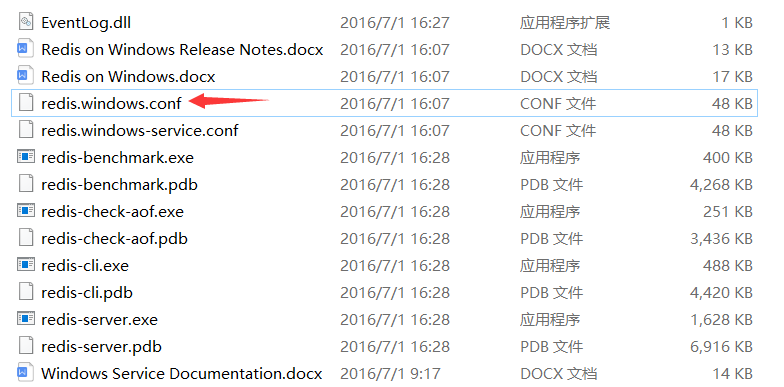
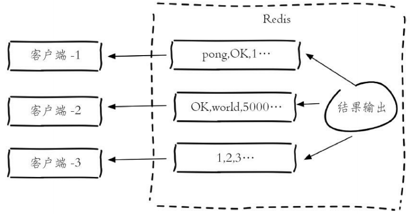
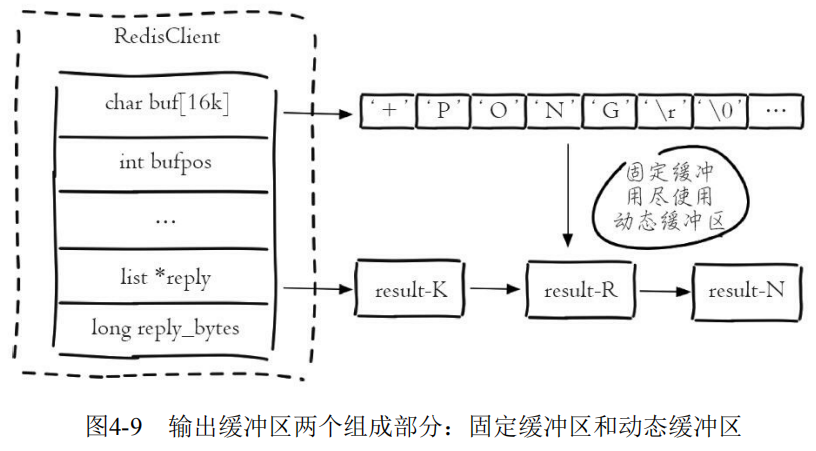
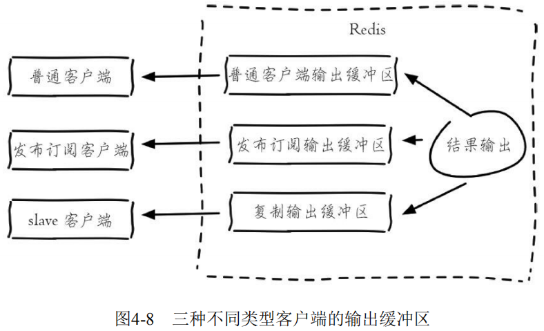

# 配置、启动、交互、关闭

## 启动

Redis有三种启动方式：直接启动、选项启动、文件启动。

### 直接启动

在命令行输入下面命令来直接启动Redis：

```
redis-server
```


可以看到启动Redis后，会打印出一些日志信息：

```
1.当前的Redis版本的是3.2.100
2.Redis的默认端口是6379
3.进程ID是33644
```

!> 注意：因为直接启动使用的都是默认配置，所以这种方式是不会在生产环境中使用的。

### 选项启动

**通过在 `redis-server` 后面加上配置选项和值（可以有多对），使Redis启动时使用该选项配置。**例如，用6380作为端口启动Redis，那么可以执行：

```
redis-server --port 6380
```


?> 提示：虽然运行配置可以自定义配置，但是如果需要修改的配置较多或者希望将配置保存到文件中，不建议使用这种方式。

### 文件启动

前面第一种直接启动的方式，在界面有一行警告提示：`没有读配置文件，使用的默认配置。`


**Redis的配置文件在Linux系统下名称是 `redis.conf`，在Windows系统下配置文件名称是 `redis.windows.conf`。**



现在我们将配置文件路径加在后面启动Redis，就会发现**警告提示消失**了：

```
redis-server 路径\redis.windows.conf
```


?> 提示：假如一台机器上启动多个Redis，通过配置文件启动的方式提供了更大的灵活性，所以大部分生产环境会使用这种方式启动Redis。

### 启动错误

启动Redis时，可能会发生这样的错误：`# Creating Server TCP listening socket *:6379: bind: No such file or directory`


其原因就是：Redis服务已经启动了。

解决办法：输入如下命令即可再次启动成功。

```
1. redis-cli.exe
2. shutdown
3. exit
4. redis-server.exe
```


## 配置

使用配置文件 `redis.conf` 或 `redis.windows.conf` 来启动Redis是最保险和主流的方式，因此这里主要讲解Redis的配置文件。Redis有60多个配置，这里只给出一些重要的配置：


**再次提醒：这里必须要用文件启动的方式来启动Reids，配置才会生效。**

```
redis-server 路径\Redis配置文件
```

### 设置密码

打开 `redis.windows.conf` 修改文件中内容，**将 `# requirepass foobared` 去掉前面的注释符 `#` 并将内容修改为 `requirepass 密码`。**


连接Reids，因为是本地就使用默认端口和地址，但密码参数 `-a` 需要加上：

```
redis-cli -a 密码
```

如果直接使用 `redis-cli` 命令也能连上只不过查询不了里面的数据，因为没有身份认证：

```
C:\Users\ChenZhuo>redis-cli

127.0.0.1:6379> keys *
(error) NOAUTH Authentication required.
```

使用 `auth 密码` 命令，通过身份认证后，便可以查询数据了：

```
127.0.0.1:6379> auth 123456
OK

127.0.0.1:6379> keys *
1) "a"
```

### 后台运行

在Linux运行起了 `redis-server` 后就没有办法在这个窗口下做任何操作了，因为使用Ctrl+C就直接退出了：


**这时我们可以修改redis的配置文件，将daemonize后面的no改为yes（即后台运行或者叫守护进程方式运行）。**

Windows不支持daemonize即后台运行：


Linux支持daemonize即后台运行：


再通过配置方式启动Redis即可后台运行：


### 允许连接

打开 `redis.windows.conf` 修改文件中内容，**在 `bind 127.0.0.1` 前面加上一个注释，允许其他IP能连接Redis。**


## 交互

Redis开头可执行文件，称之为Redis Shell，这些可执行文件可以做很多事情，例如：启动和停止Redis、检测和修复Redis的持久化文件，还可以检测Redis的性能。


### 连接服务器

**前面我们已经启动了Redis服务，要确保Redis服务的窗口一直处于运行状态（不关闭状态），否则后面的操作将无效。**接下来再启动一个命令行，使用 `redis-cli` 命令连接Redis服务器：

```
redis-cli -h 127.0.0.1 -p 6379 -a password
```

- -h参数：主机地址，默认连接127.0.0.1；

- -p参数：Redis端口，默认6379；
- -a参数：如果Redis配置了密码，就要用这个选项进行密码登录；


?> 提示：如果 `-h` 和 `-p` 和 `-a` 都没写就是连接 `127.0.0.1:6379` 这个没有密码的Redis实例。

### 通信测试

**PING命令：用于测试客户端与服务器的连接是否能正常通信或者用于测量延迟值。**

```
127.0.0.1:6379> ping
PONG
注释：客户端向Redis服务器发送一个PING，如果服务器运作正常的话，会返回PONG ，否则返回一个连接错误。
```

### redis-cli参数

redis-cli还有其他的一些参数：

- **-r（repeat）选项代表将命令执行多次，例如下面操作将会执行三次ping命令**：

  ```
  redis-cli -r 3 ping
  PONG
  PONG
  PONG
  ```

- **-i（interval）选项代表每隔几秒执行一次命令，但是-i选项必须和-r选项一起使用**，下面的操作会每隔1秒执行一次ping命令，一共执行5次：

  ```
  redis-cli -r 5 -i 1 ping 
  PONG 
  PONG 
  PONG
  PONG
  PONG
  ```

- **--slave选项是把当前客户端模拟成当前Redis节点的从节点，可以用来获取当前Redis节点的更新操作。**开启第一个客户端，使用--slave选项，看到同步已完成：

  ```
  redis-cli --slave 
  SYNC with master, discarding 72 bytes of bulk transfer... 
  SYNC done. Logging commands from master.
  ```

  再开启另一个客户端做一些更新操作：

  ```
  127.0.0.1:6379> set hello world 
  OK
  127.0.0.1:6379> set a b 
  OK
  127.0.0.1:6379> incr count 
  1
  127.0.0.1:6379> get hello 
  "world"
  ```

  第一个客户端会收到Redis节点的更新操作：

  ```
  redis-cli --slave 
  SYNC with master, discarding 72 bytes of bulk transfer... 
  SYNC done. Logging commands from master. 
  "set","hello","world" 
  "set","a","b" 
  "PING" 
  "incr","count"
  ```
  
  ?> 提示：PING命令是由于主从复制产生的。
  
- **--rdb选项会请求Redis实例生成并发送RDB持久化文件，保存在本地。可使用它做持久化文件的定期备份。**

- **--pipe选项用于将命令封装成Redis通信协议定义的数据格式，批量发送给Redis执行。**

- **--bigkeys选项使用scan命令对Redis的键进行采样，从中找到内存占用比较大的键值，这些键可能是系统的瓶颈。**

- **--eval选项用于执行指定Lua脚本。**

- **--latency选项可以测试客户端到目标Redis的网络延迟**，客户端B和Redis在机房B，客户端A在机房A，机房A和机房B是跨地区的：


客户端B：

```
redis-cli -h {machineB} --latency 
min: 0, max: 1, avg: 0.07 (4211 samples)
```

客户端A：可以看到客户端A由于距离Redis比较远，平均网络延迟会稍微高一些。

```
redis-cli -h {machineB} --latency 
min: 0, max: 2, avg: 1.04 (2096 samples)
```

- **--latency-history 选项以分时段每15秒输出一次延迟信息**：

```
redis-cli -h 10.10.xx.xx --latency-history 
min: 0, max: 1, avg: 0.28 (1330 samples) -- 15.01 seconds range… 
min: 0, max: 1, avg: 0.05 (1364 samples) -- 15.01 seconds range
```

- **--stat选项可以实时获取Redis的重要统计信息**：

```
redis-cli --stat 
------- data ------ --------------------- load -------------------- - child - 
keys mem clients blocked requests connections 
2451959 3.43G 1162 0 7426132839 (+0) 1337356 
2451958 3.42G 1162 0 7426133645 (+806) 1337356 … 
2452182 3.43G 1161 0 7426150275 (+1303) 1337356
```

- **--no-raw选项返回原始格式的结果，--raw选项返回格式化后的结果。**

```
redis-cli set hello "你好" 
OK

redis-cli get hello 
"\xe4\xbd\xa0\xe5\xa5\xbd" 

redis-cli --no-raw get hello 
"\xe4\xbd\xa0\xe5\xa5\xbd"

redis-cli --raw get hello
你好
```

### redis-benchmark参数

redis-benchmark可以为Redis做基准性能测试，它提供了很多选项帮助开发和运维人员测试Redis的相关性能。

- **-c（clients）选项代表客户端的并发数量（默认是50）。**
- **-n（num）选项代表客户端请求总量（默认是100000）。**

例如：`redis-benchmark -c 100 -n 20000` 代表100各个客户端同时请求Redis，一共执行20000次。redis-benchmark会对各类数据结构的命令进行测试，并给出性能指标： 

```
====== GET ====== 
    20000 requests completed in 0.27 seconds 
    100 parallel clients 
    3 bytes payload keep alive: 1 
99.11% <= 1 milliseconds 
100.00% <= 1 milliseconds 
73529.41 requests per second
```

上面一共执行了20000次get操作，在0.27秒完成，每个请求数据量是3个字节，99.11%的命令执行时间小于1毫秒，Redis每秒可以处理 73529.41次get请求。

- **-q选项仅仅显示redis-benchmark的requests per second信息。**
- **-r（random）选项在key、counter键上加一个12位的后缀，向 Redis插入随机键。**`-r 10000`代表只对后四位做随机处理（-r不是随机数的个数）。
- **-P选项代表每个请求pipeline的数据量（默认为1）。**
- **-k选项代表客户端是否使用keepalive，1为使用，0为不使用，默认值为1。**
- **-t选项可以对指定命令进行基准测试。**

```
redis-benchmark -t get,set -q 
SET: 98619.32 requests per second 
GET: 97560.98 requests per second
```

- **--csv选项会将结果按照csv格式输出，便于后续处理，如导出到Excel等。**

```
redis-benchmark -t get,set --csv 
"SET","81300.81" 
"GET","79051.38"
```

### 客户端管理

#### 连接信息

`client list` 命令：**列出与Redis服务端相连的所有客户端连接信息，结果的每一行代表一个客户端的信息，每行包含了十几个属性，它们是每个客户端的一些执行状态。**

```
127.0.0.1:6379> client list 
id=254487 addr=10.2.xx.234:60240 fd=1311 name= age=8888581 idle=8888581 flags=N db=0 sub=0 psub=0 multi=-1 qbuf=0 qbuf-free=0 obl=0 oll=0 omem=0 events=r cmd=get 
id=7125109 addr=10.10.xx.101:58658 fd=140 name= age=241 idle=1 flags=N db=0 sub=0 psub=0 multi=-1 qbuf=0 qbuf-free=0 obl=0 oll=0 omem=0 events=r cmd=del 
...
```

- id：客户端连接的唯一标识，这个id是随着Redis的连接自增的，重启Redis后会重置为0。

- addr：客户端连接的ip和端口。
- fd：socket的文件描述符，与 `lsof` 命令结果中的fd是同一个，如果 `fd=-1` 代表当前客户端不是外部客户端，而是Redis内部的伪装客户端。

- name：客户端的名字，后面的 `client setName` 和 `client getName` 两个命令会对其进行说明。

- age：当前客户端已经连接的时间。
- idle：当前客户端最近一次的空闲时间。

当前客户端连接Redis的时间为603382秒，其中最近一次空闲了331060秒：

```
id=2232080 addr=10.16.xx.55:32886 fd=946 name= age=603382 idle=331060 flags=N db=0 sub=0 psub=0 multi=-1 qbuf=0 qbuf-free=0 obl=0 oll=0 omem=0 events=r cmd=get
```

#### 最大连接数

Redis提供了 `maxclients` 参数来限制最大客户端连接数，一旦连接数超过 `maxclients`，新的连接将被拒绝。`maxclients` 默认值是10000，可以通过`info clients`来查询当前Redis的连接数

```
127.0.0.1:6379> info clients
# Clients
connected_clients:1414
...
```

通过 `config set maxclients` 对最大客户端连接数进行动态设置：

```
127.0.0.1:6379> config get maxclients 
1) "maxclients" 
2) "10000" 
127.0.0.1:6379> config set maxclients 50 
OK
127.0.0.1:6379> config get maxclients 
1) "maxclients" 
2) "50"
```

#### 最大空闲时间

为了防止存在大量idle(空闲)连接，Redis提供了 timeout（单位为秒）参数来限制连接的最大空闲时间，一旦客户端连接的idle时间超过了 timeout，连接将会被关闭。

```
#Redis默认的timeout是0，也就是不会检测客户端的空闲 
127.0.0.1:6379> config set timeout 30 
OK
```

?> 在实际开发和运维中，需要将timeout设置成大于0，例如可以设置为300秒，同时在客户端使用上添加空闲检测和验证等等措施，例如JedisPool使用common-pool提供的三个属性：`minEvictableIdleTimeMillis`、`testWhileIdle`、`timeBetweenEvictionRunsMillis`。

#### 输入缓冲区

**Redis为每个客户端分配了输入缓冲区，它的作用是将客户端发送的命令临时保存，同时Redis从会输入缓冲区拉取命令并执行，输入缓冲区为客户端发送命令到Redis执行命令提供了缓冲功能。**

Redis没有提供相应的配置来规定每个缓冲区的大小，输入缓冲区会根据输入内容大小的不同动态调整，只是要求**每个客户端缓冲区的大小不能超过1G，超过后客户端将被关闭。**


输入缓冲区不受maxmemory控制，假设maxmemory为4G，已经存储了2G数据，但是如果此时输入缓冲区使用了3G，已经超过maxmemory限制，可能会产生数据丢失、键值淘汰、OOM等情况。


**输入缓冲区过大主要是因为Redis的处理速度跟不上输入缓冲区的输入速度，并且每次进入输入缓冲区的命令包含了大量bigkey，从而造成了输入缓冲区过大的情况。还有一种情况就是Redis发生了阻塞，短期内不能处理命令，造成客户端输入的命令积压在了输入缓冲区，造成了输入缓冲区过大。**

监控输入缓冲区的方法有两种：

定期执行 `client list` 命令，收集qbuf和qbuf-free找到异常的连接记录并分析，最终找到可能出问题的客户端。

- qbuf：缓冲区的总容量。
- qbuf-free：缓冲区的剩余容量。

**`info clients` 命令：输出内容中 `client_biggest_input_buf` 代表最大的输入缓冲区。**可以设置最大的输入缓冲区超过10M就进行报警： 

```
127.0.0.1:6379> info clients 
# Clients 
connected_clients:1414 
client_longest_output_list:0 
client_biggest_input_buf:2097152 
blocked_clients:0
```


#### 输出缓冲区

**Redis为每个客户端分配了输出缓冲区，它的作用是保存命令执行的结果返回给客户端，为Redis和客户端交互返回结果提供缓冲。**



输出缓冲区由两部分组成：**固定缓冲区（16KB）和动态缓冲区，，其中固定缓冲区返回比较小的执行结果，而动态缓冲区返回比较大的结果，例如大的字符串、hgetall、smembers命令的结果等。**

**固定缓冲区使用的是字节数组，动态缓冲区使用的是列表。当固定缓冲区存满后会将Redis新的返回结果存放在动态缓冲区的队列中，队列中的每个对象就是每个返回结果。**



- obl：固定缓冲区的长度。
- oll：动态缓冲区列表的长度。
- omem：使用的字节数

当前客户端的固定缓冲区的长度为0，动态缓冲区有4869个对象，两个部分共使用了133081288字节=126M内存：

```
id=7 addr=127.0.0.1:56358 fd=6 name= age=91 idle=0 flags=O db=0 sub=0 psub=0 multi=-1 qbuf=0 qbuf-free=0 obl=0 oll=4869 omem=133081288 events=rw cmd=monitor
```

**输出缓冲区的容量可以通过参数 `client-output-buffer-limit` 来进行设置**，并且输出缓冲区做得更加细致，按照客户端的不同分为三种：普通客户端、发布订阅客户端、slave客户端。

对应的配置规则是：

```
client-output-buffer-limit <class> <hard limit> <soft limit> <soft seconds>
```

- `<class>`：客户端类型，分为三种。a）normal：普通客户端；b） 

  slave：slave客户端，用于复制；c）pubsub：发布订阅客户端。

- `<hard limit>`：如果客户端使用的输出缓冲区大于`<hard limit>`，客户端会被立即关闭。

- `<soft limit>`和`<soft seconds>`：如果客户端使用的输出缓冲区超过了`<soft limit>`并且持续了`<soft limit>`秒，客户端会被立即关闭。

Redis的默认配置是：

```
client-output-buffer-limit normal 0 0 0 
client-output-buffer-limit slave 256mb 64mb 60 
client-output-buffer-limit pubsub 32mb 8mb 60
```



**输出缓冲区也不会受到maxmemory的限制，如果使用不当同样会造成maxmemory用满产生的数据丢失、键值淘汰、OOM等情况。**

监控输出缓冲区的方法依然有两种：

**通过定期执行 `client list` 命令，收集obl、oll、omem找到异常的连接记录并分析，最终找到可能出问题的客户端。** 

**`info clients`命令：找到输出缓冲区列表最大对象`client_biggest_input_buf`。**

```
127.0.0.1:6379> info clients 
# Clients 
connected_clients:502 
client_longest_output_list:4869
client_biggest_input_buf:0 
blocked_clients:0
```

预防输出缓冲区出现异常：

1. 进行上述监控，设置阀值，超过阀值及时处理。
2. 限制普通客户端输出缓冲区的，把错误扼杀在摇篮中。

```
client-output-buffer-limit normal 20mb 10mb 120
```

3. 适当增大slave的输出缓冲区的，如果master节点写入较大，slave客户端的输出缓冲区可能会比较大，一旦slave客户端连接因为输出缓冲区溢出被kill，会造成复制重连。
4. 限制容易让输出缓冲区增大的命令，例如，高并发下的monitor命令就是一个危险的命令。 
5. 及时监控内存，一旦发现内存抖动频繁，可能就是输出缓冲区过大。

## 关闭

**客户端通过 `shutdown` 命令来停止Redis服务器提供服务。**方式如下：

```
# 直接停止Redis服务
redis-cli shutdown

# 停止有密码保护的redis
redis-cli -a 密码 shutdown

# 停止Redis服务前，生成持久化文件
redis-cli shutdown nosave|save
```

?> 提示：断开与客户端的连接、持久化文件生成，是一种相对优雅的关闭方式。

?> 提示：除了通过 `shutdown` 命令关闭Redis服务以外，还可以通过 `kill 进程号` 的方式关闭掉Redis。

!> 注意：不要粗暴地使用 `kill -9` 强制杀死Redis服务，不但不会做持久化操作，还会造成缓冲区等资源不能被优雅关闭，极端情况会造成AOF和复制丢失数据的情况。

**停止Redis服务后，当使用redis-cli再次连接该Redis服务时，看到Redis已经“失联”。**

```
C:\Users\ChenZhuo>redis-cli
Could not connect to Redis at 127.0.0.1:6379: Connection refused
```
