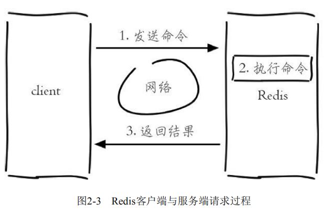
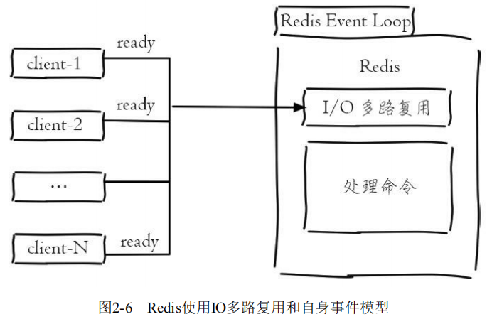

# 单线程架构、库、全局命令

连接上了Redis，我们还需要对Redis做进一步了解。

### 单线程架构

在前面已经提到过，Redis使用的是单线程，**准确来说是单线程架构和I/O多路复用模型来实现高性能的内存数据库服务**。

##### 单线程模型

现在开启三个redis-cli客户端同时执行命令：

客户端1设置一个字符串键值对：键为`hello`，值为`world`

```
127.0.0.1:6379> set hello world
```

客户端2对 `counter` 做自增操作：

```
127.0.0.1:6379> incr counter
```

客户端3对 `counter` 做自增操作： 

```
127.0.0.1:6379> incr counter
```

Redis客户端与服务端的模型可以简化成：发送命令、执行命令、返回结果。



**因为Redis是单线程来处理命令的，所以一条命令从客户端达到服务端不会立刻被执行，所有命令都会进入一个队列中，然后逐个被执行。**

**所以上面3个客户端命令的执行顺序是不确定的，但可以确定的是不会有两条命令被同时执行。**


所以上面两条incr命令无论怎么执行最终结果都是2，不会产生并发问题，这就是Redis单线程的基本模型。

##### 高性能基础

通常来讲，单线程处理能力要比多线程差，例如有10000斤货物，每辆车的运载能力是每次200斤，那么要50次才能完成，但是如果有50辆车，只要安排合理，只需要一次就可以完成任务。那么为什么Redis使用单线程模型会达到每秒万级别的处理能力呢？可以将其归结为三点：

1. **纯内存访问，Redis将所有数据放在内存中**，内存的响应时长大约为100纳秒，**这是Redis达到每秒万级别访问的重要基础。**
2. **非阻塞I/O**，Redis使用epoll作为I/O多路复用技术的实现，再加上Redis自身的事件处理模型将epoll中的连接、读写、关闭都转换为事件，不在网络I/O上浪费过多的时间。



3. 单线程避免了线程切换和竞态产生的消耗。单线程能带来几个好处：第一，**单线程可以简化数据结构和算法的实现。**如果对高级编程语言熟悉的读者应该了解并发数据结构实现不但困难而且开发测试比较麻烦。第二，**单线程避免了线程切换和竞态产生的消耗，对于服务端开发来说，锁和线程切换通常是性能杀手。**

##### Redis之殇

Redis单线程会有一个问题：**对于每个命令的执行时间是有要求的。如果某个命令执行过长，会造成其他命令的阻塞，对于Redis这种高性能的服务来说是致命的，所以Redis是面向快速执行场景的数据库。** 

### 库

与其他数据库不同的是，**Redis默认支持16个数据库**（修改配置信息可以支持更多，无上限），**每个数据库都以编号命名（默认0-15），客户端与Redis建立连接会自动选择0号数据库**。

##### 切换数据库

```
redis 127.0.0.1:6379>               # 默认使用0号数据库

redis 127.0.0.1:6379> SELECT 1      # 使用 1 号数据库
OK

redis 127.0.0.1:6379[1]>            # 已经切换到 1 号数据库，Redis的命令提示符多了个 [1]

redis 127.0.0.1:6379[1]> SELECT 3   # 再切换到 3 号数据库
OK
 
redis 127.0.0.1:6379[3]>            # 提示符从 [1] 改变成了 [3]
```

?> Redis每个数据库的数据是不能共享，但并不是完全隔离的，比如FLUSHALL命令可以清空Redis中所有数据库中的数据。

### 全局命令

Redis的命令有上百个，如果纯靠死记硬背比较困难，但是如果理解了Redis的一些机制，会发现这些命令有很强的通用性。

**Redis对外有5种数据结构分别是： string（字符串）、hash（哈希）、list（列表）、set（集合）、zset（有序集合），它们都是键值对中的值，对于键来说有一些通用的命令。**

##### 查看所有键

查看所有键命令：**`key` 就代表所有的键值对的剑鸣。**

```
keys *
```

下面插入了3对字符串类型的键值对：

```
127.0.0.1:6379> set hello world 
OK
127.0.0.1:6379> set java jedis 
OK
127.0.0.1:6379> set python redis-py 
OK
```

`keys*` 命令会将所有的键输出：

```
127.0.0.1:6379> keys * 
1) "python" 
2) "java" 
3) "hello"
```

##### 统计键总数

统计键总数命令：

```
dbsize
```

下面插入一个列表类型的键值对（值是由`a b c d e f g`多个元素组成）：

```
127.0.0.1:6379> rpush mylist a b c d e f g 
(integer) 7
```

`dbsize` 命令会返回当前数据库中键的总数。例如当前数据库有4个键， 分别是`hello、java、python、mylist`，所以结果是4：

```
127.0.0.1:6379> dbsize 
(integer) 4
```

**dbsize命令在计算键总数时不会遍历所有键，而是直接获取Redis内置的键总数变量，**所以dbsize命令的时间复杂度是O（1）。**而keys命令会遍历所有键**，所以它的时间复杂度是O（n）。

!> 当Redis保存了大量键时，线上环境禁止使用keys命令。

##### 检查键存在

检查键是否存在命令：

```
exists 键名
```

**如果键存在则返回1，不存在则返回0**

```
127.0.0.1:6379> exists java 
(integer) 1 
127.0.0.1:6379> exists not_exist_key 
(integer) 0
```

!> 如果键的值为空，那么键也不会存在，因为“键值对”必须是一个键对应一个值。

##### 删除键

删除键命令：**`del`是一个通用命令，无论值是什么数据结构类型，都可以将其删除。**

```
del 键名
```

**返回结果为成功删除键的个数，如果删除一个不存在的键，就会返回 0**

```
127.0.0.1:6379> del java 
(integer) 1 
127.0.0.1:6379> exists java 
(integer) 0 

127.0.0.1:6379> del not_exist_key 
(integer) 0
```

`del` 命令可以支持删除多个键

```
127.0.0.1:6379> del a b c 
(integer) 3
```

##### 键过期

键过期：即给键设置一个过期时间

```
expire 键名 时间(秒)
```

新建一个键值对，设置过期时间为10秒：

```
127.0.0.1:6379> set hello world 
OK
127.0.0.1:6379> expire hello 10 
(integer) 1
```

过 `ttl` 命令观察键hello的剩余过期时间，它有3种返回值：

- 大于等于0的整数：键剩余的过期时间。

- -1：键没设置过期时间。
- -2：键不存在。

```
#还剩7秒 
127.0.0.1:6379> ttl hello 
(integer) 7 
... 
#还剩1秒 
127.0.0.1:6379> ttl hello 
(integer) 1 
#返回结果为-2，说明键hello已经被删除 
127.0.0.1:6379> ttl hello 
(integer) -2 
# 查询键hello，返回结果为空
127.0.0.1:6379> get hello 
(nil)
```

##### 查询数据类型

查询数据类型命令：

```
type 键名
```

键hello是**字符串类型，返回结果为string**；键mylist是**列表类型，返回结果为list**；**键不存在，则返回none**。

```
127.0.0.1:6379> set a b 
OK
127.0.0.1:6379> type a 
string

127.0.0.1:6379> rpush mylist a b c d e f g 
(integer) 7 
127.0.0.1:6379> type mylist 
list

127.0.0.1:6379> type not_exsit_key 
none
```