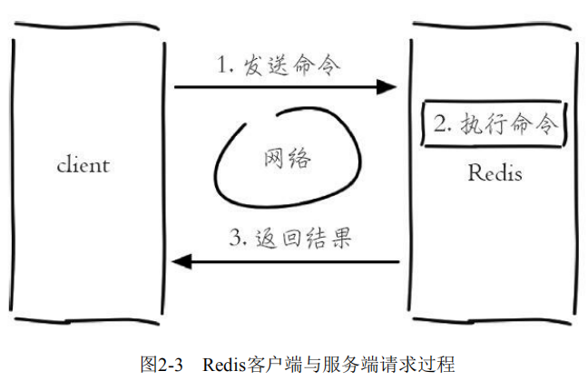
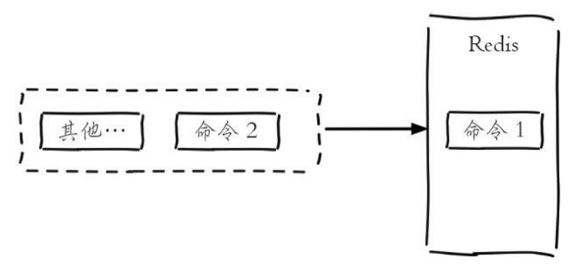
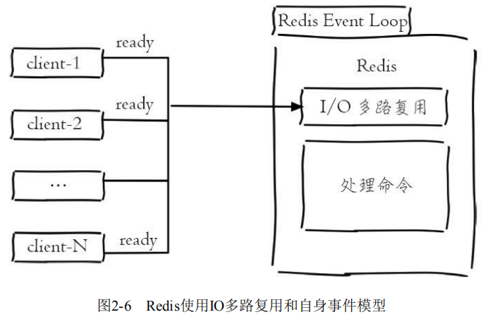
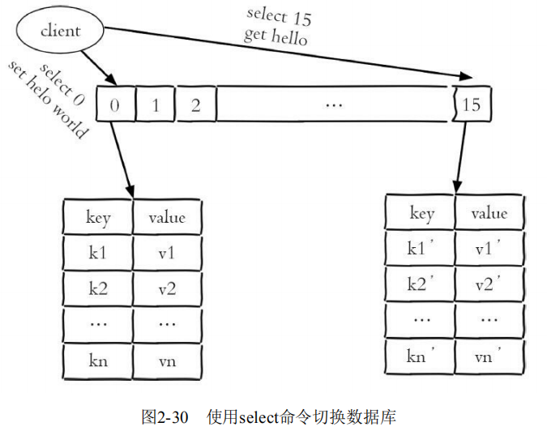
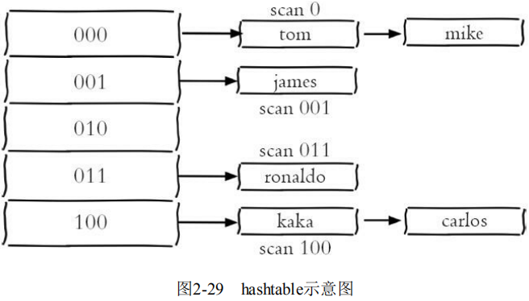
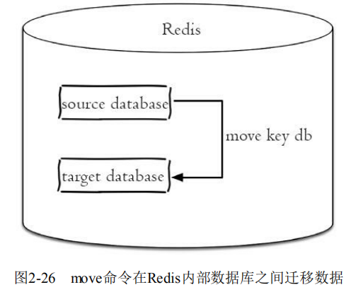
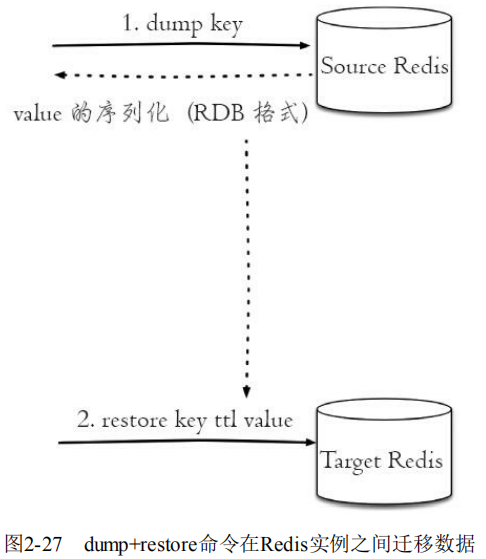
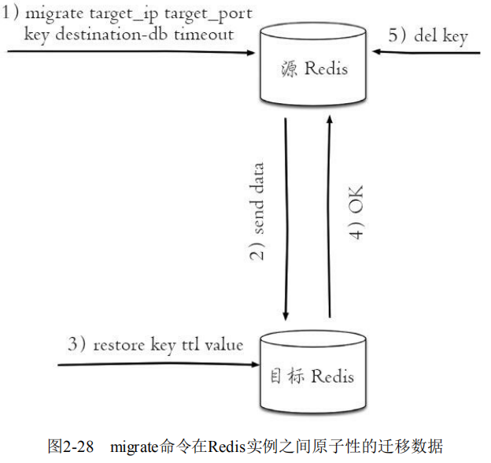
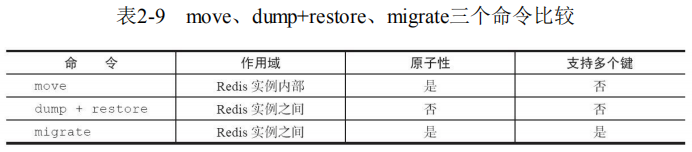

# 单线程架构、库、全局命令

连接上了Redis，我们还需要对Redis做进一步了解。

### 单线程架构

在前面已经提到过，Redis使用的是单线程，**准确来说是单线程架构和I/O多路复用模型来实现高性能的内存数据库服务**。

##### 单线程模型

现在开启三个redis-cli客户端同时执行命令：

客户端1设置一个字符串键值对：键为`hello`，值为`world`

```
127.0.0.1:6379> set hello world
```

客户端2对 `counter` 做自增操作：

```
127.0.0.1:6379> incr counter
```

客户端3对 `counter` 做自增操作： 

```
127.0.0.1:6379> incr counter
```

Redis客户端与服务端的模型可以简化成：发送命令、执行命令、返回结果。



**因为Redis是单线程来处理命令的，所以一条命令从客户端达到服务端不会立刻被执行，所有命令都会进入一个队列中，然后逐个被执行。**

**所以上面3个客户端命令的执行顺序是不确定的，但可以确定的是不会有两条命令被同时执行。**



所以上面两条incr命令无论怎么执行最终结果都是2，不会产生并发问题，这就是Redis单线程的基本模型。

##### 高性能基础

通常来讲，单线程处理能力要比多线程差，例如有10000斤货物，每辆车的运载能力是每次200斤，那么要50次才能完成，但是如果有50辆车，只要安排合理，只需要一次就可以完成任务。那么为什么Redis使用单线程模型会达到每秒万级别的处理能力呢？可以将其归结为三点：

1. **纯内存访问，Redis将所有数据放在内存中**，内存的响应时长大约为100纳秒，**这是Redis达到每秒万级别访问的重要基础。**
2. **非阻塞I/O**，Redis使用epoll作为I/O多路复用技术的实现，再加上Redis自身的事件处理模型将epoll中的连接、读写、关闭都转换为事件，不在网络I/O上浪费过多的时间。



3. 单线程避免了线程切换和竞态产生的消耗。单线程能带来几个好处：第一，**单线程可以简化数据结构和算法的实现。**如果对高级编程语言熟悉的读者应该了解并发数据结构实现不但困难而且开发测试比较麻烦。第二，**单线程避免了线程切换和竞态产生的消耗，对于服务端开发来说，锁和线程切换通常是性能杀手。**

##### 应用场景

Redis单线程会有一个问题：**对于每个命令的执行时间是有要求的。如果某个命令执行过长，会造成其他命令的阻塞，对于Redis这种高性能的服务来说是致命的，所以Redis是面向快速执行场景的数据库。** 

### 库

与其他数据库不同的是，**Redis默认支持16个数据库**（修改配置信息可以支持更多，无上限），**每个数据库都以编号命名（默认0-15），客户端与Redis建立连接会自动选择0号数据库**。

##### 切换数据库

```
redis 127.0.0.1:6379>              # 默认使用0号数据库

redis 127.0.0.1:6379> SELECT 15    # 使用1号数据库
OK

redis 127.0.0.1:6379[15]>          # 已经切换到1号数据库，Redis的命令提示符多了个[15]

redis 127.0.0.1:6379[15]> SELECT 3 # 再切换到3号数据库
OK
 
redis 127.0.0.1:6379[3]>           # 提示符从[1]改变成了[3]
```



!> Redis每个数据库的数据是不能共享，不同数据库可以存在相同的键。

?> Redis已经在逐渐弱化多数据库功能，因为单线程架构。如果使用多个数据库，那么这些数据库仍然是使用一个CPU核心，彼此之间还是会受到影响的。假如有一个慢查询存在，依然会影响其他数据库。在开发的时候来回切换数字形式的数据库，很容易弄乱。建议如果要使用多个数据库功能，完全可以在一台机器上部署多个Redis实例，彼此用端口来做区分，因为现代计算机或者服务器通常是有多个CPU的。这样既保证了业务之间不会受到影响，又合理地使用了CPU资源。 

##### 清空数据库

`flushdb` **只清除当前数据库**。

`flushall` **清除所有数据库**。

```
127.0.0.1:6379> flushdb     # 清空当前0号数据库
OK

127.0.0.1:6379> flushall    # 清空0号至15号的所有数据库
OK
```

!> 如果当前数据库键值数量比较多，`flushdb`/`flushall`存在阻塞Redis的可能性。所以在使用时一定要小心谨慎。

### 通用命令

Redis的命令有上百个，如果纯靠死记硬背比较困难，但是如果理解了Redis的一些机制，会发现这些命令有很强的通用性。

**Redis对外有5种数据结构分别是： string（字符串）、hash（哈希）、list（列表）、set（集合）、zset（有序集合），它们都是键值对中的值，对于键来说有一些通用的命令。**

##### 遍历键

**全量遍历键：`keys` 就代表所有的键值对的键名。**

```
keys pattern
```

`pattern` 使用的是glob风格的通配符：

- `*`代表匹配任意字符。
- `.`代表匹配一个字符。
- `[]`代表匹配部分字符，例如[1，3]代表匹配1、3；[1-10]代表匹配1到10的任意数字。
- `\x`用来做转义，例如要匹配星号、问号需要进行转义。

下面插入了3对字符串类型的键值对：

```
127.0.0.1:6379> set hello world 
OK
127.0.0.1:6379> set java jedis 
OK
127.0.0.1:6379> set python redis-py 
OK
```

`keys *` 命令会将所有的键输出：

```
127.0.0.1:6379> keys * 
1) "python" 
2) "java" 
3) "hello"
```

匹配到hello这个键：

```
127.0.0.1:6379> keys h*ll* 
1) "hello"
```

匹配以j，r开头，紧跟edis字符串的所有键：

```
127.0.0.1:6379> keys [j,r]edis 
1) "jedis" 
2) "redis"
```

**渐进式遍历**：`scan` 采用渐进式遍历的方式来解决keys命令可能带来的阻塞问题，每次 `scan` 命令的时间复杂度是 O（1），但是要真正实现keys的功能，需要执行多次 `scan`。

Redis存储键值对实际使用的是 `hashtable` 的数据结构：



每次执行 `scan`，可以想象成只扫描一个字典中的一部分键，直到将字典中的所有键遍历完毕。

```
scan cursor [match pattern] [count number]
```

- cursor是必需参数，实际上cursor是一个游标，第一次遍历从0开始，每次**scan遍历完都会返回当前游标的值**，直到游标值为0，表示遍历结束。
- match pattern是可选参数，它的作用的是做模式的匹配，这点和 `keys` 的模式匹配很像。
- count number是可选参数，它的作用是表明每次要遍历的键个数，默认值是10，此参数可以适当增大。

现有一个Redis有26个键（英文26个字母），现在要遍历所有的键，第一次执行`scan 0`，返回结果分为两个部分：第一个部分6就是下次 `scan` 需要的cursor，第二个部分是10个键：

```
127.0.0.1:6379> scan 0 
1) "6" 
2) 1) "w" 
   2) "i" 
   3) "e" 
   4) "x" 
   5) "j" 
   6) "q" 
   7) "y" 
   8) "u" 
   9) "b" 
   10) "o"
```

使用新的cursor="6"，执行`scan 6`：

```
127.0.0.1:6379> scan 6 
1) "11" 
2) 1) "h" 
   2) "n" 
   3) "m" 
   4) "t" 
   5) "c" 
   6) "d" 
   7) "g" 
   8) "p" 
   9) "z" 
   10) "a"
```

这次得到的cursor="11"，**继续执行scan11得到结果cursor变为0，说明所有的键已经被遍历过了**：

```
127.0.0.1:6379> scan 11 
1) "0" 
2) 1) "s" 
   2) "f" 
   3) "r" 
   4) "v" 
   5) "k" 
   6) "l"
```

?> `scan` 命令可以解决keys命令可能带来的阻塞问题，同时Redis还提供了 `hscan`、`sscan`、`zscan`渐进式地遍历hash、set、zset。

!> 如果在 `scan` 的过程中如果有键的变化（增加、删除、修改），可能有如下问题：新增的键可能没有遍历到，重复遍历键等情况，也就是说 `scan` 并不能保证完整的遍历出来所有的键。 

##### 统计键总数

统计键总数命令：

```
dbsize
```

下面插入一个列表类型的键值对（值是由`a b c d e f g`多个元素组成）：

```
127.0.0.1:6379> rpush mylist a b c d e f g 
(integer) 7
```

`dbsize` 命令会返回当前数据库中键的总数。例如当前数据库有4个键， 分别是`hello、java、python、mylist`，所以结果是4：

```
127.0.0.1:6379> dbsize 
(integer) 4
```

**dbsize命令在计算键总数时不会遍历所有键，而是直接获取Redis内置的键总数变量，**所以dbsize命令的时间复杂度是O（1）。**而keys命令会遍历所有键**，所以它的时间复杂度是O（n）。

!> 当Redis保存了大量键时，线上环境禁止使用keys命令。

##### 检查键存在

检查键是否存在命令：

```
exists 键名
```

**如果键存在则返回1，不存在则返回0**

```
127.0.0.1:6379> exists java 
(integer) 1 
127.0.0.1:6379> exists not_exist_key 
(integer) 0
```

!> 如果键的值为空，那么键也不会存在，因为“键值对”必须是一个键对应一个值。

##### 键重命名

```
rename key newkey
```

现有一个键值对，键为python，值为jedis，将键python重命名为java：

```
127.0.0.1:6379> set python jedis 
OK
127.0.0.1:6379> rename python java 
OK
127.0.0.1:6379> get python 
(nil) 
127.0.0.1:6379> get java 
"jedis"
```

!> 如果在 `rename`之前，键已经存在，那么它的值也将被覆盖。

```
127.0.0.1:6379> set a b 
OK
127.0.0.1:6379> set c d 
OK
127.0.0.1:6379> rename a c 
OK
127.0.0.1:6379> get a 
(nil) 
127.0.0.1:6379> get c 
"b"
```

为了防止被强行 `rename`，Redis提供了 `renamenx`命令，确保只有 newKey 不存在时候才被覆盖。

操作renamenx时，newkey=python已经存在，**返回结果是0代表没有完成重命名，所以键java和python的值没变**：

```
127.0.0.1:6379> set java jedis 
OK
127.0.0.1:6379> set python redis-py 
OK
127.0.0.1:6379> renamenx java python 
(integer) 0 
127.0.0.1:6379> get java 
"jedis" 
127.0.0.1:6379> get python 
"redis-py"
```

##### 随机返回键

```
randomkey
```

当前数据库有1000个键值对，`randomkey` 命令会随机从中 挑选一个键：

```
127.0.0.1:6379> dbsize 
1000 
127.0.0.1:6379> randomkey 
"hello" 
127.0.0.1:6379> randomkey 
"jedis"
```

##### 删除键

删除键命令：**`del` 是一个通用命令，无论值是什么数据结构类型，都可以将其删除。**

```
del 键名
```

**返回结果为成功删除键的个数，如果删除一个不存在的键，就会返回 0**

```
127.0.0.1:6379> del java 
(integer) 1 
127.0.0.1:6379> exists java 
(integer) 0 

127.0.0.1:6379> del not_exist_key 
(integer) 0
```

`del` 命令可以支持删除多个键

```
127.0.0.1:6379> del a b c 
(integer) 3
```

##### 键过期

键过期：**即给键设置一个过期时间。**

1. **如果键不存在，返回结果为0。**
2. **在过期时间，键存在，超过过期时间，键会立即被删除，犹如使用del命令一样。**
3. **如果过期时间为负值，键会立即被删除，犹如使用del命令一样。**

```
expire key seconds
expireat key timestamp
pexpire key milliseconds
pexpireat key milliseconds-timestamp
```

- seconds：键在seconds秒后过期。
- timestamp：键在秒级时间戳timestamp后过期。
- milliseconds：键在milliseconds毫秒后过期。
- milliseconds-timestamp：键在毫秒级时间戳timestamp后过 期。

新建一个键值对，设置过期时间为10秒：

```
127.0.0.1:6379> set hello world 
OK
127.0.0.1:6379> expire hello 10 
(integer) 1
```

通过 `ttl` 或 `pttl` 命令观察键hello的剩余过期时间，它有3种返回值：

- 大于等于0的整数：键剩余的过期时间（`ttl` 是秒，`pttl` 是毫秒）。

- -1：键没设置过期时间。
- -2：键不存在。

```
#还剩7秒 
127.0.0.1:6379> ttl hello 
(integer) 7 
... 
#还剩1秒 
127.0.0.1:6379> ttl hello 
(integer) 1 
#返回结果为-2，说明键hello已经被删除 
127.0.0.1:6379> ttl hello 
(integer) -2 
# 查询键hello，返回结果为空
127.0.0.1:6379> get hello 
(nil)
```

?> Redis不支持二级数据结构（例如哈希、列表）内部元素的过期功能，例如不能对列表类型的一个元素做过期时间设置。

!> `set` 相同的键会导致过期时间失效，可以用 `setex` 命令作为 `set+expire` 的组合，不但是原子执行，同时减少了一次网络通讯的时间。

##### 清除键过期

**`persist` 命令可以将键的过期时间清除**：

```
127.0.0.1:6379> set f1 v1 
OK 
127.0.0.1:6379> expire f1 50 
(integer) 1 
127.0.0.1:6379> ttl f1 
(integer) 46 
127.0.0.1:6379> persist f1 
(integer) 1 
127.0.0.1:6379> ttl f1 
(integer) -1
```

##### 迁移键

迁移键功能非常重要，因为有时候我们只想把部分数据由一个Redis迁移到另一个Redis（例如从生产环境迁移到测试环境）。

`move` 命令用于在Redis内部进行数据迁移：

```
move key db
```



`dump+restore` 命令可以实现在不同的Redis实例之间进行数据迁移的功能，迁移过程分为两步： 

1. 在源Redis上，`dump `命令会将键值序列化，格式采用的是RDB格式。

```
redis-source> set hello world 
OK
redis-source> dump hello 
"\x00\x05world\x06\x00\x8f<T\x04%\xfcNQ"
```

2. 在目标Redis上，`restore` 命令将上面序列化的值进行复原，其中 `ttl` 参数代表过期时间，如果 `ttl=0` 代表没有过期时间。

```
redis-target> get hello 
(nil) 
redis-target> restore hello 0 "\x00\x05world\x06\x00\x8f<T\x04%\xfcNQ" 
OK
redis-target> get hello 
"world"
```




有关 `dump+restore` 有两点需要注意：

1. 整个迁移过程并非原子性的，而是通过客户端分步完成的。
2. 迁移过程是开启了两个客户端连接，所以 `dump` 的结果不是在源Redis和目标Redis之间进行传输。

`migrate` 也是用于在Redis实例间进行数据迁移的，实际上就是将 `dump`、`restore`、`del`三个命令进行组合，从而简化了操作流程。

1. 整个过程是原子执行的，不需要在多个Redis实例上开启客户端的，只需要在源Redis上执行 `migrate` 命令即可。
2. `migrate` 命令的数据传输直接在源Redis和目标Redis上完成的。
3. 目标Redis完成 `restore` 后会发送OK给源Redis，源Redis接收后会根据 `migrate` 对应的选项来决定是否 在源Redis上删除对应的键。

```
migrate host port key|"" destination-db timeout [copy] [replace] [keys key[key...]]
```

- host：目标Redis的IP地址。 
- port：目标Redis的端口。 
- key|""：如果当前需要迁移多 个键，此处为空字符串""。 
- destination-db：目标Redis的数据库索引，如果迁移到0号数据库，这里就写0。
- timeout：迁移的超时时间（单位为毫秒）。 
- [copy]：如果添加此选项，迁移后并不删除源键。 
- [replace]：如果添加此选项，migrate不管目标Redis是否存在该键都会正常迁移进行数据覆盖。 
- [keys key[key...]]：迁移多个键，例如要迁移key1、key2、key3，此处填写“keys key1 key2 key3”。



情况1：源Redis有键hello，目标Redis没有：

```
127.0.0.1:6379> migrate 127.0.0.1 6380 hello 0 1000 
OK
```

情况2：源Redis和目标Redis都有键hello：

```
127.0.0.1:6379> get hello 
"world" 
127.0.0.1:6380> get hello 
"redis"
```

如果migrate命令没有加replace选项会收到错误提示，如果加了replace会 返回OK表明迁移成功：

```
127.0.0.1:6379> migrate 127.0.0.1 6379 hello 0 1000 
(error) ERR Target instance replied with error: BUSYKEY Target key name already
127.0.0.1:6379> migrate 127.0.0.1 6379 hello 0 1000 replace 
OK
```

情况3：源Redis没有键hello。如下所示，此种情况会收到nokey的提示：

```
127.0.0.1:6379> migrate 127.0.0.1 6380 hello 0 1000 
NOKEY
```

情况4：完成多个键的迁移：

```
127.0.0.1:6379> migrate 127.0.0.1 6380 "" 0 5000 keys key1 key2 key3 
OK
```



##### 查询数据类型

查询数据类型命令：

```
type 键名
```

键hello是**字符串类型，返回结果为string**；键mylist是**列表类型，返回结果为list**；**键不存在，则返回none**。

```
127.0.0.1:6379> set a b 
OK
127.0.0.1:6379> type a 
string

127.0.0.1:6379> rpush mylist a b c d e f g 
(integer) 7 
127.0.0.1:6379> type mylist 
list

127.0.0.1:6379> type not_exsit_key 
none
```