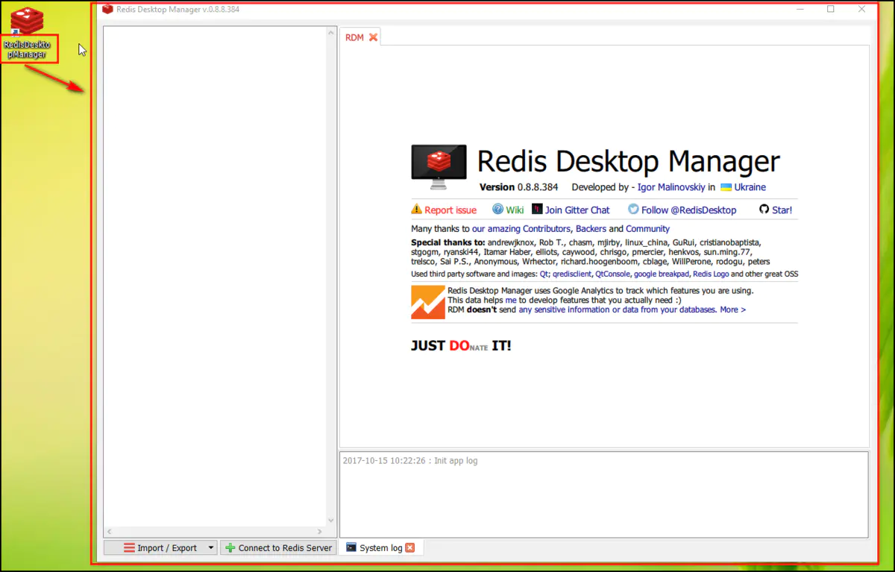
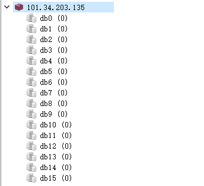

# 可视化工具、库、键命令

连接上了Redis，我们还需要对Redis做进一步了解。

## 可视化工具

为了更直观的展示下面的例子，我们先来安装一个Redis可视化工具。

工具名称：[RedisDesktopManager](https://redisdesktop.com/download)

安装完成桌面会生成如下快捷图标，双击启动如右图：



点击下方的 `Connect to Redis Server` 创建连接：出现 `Successful connection to redis-server` 说明连接成功。

```
Name：当前连接的名称
Host：主机地址（一般为本机的环回地址127.0.0.1或者局域网地址）
Port：连接端口
Auth：Reids的认证密码
Test Connection：测试能否连接成功
```


如果我们要连接云服务器上的Redis，还需要配置 `SSH Tunnel` 选项卡，**因为要先通过SSH连接到云服务器才能连接到里面的Redis。**配置如下：

```
勾选Use SSH Tunnel：使用SSH管道
Remote Host：云服务器的IP
Remote Port：SSH的连接端口，通常是22
User Name：登录云服务器的用户名
勾选Private Key：使用私钥登录
勾选Password：使用密码登录
```


?> 注意：云服务器上的Redis要停止服务 `systemctl stop redis`，Redis要通过 `路径\redis-server 路径\redis.conf` 启动起来。

## 数据库

与其他数据库不同的是，**Redis默认支持16个数据库（修改配置信息可以支持更多，无上限），每个数据库都以编号命名（默认0-15）。**



?> 提示：因为单线程架构，让Redis多数据库功能仍然是使用一个CPU核心，彼此之间还是会受到影响的。建议如果要使用多个数据库功能，完全可以在一台机器上部署多个Redis实例，彼此用端口来做区分，因为现代计算机或者服务器通常是有多核CPU的。这样既保证了业务之间不会受到影响，又合理地使用了CPU资源。

!> 注意：Redis每个数据库的数据是不能共享，不同数据库可以存在相同的键。

### 切换数据库

**客户端与Redis建立连接会自动选择0号数据库，通过 `select 数据库编号` 来切换数据库。**可以看到下图中，除0号数据库外，在其它库上都显示有编号：


### 清空数据库

`flushdb`：**清除当前数据库。**

```
127.0.0.1:6379[1]> flushdb   # 清空当前所在1号数据库中的所有数据
```

`flushall`：**清除所有数据库。**

```
127.0.0.1:6379[1]> flushall  # 清空0号至15号的所有数据库的所有数据
```

!> 注意：如果当前数据库键值数量比较多，`flushdb`/`flushall` 存在阻塞Redis的可能性。所以在使用时一定要小心谨慎。

## 键命令

Redis的命令有上百个，如果纯靠死记硬背比较困难，但是如果理解了Redis的一些机制，会发现这些命令有很强的通用性。

**Redis对外有5种数据结构分别是： string（字符串）、hash（哈希）、list（列表）、set（集合）、zset（有序集合），它们都是键值对中的值，对于键来说有一些通用的命令。**

**Redis中的数据都是以键值对的形式存在，如果键的值为空，那么键也不会存在，同样的只有值没有键也不会存在，因为“键值对”必须是一个键对应一个值。**

为了更加直观的展示下面的操作，请在可视化工具中选中数据库，右键选择 `Console` 呼出命令行：


### 设置键

`set 键 值`：**设置键值对的命令。**


同样，还可以用相同的命令来改变键值对当中键对应的值：


### 类型键

`type 键`：**返回键的类型。Redis对外有5种数据结构分别是： string（字符串）、hash（哈希）、list（列表）、set（集合）、zset（有序集合）。**

键hello是字符串类型，返回结果为string：


### 获取值

`get 键`：**获取一个键对应的值，如果要获取的键不存在，则返回nil（空）。**


### 匹配键

`keys 通配符`：**按通配符来匹配键名。**

- `keys`：代表所有的键值对的键名。
- `*`：代表匹配任意字符。
- `.`：代表匹配一个字符。
- `[]`：代表匹配部分字符，[1，3]代表匹配1和3；[1-10]代表匹配1到10的任意数字。
- `\x`：用来做转义，例如要匹配星号、问号需要进行转义。

`keys *` ：遍历所有的键。


`keys h*ll*`：匹配以h开头中间有两个l的键。


`keys [h,l]ell* `：匹配以j，r开头，紧跟ell字符串的所有键。


如果通配符**不能完全匹配上**，则返回为空。


!> 注意：当Redis保存了大量键时，线上环境禁止使用 `keys` 命令。

### 键数量

`dbsize`：返回当前数据库中键的总数。


?> 提示：dbsize命令是直接获取Redis内置的键总数变量，所以dbsize命令的时间复杂度是O(1)，而keys命令会遍历所有键，所以它的时间复杂度是O(n)。

### 键存在

`exists 键`：**检查键是否存在，如果存在则返回1，不存在则返回0。**


### 重命名

`rename 键 新键`：**将旧键名称替换为新键名称，若已存在新键名称，新键的值将被覆盖。**

现有一个键值对，键为hello，将键hello重命名为python：


**如果在键hello重命名之前，键python已经存在，键python的值也将被覆盖为键hello的值。**

```
# 存在键值对：{hello: world123}、{python: world}
127.0.0.1:6379> rename hello python
OK
127.0.0.1:6379> get hello 
(nil)
127.0.0.1:6379> get python 
"world123"
```

为了防止被强行 `rename`，Redis提供了 `renamenx`命令，确保只有 newKey 不存在时候才被覆盖。

`renamenx 键 新键`：**将旧键名称替换为新键名称，若已存在新键名称，返回结果0，代表没有完成重命名，所以旧键新键的值不变。**

新键名python已经存在，rename返回0，所以键hello和python的值没变：

```
# 存在键值对：{hello: world123}、{python：world}
127.0.0.1:6379> rename hello python
(integer) 0 
127.0.0.1:6379> get hello
"world123" 
127.0.0.1:6379> get python 
"world"
```

### 随机键

`randomkey`：**返回一个随机键。**


### 删除键

`del 键`：**删除单个或多个任意键，返回结果为成功删除的个数，如果删除不存在的键，返回0。**


### 过期键

过期键：**即给键设置一个过期时间；在过期时间，键存在；超过过期时间，键会立即被删除，犹如使用del命令一样；如果过期时间为负值，键会立即被删除。**

`expire 键 秒数`：**设置键在指定秒数后过期。**

`ttl 键`：**观察键剩余过期时间；结果大于等于0的整数，键剩余的过期时间；结果等于-1，键没有设置过期时间；结果等于-2，键不存在。**

`persist 键`：**清除键的过期时间。**

新建一个键值对：`set hello world`

观察新键值对过期时间：`ttl hello`


设置过期时间为20秒：`expire hello 20 `


20秒后再用 `ttl` 命令：`ttl hello`


?> 提示：Redis不支持二级数据结构（例如哈希、列表）内部元素的过期功能，例如不能对列表中的某一个元素做过期时间设置。

!> 注意：`set` 相同的键会导致过期时间失效，可以用 `setex` 命令作为 `set+expire` 的组合，不但是原子执行，同时减少了一次网络通讯的时间。

### 计数键

`incr 键`：**对键中的值进行自增1的操作。**

- 键中的值必须是整型，否则返回错误。


- 键不存在，按照值为0自增，返回结果为1。


- 值是整数，返回自增后的结果。


除了 `incr` 命令，Redis提供了 `incrby`（自增指定数字）、`decr`（自减）、 `decrby`（自减指定数字）、`incrbyfloat`（自增浮点数）：

```
incrby key increment
decr key
decrby key decrement
incrbyfloat key increment
```

