# 数据结构、内部编码

**Redis有5种数据结构分别是： string（字符串）、hash（哈希）、list（列表）、set（集合）、zset（有序集合）。**

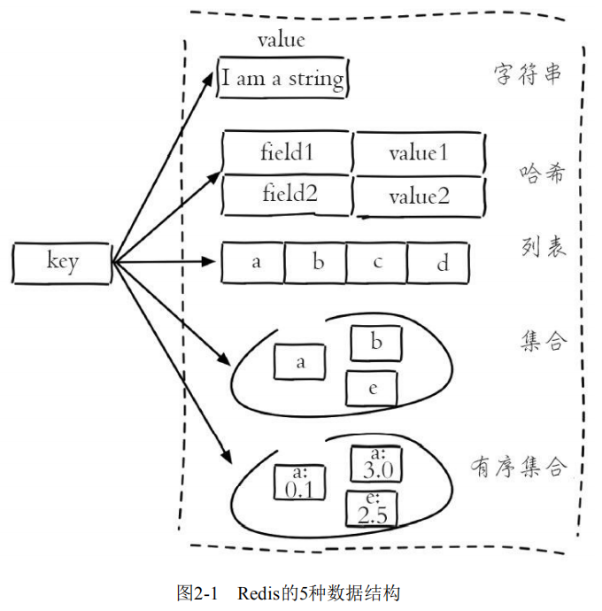

### 字符串

**字符串类型是Redis最基础的数据结构，其他几种数据结构都是在字符串类型基础上构建的。**

字符串类型的值实际可以是字符串（简单的字符串、复杂的字符串（例如JSON、XML））、数字 （整数、浮点数），甚至是二进制（图片、音频、视频），但是**值最大不能超过512MB**。

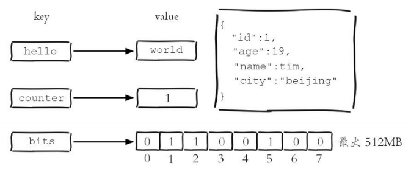

##### 添加、获取、计数

添加：**添加一个键值对**。

```
set key value [ex seconds] [px milliseconds] [nx|xx]
```

- ex seconds：为键设置秒级过期时间。 

- px milliseconds：为键设置毫秒级过期时间。 

- nx：**键必须不存在，才可以设置成功，用于添加。** 

- xx：**与nx相反，键必须存在，才可以设置成功，用于更新。**

上述的命令列举的参数，都可以和`set` 合并：

```
set key value ex seconds == setex key seconds value
set key value px seconds == setpx key seconds value
set key value nx == setnx key value
set key value xx == setxx key value
```

设置键为hello，值为world的键值对，**返回结果为OK代表设置成功**：

```
127.0.0.1:6379> set hello world 
OK
```

获取：**获取一个键值对的值**。

```
get key
```

获取键hello的值，**如果要获取的键不存在，则返回nil（空）**：

```
127.0.0.1:6379> get hello 
"world"

127.0.0.1:6379> get not_exist_key 
(nil)
```

计数：**统计次数。**

```
incr key
```

`incr`命令用于对值做自增操作，返回结果分为三种情况： 

- **值不是整数，返回错误。**
- **值是整数，返回自增后的结果**。
- **键不存在，按照值为0自增，返回结果为1。** 

例如**对一个不存在的键执行incr操作后，返回结果是1，再次对键执行incr命令，返回结果是2**：

```
127.0.0.1:6379> exists key 
(integer) 0 
127.0.0.1:6379> incr key 
(integer) 1
127.0.0.1:6379> incr key 
(integer) 2
```

如果值不是整数，那么会返回错误：

```
127.0.0.1:6379> set hello world 
OK
127.0.0.1:6379> incr hello 
(error) ERR value is not an integer or out of range
```

除了incr命令，Redis提供了`decr`（自减）、 `decrby`（自减指定数字）、`incrby`（自增指定数字）、`incrbyfloat`（自增浮点数）：

```
decr key 
decrby key decrement 
incrby key increment 
incrbyfloat key increment
```

##### 批量添加、批量获取

批量添加：**批量添加键值对**。

```
mset key value [key value ...]
```

通过mset命令一次性设置4个键值对：

```
127.0.0.1:6379> mset a 1 b 2 c 3 d 4 
OK
```

批量获取：**批量获取键值**。

```
mget key [key ...]
```

批量获取了键a、b、c、d、f的值，**f键不存在，那么它的值为nil（空）**：

```
127.0.0.1:6379> mget a b c d f
1) "1" 
2) "2" 
3) "3" 
4) "4"
5) (nil)
```

批量操作命令可以有效提高开发效率，假如没有批量操作命令，执行n次get命令需要按下面方式来执行：

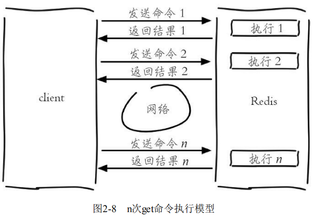

使用批量操作命令后，要执行n次get命令操作只需要按照下面方式来完成：

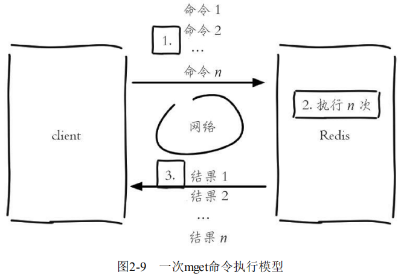

假设网络时间为1毫秒，命令时间为0.1毫秒（按照每秒处理1万条命令算），那么执行1000次get命令和1次mget命令的区别如下：

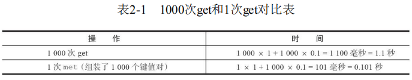

##### 长度、切片、替换

**长度**：获取键值长度。

```
strlen key
```

例如，当前值为redisworld，所以返回值为10：

```
127.0.0.1:6379> get key 
"redisworld" 
127.0.0.1:6379> strlen key 
(integer) 10
```

!> 在Redis中每个汉字的长度为3。

**切片：**`start` 和 `end` 分别是开始位置和结束位置，开始位置从0开始计算，**前闭后闭区间**。

```
getrange key start end
```

取best的前两个字符：

```
127.0.0.1:6379> getrange redis 0 1 
"be"
```

**替换**：替换指定位置的字符。

```
setrange key offeset value
```

下面操作将值由pest变为了best：

```
127.0.0.1:6379> set redis pest 
OK
127.0.0.1:6379> setrange redis 0 b 
(integer) 4 
127.0.0.1:6379> get redis 
"best"
```

##### 追加值、返回原值

追加值： **`append` 可以向字符串尾部追加值**。

```
append key value
```

字符串后面追加字符串：

```
127.0.0.1:6379> set key redis
OK
127.0.0.1:6379> get key
"redis"
127.0.0.1:6379> append key world
(integer) 10
127.0.0.1:6379> get key
"redisworld"
```

返回原值：**`getset` 设置值的同时会返回键原来的值**。

```
getset key value
```

获取原来字符串：

```
127.0.0.1:6379> getset hello world 
(nil) 
127.0.0.1:6379> getset hello redis 
"world"
```

##### 时间复杂度、使用场景

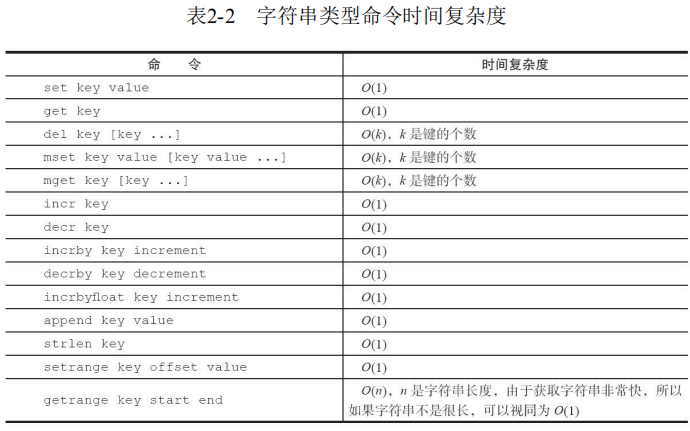

**缓存功能**：Redis作为缓存层，MySQL作为存储层，绝大部分请求的数据都是从Redis中获取。由于Redis具有支撑高并发的特性，所以缓存通常能起到加速读写和降低后端压力的作用。

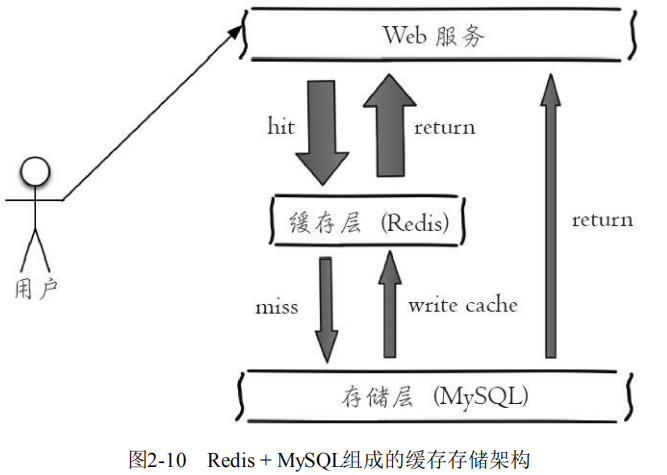

### 列表

**列表（`list`）类型是用来存储多个有序的字符串。列表中的每个字符串称为元素（`element`），一个列表最多可以存储232-1个元素。**在Redis中，可以对列表两端插入（`push`）和弹出（`pop`），还可以获取指定范围的元素列表、获取指定索引下标的元素等。

列表类型有两个特点：

- **列表中的元素是有序的，这就意味着可以通过索引下标获取某个元素或者某个范围内的元素列表**。
- **列表中的元素可以是重复的**。

**列表是一种比较灵活的数据结构，它可以充当栈和队列的角色，在实际开发上有很多应用场景。**

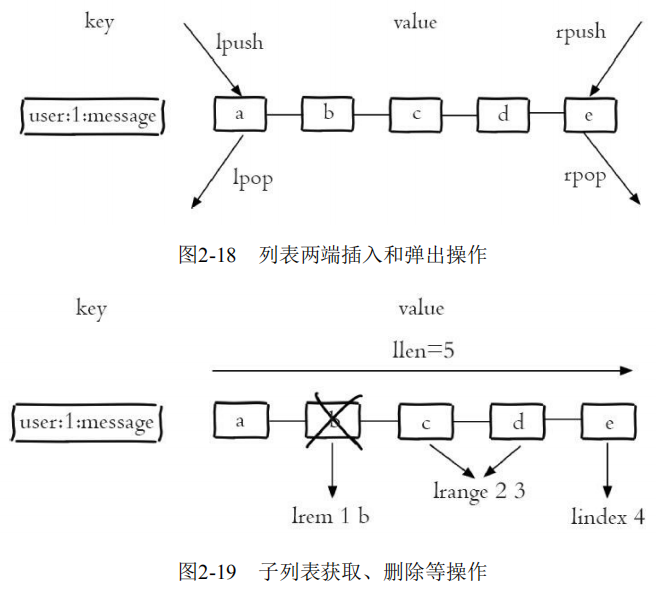

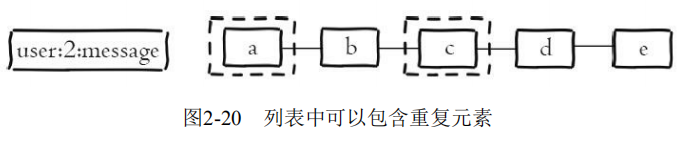

##### 添加、查找、删除

右添加：**从右边插入一个或多个元素。**

``` 
rpush key value [value ...]
```

左添加：**从左边插入一个或多个元素。**

```
lpush key value [value ...]
```

位置添加：**`linsert` 命令会从列表中找到等于 `pivot` 的元素，在其前（before）或者后（after）插入一个新的元素 `value`。**

```
linsert key before|after pivot value
```

在列表最右边依次插入元素c、b、a：

```
127.0.0. 1:6379> rpush listkey c b a 
(integer) 3
```

在列表的元素b前插入 java：

```
127.0.0.1:6379> linsert listkey before b java 
(integer) 4
```

范围查找：**获取指定范围内的元素列表。**

`lrange` 命令会获取列表指定索引范围所有的元素。索引下标有两个特点：

- **索引下标从左到右分别是0到N-1，但是从右到左分别是-1到-N。**
- **`lrange`中的end选项包含了自身，这个和很多编程语言不包含end不太相同。**

```
lrange key start end
```

获取列表的第2到第4个元素：

```
127.0.0.1:6379> lrange listkey 1 3 
1) "java" 
2) "b" 
3) "a"
```

位置查找：**获取列表指定索引下标的元素。**

```
lindex key index
```

获取列表最后一个元素：

```
127.0.0.1:6379> lindex listkey -1 
"a"
```

左删除：**从列表左侧弹出元素。**

```
lpop key
```

将列表最左侧的元素c会被弹出，弹出后列表变为java、b、a：

```
127.0.0.1:6379>t lpop listkey 
"c" 

127.0.0.1:6379> lrange listkey 0 -1 
1) "java" 
2) "b" 
3) "a"
```

右删除：**从列表右侧弹出。** 

```
rpop key
```

右删除左添加：**从列表A的最右边弹出元素，加入到列表B的最左边。**

```
rpoplpush keyA keyB
```

指定删除：**删除指定元素。**

`lrem` 命令会从列表中找到等于 `value` 的元素进行删除，根据count的不同分为三种情况： 

- **count>0，从左到右，删除最多count个元素。**
- **count<0，从右到左，删除最多count绝对值个元素。**
- **count=0，删除所有。**

```
lrem key count value
```

向列表从左向右插入5个a，那么当前列表变为“a a a a a java b a”，下面操作将从列表左边开始删除4个为a的元素：

```
127.0.0.1:6379> lrem listkey 4 a 
(integer) 4 
127.0.0.1:6379> lrange listkey 0 -1 
1) "a" 
2) "java" 
3) "b" 
4) "a"
```

修剪：**按照索引范围修剪列表。**

```
ltrim key start end
```

保留列表listkey第2个到第4个元素：

```
127.0.0.1:6379> ltrim listkey 1 3 
OK

127.0.0.1:6379> lrange listkey 0 -1 
1) "java" 
2) "b" 
3) "a"
```

##### 长度、阻塞

长度：**计算列表长度。**

```
llen key
```

下面示例当前列表长度为4：

```
127.0.0.1:6379> llen listkey 
(integer) 4
```

阻塞：阻塞式弹出。

```
blpop key [key ...] timeout 
brpop key [key ...] timeout
```

`blpop` 和 `brpop` 是 `lpop` 和 `rpop` 的阻塞版本，它们除了弹出方向不同，使用方法基本相同，参数说明：

- `key [key...]`：多个列表的键。
- `timeout`：阻塞时间（单位：秒）。

如果 `timeout=0`，列表为空，客户端一直阻塞等下去。

```
127.0.0.1:6379> brpop list:test 0 
...阻塞...
```

如果 `timeout=3`，列表为空，客户端要等到3秒后返回。

```
127.0.0.1:6379> brpop list:test 3 
(nil) 
(3.10s) 
```

只要列表不为空，客户端都会立即返回。

```
127.0.0.1:6379> brpop list:test 0 
1) "list:test" 
2) "element1"
```

!> 如果有多个键，那么brpop会从左至右遍历键，一旦有一个键能弹出元素，客户端立即返回。

!> 如果多个客户端对同一个键执行brpop，那么最先执行brpop命令的客户端可以获取到弹出的值。

##### 时间复杂度、使用场景


**阻塞式消息队列**：Redis的 `lpush+brpop` 命令组合即可实现阻塞队列，生产者客户端使用 `lpush` 从列表左侧插入元素，多个消费者客户端使用 `brpop` 命令阻塞式的“抢”列表尾部的元素，多个客户端保证了消费的负载均衡和高可用性。

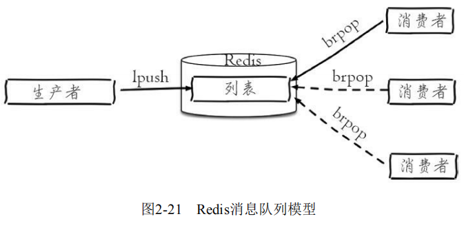

**可靠式消息队列**：使用两个列表，一个列表存储待处理元素，一个列表存储处理中元素，通过Redis的 `rpoplpush` 命令将一个列表的待处理元素移动至另一个列表变成处理中元素，最后再通过 `lrem` 命令删除处理中的元素，保证元素处理过程中的不丢失。

?> 实际上列表的使用场景很多，在选择时可以参考以下口诀：`lpush+lpop=Stack（栈）` 、`lpush+rpop=Queue（队列）`、`lpush+ltrim=Capped Collection（有限集合）` 、`lpush+brpop=Message Queue（消息队列）`。

### 哈希

**在Redis中，哈希类型是指键值本身又是一个键值对结构**，形如`value={{field1，value1}，...{fieldN，valueN}}`。

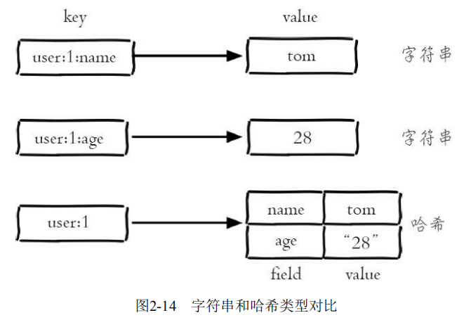

!> 哈希类型中的映射关系叫作 `field-value`，注意这里的 `value` 是指 `field` 对应的值，不是键对应的值。

##### 添加、获取、删除

添加：**添加一对域值**。

```
hset key field value
```

为 `user` 添加一对 `field-value`，**如果设置成功会返回1，反之会返回0**。

```
127.0.0.1:6379> hset user name tom 
(integer) 1
```

获取：**获取域的属性值**。

```
hget key field
```

获取 `user` 的 `name` 域（属性）对应的值，**如果键或 `field` 不存在，会返回 `nil`**：

```
127.0.0.1:6379> hget user name 
"tom"

127.0.0.1:6379> hget user age 
(nil)

127.0.0.1:6379> hget user2 name 
(nil) 
```

删除：删除除一个或多个 `field`，**返回结果为成功删除 `field` 的个数**。

```
hdel key field [field ...]
```

删除 `user` 的 `name` 域，**如果域不存在返回0**：

```
127.0.0.1:6379> hdel user name
(integer) 1 

127.0.0.1:6379> hdel user name
(integer) 0
```

##### 批量添加、批量获取

`hmset` 和 `hmget` 分别是批量设置和获取 `field-value`，`hmset` 需要的参数是 `key` 和多对 `field-value`，`hmget` 需要的参数是 `key` 和多个 `field`。

```
hmget key field [field ...] 
hmset key field value [field value ...]
```

批量添加、批量获取多个域值：

```
127.0.0.1:6379> hmset user name mike age 12 city tianjin 
OK
127.0.0.1:6379> hmget user name city 
1) "mike" 
2) "tianjin"
```

获取全域、获取全值

获取所有 `field`：

```
hkeys key
```

获取所有的`value`：

```
hvals key
```

获取所有的 `field-value`：

```
hgetall key
```

获取 `user` 全部 `field` 和 `value` 和 `field-value`：

```
127.0.0.1:6379> hkeys user 
1) "name" 
2) "age" 
3) "city"

127.0.0.1:6379> hvals user 
1) "mike" 
2) "12" 
3) "tianjin"

127.0.0.1:6379> hgetall user 
1) "name" 
2) "mike" 
3) "age" 
4) "12" 
5) "city" 
6) "tianjin"
```

?> 在使用 `hgetall` 时，如果哈希元素个数比较多，会存在阻塞Redis的可能。如果开发人员只需要获取部分 `field`，可以使用 `hmget`，如果一定要获取全部 `field-value`，可以使用 `hscan` 命令，该命令会渐进式遍历哈希类型。

##### 存在、统计、计算

存在：判断 `field` 是否存在，**存在返回结果为1，不存在时返回0**。

```
hexists key field
```

统计：**统计 `field` 个数。**

```
hlen key
```

计算：**计算 `value` 的字符串长度。**

```
hstrlen key field
```

例如 `user` 有3个 `field`：

```
127.0.0.1:6379> hset user name tom 
(integer) 1 
127.0.0.1:6379> hset user age 23 
(integer) 1 
127.0.0.1:6379> hset user city tianjin 
(integer) 1 

127.0.0.1:6379> hexists user name 
(integer) 1

127.0.0.1:6379> hlen user 
(integer) 3

127.0.0.1:6379> hstrlen user name 
(integer) 3
```

##### 时间复杂度、使用场景

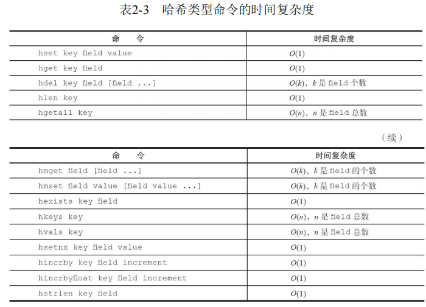

用户信息存储更直观，**关系型数据库可以做复杂的关系查询，而Redis去模拟关系型复杂查询开发困难，维护成本高**。 

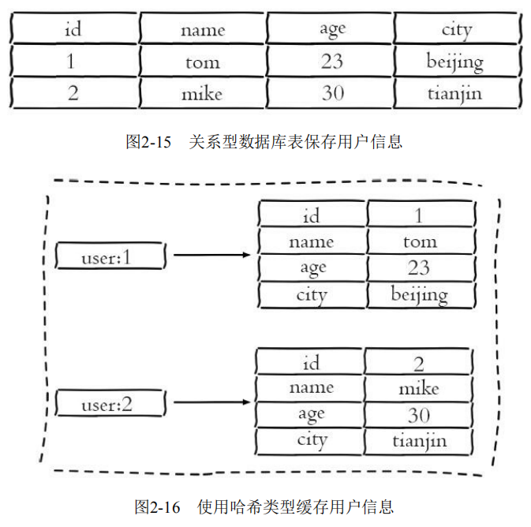

哈希类型是稀疏的，而关系型数据库是完全结构化的，例如哈希类型每个键可以有不同的`field`，而关系型数据库一旦添加新的列，所有行都要为其设置值（即使为NULL）。

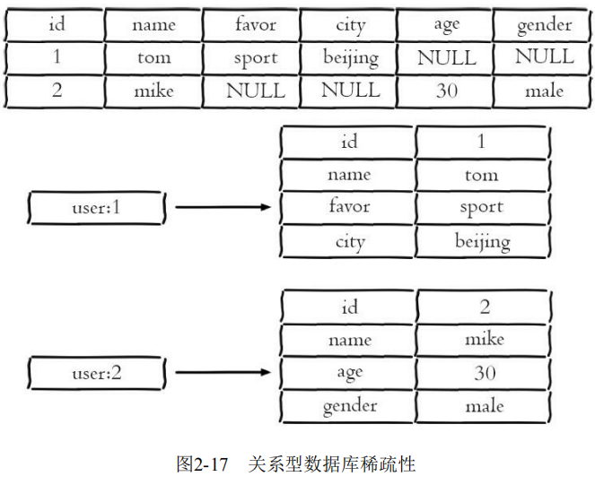

### 集合

**集合（set）类型也是用来保存多个的字符串元素，但和列表类型不一样的是，集合中不允许有重复元素，并且集合中的元素是无序的，不能通过 索引下标获取元素。**

**一个集合最多可以存储2^32-1个元素。**

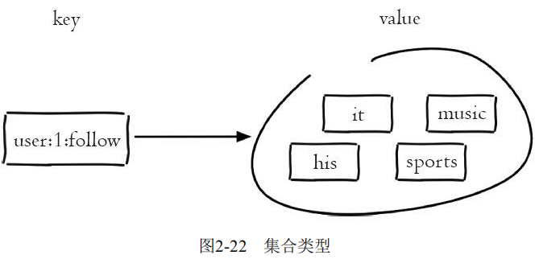

##### 添加、获取、删除

添加元素：**向集合里面添加元素**。

```
sadd key element [element ...]
```

**返回结果为添加成功的元素个数**，例如：

```
127.0.0.1:6379> exists myset 
(integer) 0 
127.0.0.1:6379> sadd myset a b c 
(integer) 3 
127.0.0.1:6379> sadd myset a b 
(integer) 0
```

获取：**获取所有元素**。

```
smembers key
```

获取集合myset所有元素，并且返回结果是无序的：

```
127.0.0.1:6379> smembers myset 
1) "c" 
2) "b" 
3) "a"
```

?> `smembers` 和 `lrange`、`hgetall` 都属于比较重的命令，如果元素过多存在阻塞Redis的可能性，这时候可以使用 `sscan` 来完成。

删除元素：**删除集合中的元素。**

```
srem key element [element ...]
```

**返回结果为成功删除元素个数**，例如：

```
127.0.0.1:6379> srem myset a b 
(integer) 2 
127.0.0.1:6379> srem myset hello 
(integer) 0
```

##### 存在、随机、计算

存在：**判断元素是否在集合中。**

```
sismember key element
```

如果给定元素element在集合内返回1，反之返回0，例如：

```
127.0.0.1:6379> sismember myset c 
(integer) 1
```

随机返回：**随机从集合返回指定个数元素**。

```
srandmember key [count]
```

- `[count]`是可选参数，如果不写默认为1，例如：

```
127.0.0.1:6379> srandmember myset 2 
1) "a" 
2) "c" 
127.0.0.1:6379> srandmember myset 
"d"
```

随机弹出：**从集合随机弹出元素。**

```
spop key [count]
```

- `[count]`是可选参数，如果不写默认为1，例如：

```
127.0.0.1:6379> spop myset 
"c" 
127.0.0.1:6379> smembers myset 
1) "d" 
2) "b" 
3) "a"
```

!> `srandmember` 和 `spop` 都是随机从集合选出元素，两者不同的是 `spop` 命令执行后，元素会从集合中删除，而 `srandmember` 不会。

计算：**计算元素个数。**

```
scard key
```

**scard的时间复杂度为O（1），它不会遍历集合所有元素，而是直接用 Redis内部的变量，**例如：

```
127.0.0.1:6379> scard myset 
(integer) 3
```

##### 集合间的操作

现在有两个集合，它们分别是user1和user2：

```
127.0.0.1:6379> sadd user1 it music his sports 
(integer) 4 
127.0.0.1:6379> sadd user2 it news ent sports 
(integer) 4
```

交集：**多个集合中共有的元素。**

```
sinter key [key ...]
```

求user1和user2两个集合的交集：

```
127.0.0.1:6379> sinter user1 user2 
1) "sports" 
2) "it"
```

并集：**多个集合中所有的元素。**

```
suinon key [key ...]
```

求 `user1` 和 `user2` 两个集合的并集：

```
127.0.0.1:6379> sunion user1 user2 
1) "sports" 
2) "it" 
3) "his" 
4) "news" 
5) "music" 
6) "ent"
```

差集：**多个集合中除开共有的元素。**

```
sdiff key [key ...]
```

求 `user1` 和 `user2` 两个集合的差集：

```
127.0.0.1:6379> sunion user1 user2 
1) "music"
2) "his" 
```

前面三个命令如图所示：

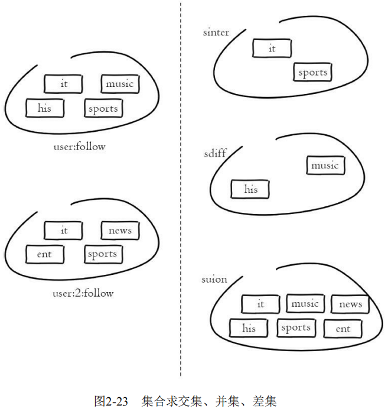

保存结果：Redis提供了上面 三个命令（原命令+`store`）将集合间交集、并集、差集的结果保存在 `destination key` 中。

```
sinterstore destination key [key ...] 
suionstore destination key [key ...] 
sdiffstore destination key [key ...]
```

##### 时间复杂度、使用场景

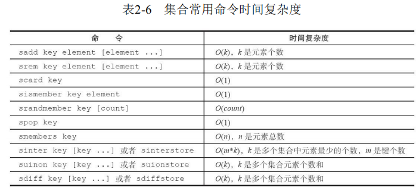

**集合类型比较典型的使用场景是标签（tag）。**

例如一个用户可能对娱乐、体育比较感兴趣，另一个用户可能对历史、新闻比较感兴趣，这些兴趣点就是标签。有了这些数据就可以得到喜欢同一个标签的人，以及用户的共同喜好的标签，这些数据对于用户体验以及增强用户黏度比较重要。

### 有序集合

**有序集合：它保留了集合不能有重复成员的特性， 但不同的是，有序集合中的元素可以排序。但是它和列表使用索引下标作为排序依据不同的是，它给每个元素设置一个分数（score）作为排序的依据。**

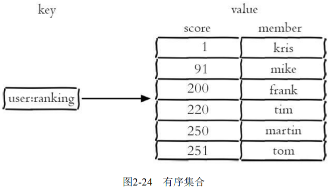

!> 有序集合中的元素不能重复，但是score可以重复，就和一个班里的同学学号不能重复，但是考试成绩可以相同。

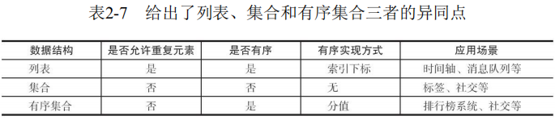

##### 添加、获取、删除

添加：**集合内添加成员。**

```
zadd key [NX|XX] [CH] [INCR] score member [score member ...]
```

- nx：member必须不存在，才可以设置成功，用于添加。 
- xx：member必须存在，才可以设置成功，用于更新。 
- ch：返回此次操作后，有序集合元素和分数发生变化的个数。 
- incr：对score做增加，相当于后面介绍的zincrby。

向有序集合user：ranking添加用户tom和他的分数251，**返回结果代表成功添加成员的个数**：

```
127.0.0.1:6379> zadd user:ranking 251 tom 
(integer) 1
```

获取排名成员：**返回指定排名范围的成员。**

```
zrange key start end [withscores] 
zrevrange key start end [withscores]
```

- 有序集合是按照分值排名的，`zrange` 是从低到高返回，`zrevrange` 反之。

返回排名最低的是三个成员，如果加上withscores选项，同时会返回成员的分数：

```
127.0.0.1:6379> zrange user:ranking 0 2 withscores 
1) "kris" 
2) "1" 
3) "frank" 
4) "200" 
5) "tim" 
6) "220" 
127.0.0.1:6379> zrevrange user:ranking 0 2 withscores 
1) "tom" 
2) "260" 
3) "martin" 
4) "250" 
5) "tim" 
6) "220"
```

获取分数成员：**返回指定分数范围的成员。**

```
zrangebyscore key min max [withscores] [limit offset count] 
zrevrangebyscore key max min [withscores] [limit offset count]
```

- 其中 `zrangebyscore` 按照分数从低到高返回，`zrevrangebyscore`反之。
- `[limit offset count]` 选项可以限制输出的起始位置和个数。

```
127.0.0.1:6379> zrangebyscore user:ranking 200 220 withscores 
1) "frank" 
2) "200" 
3) "tim" 
4) "220" 
127.0.0.1:6379> zrevrangebyscore user:ranking 220 200 withscores 
1) "tim" 
2) "220" 
3) "frank" 
4) "200"
```

删除：**删除成员。**

```
zrem key member [member ...]
```

将成员mike从有序集合user：ranking中删除，**返回结果为成功删除的个数**：

```
127.0.0.1:6379> zrem user:ranking mike 
(integer) 1
```

删除排名范围：**删除指定排名内的升序元素。**

```
zremrangebyrank key start end
```

删除第start到第end名的成员：

```
127.0.0.1:6379> zremrangebyrank user:ranking 0 2 
(integer) 3
```

删除分数范围：**删除指定分数范围的成员。**

```
zremrangebyscore key min max
```

将250分以上的成员全部删除，**返回结果为成功删除的个数**：

```
127.0.0.1:6379> zremrangebyscore user:ranking (250 +inf 
(integer) 2
```

##### 长度、增加、计算

长度：**成员个数。**

```
zcard key
```

返回有序集合user：ranking的成员数为5，和集合类型的 scard命令一样：

```
127.0.0.1:6379> zcard user:ranking 
(integer) 5
```

增加分数：**增加成员的分数。**

```
zincrby key increment member
```

给tom增加了9分，分数变为了260分：

```
127.0.0.1:6379> zincrby user:ranking 9 tom 
"260"
```

计算范围个数：**返回指定分数范围成员个数。**

```
zcount key min max
```

返回200到221分的成员的个数：

```
127.0.0.1:6379> zcount user:ranking 200 221 
(integer) 2
```

计算分数：**计算某个成员的分数。**

```
zscore key member
```

tom的分数为251，如果成员不存在则返回 `nil`：

```
127.0.0.1:6379> zscore user:ranking tom 
"251" 
127.0.0.1:6379> zscore user:ranking test 
(nil)
```

计算排名：**计算成员的排名。**

- `zrank`是从分数从低到高返回排名，`zrevrank`反之。

```
zrank key member 
zrevrank key member
```

tom 在zrank和zrevrank分别排名第5和第0（排名从0开始计算）：

```
127.0.0.1:6379> zrank user:ranking tom 
(integer) 5 
127.0.0.1:6379> zrevrank user:ranking tom 
(integer) 0
```

##### 集合间的操作

```
127.0.0.1:6379> zadd user:ranking:1 1 kris 91 mike 200 frank 220 tim 250 martin 251 tom 
(integer) 6 
127.0.0.1:6379> zadd user:ranking:2 8 james 77 mike 625 martin 888 tom 
(integer) 4
```

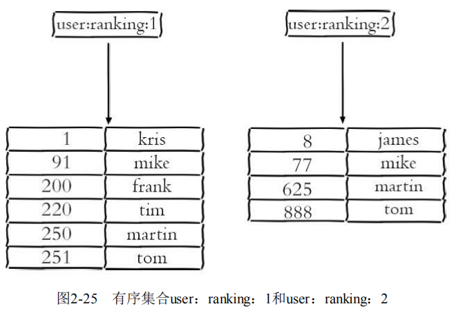

交集：**多个集合中共有的元素。**

```
zinterstore destination numkeys key [key ...] [weights weight [weight ...]] [aggregate sum|min|max]
```

- destination：交集计算结果保存到这个键。 
- numkeys：需要做交集计算键的个数。 
- key[key...]：需要做交集计算的键。
- weights weight[weight...]：每个键的权重，在做交集计算时，每个键中的每个member会将自己分数乘以这个权重，**每个键的权重默认是1**。 
- aggregate sum|min|max：计算成员交集后，分值可以按照sum（和）、min（最小值）、max（最大值）做汇总，**默认值是sum**。 

对user：ranking：1和user：ranking：2做交集，weights和aggregate使用了默认配置，可以看到目标键user：ranking：1_inter_2对分值做了sum操作： 

```
127.0.0.1:6379> zinterstore user:ranking:1_inter_2 2 user:ranking:1 user:ranking:2 
(integer) 3 
127.0.0.1:6379> zrange user:ranking:1_inter_2 0 -1 withscores 
1) "mike" 
2) "168" 
3) "martin" 
4) "875" 
5) "tom" 
6) "1139"
```

让user：ranking：2的权重变为0.5，并且聚合效果使用max：

```
127.0.0.1:6379> zinterstore user:ranking:1_inter_2 2 user:ranking:1 user:ranking:2 weights 1 0.5 aggregate max 
(integer) 3 
127.0.0.1:6379> zrange user:ranking:1_inter_2 0 -1 withscores 
1) "mike" 
2) "91" 
3) "martin" 
4) "312.5" 
5) "tom" 
6) "444"
```

并集：**多个集合中所有的元素。**

```
zunionstore destination numkeys key [key ...] [weights weight [weight ...]] [aggregate sum|min|max]
```

该命令的所有参数和zinterstore是一致的，只不过是做并集计算。

计算user：ranking：1和user：ranking：2的并集，weights和aggregate使用了默认配置，可以看到目标键user：ranking：1_union_2对分值做了sum操作：

```
127.0.0.1:6379> zunionstore user:ranking:1_union_2 2 user:ranking:1 user:ranking:2 
(integer) 7 
127.0.0.1:6379> zrange user:ranking:1_union_2 0 -1 withscores 
1) "kris" 
2) "1" 
3) "james" 
4) "8" 
5) "mike" 
6) "168" 
7) "frank" 
8) "200" 
9) "tim" 
10) "220" 
11) "martin" 
12) "875" 
13) "tom" 
14) "1139"
```

##### 时间复杂度、使用场景

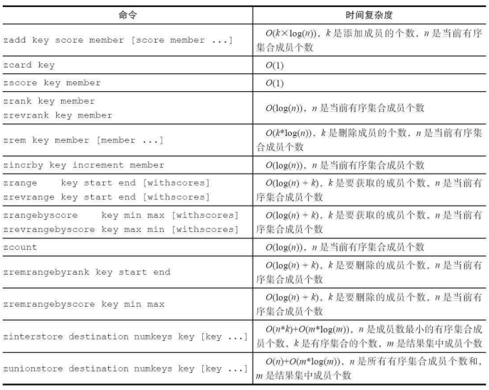

**有序集合比较典型的使用场景就是排行榜系统。**

例如视频网站需要对用户上传的视频做排行榜，榜单的维度可能是多个方面的：按照时间、按照播放数量、按照获得的赞数。本节使用赞数这个维度，记录每天用户上传视频的排行榜。

### 内部编码

**Redis对外有5种数据结构分别是： string（字符串）、hash（哈希）、list（列表）、set（集合）、zset（有序集合），实际上每种数据结构都有自己底层的内部编码实现，而且是多种实现**，这样Redis会在合适的场景选择合适的内部编码。

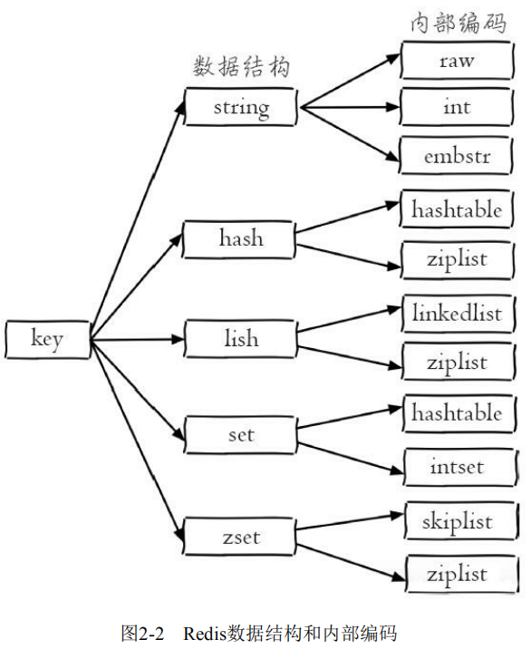

##### 查询内部编码

可以看到每种数据结构都有两种以上的内部编码实现，可以通过 `object encoding` 命令查询内部编码：

```
127.0.0.1:6379> set hello world 
OK
127.0.0.1:6379> object encoding hello 
"embstr" 

127.0.0.1:6379> rpush mylist a b c d e f g 
(integer) 7
127.0.0.1:6379> object encoding mylist 
"ziplist"
```

Redis这样设计有两个好处：第一，可以改进内部编码，而对外的数据结构和命令没有影响，这样一旦开发出更优秀的内部编码，无需改动外部数据结构和命令。第二，多种内部编码实现可以在不同场景下发挥各自的优势。

##### 字符串编码

字符串类型的内部编码有3种： 

- int：8个字节的长整型。 

- embstr：小于等于39个字节的字符串。 

- raw：大于39个字节的字符串。 

Redis会根据当前值的类型和长度决定使用哪种内部编码实现。

整数类型示例如下：

```
127.0.0.1:6379> set key 8653 
OK
127.0.0.1:6379> object encoding key 
"int"
```

短字符串示例如下：

```
#小于等于39个字节的字符串：embstr 
127.0.0.1:6379> set key "hello,world" 
OK
127.0.0.1:6379> object encoding key 
"embstr"
```

长字符串示例如下：

```
#大于39个字节的字符串：raw 
127.0.0.1:6379> set key "one string greater than 39 byte........." 
OK
127.0.0.1:6379> object encoding key 
"raw" 
127.0.0.1:6379> strlen key 
(integer) 40
```

##### 列表编码

列表类型的内部编码有两种：

- `ziplist`（压缩列表）：当列表的元素个数小于 `list-max-ziplist-entries` 配置（默认512个），同时列表中每个元素的值都小于 `list-max-ziplist-value` 配置时（默认64字节），Redis会选用 `ziplist` 来作为列表的内部实现来减少内存的使 用。
- `linkedlist`（链表）：当列表类型无法满足 `ziplist` 的条件时，Redis会使用 `linkedlist` 作为列表的内部实现。

当元素个数较少且没有大元素时，内部编码为 `ziplist`：

```
127.0.0.1:6379> rpush listkey e1 e2 e3 
(integer) 3 
127.0.0.1:6379> object encoding listkey 
"ziplist"
```

当元素个数超过512个或者当某个元素超过64字节，内部编码变为 `linkedlist`：

```
127.0.0.1:6379> rpush listkey e4 e5 ... e512 e513 
(integer) 513 
127.0.0.1:6379> object encoding listkey 
"linkedlist"
127.0.0.1:6379> rpush listkey "one string is bigger than 64 byte..." 
(integer) 4 
127.0.0.1:6379> object encoding listkey
"linkedlist"
```

##### 哈希编码

哈希类型的内部编码有两种：

- `ziplist`（压缩列表）：当哈希类型元素个数小于 `hash-max-ziplist-entries` 配置（默认512个）、同时所有值都小于 `hash-max-ziplist-value` 配置（默认64 字节）时，Redis会使用 `ziplist` 作为哈希的内部实现，`ziplist` 使用更加紧凑的结构实现多个元素的连续存储，所以在节省内存方面比 `hashtable` 更加优秀。
- `hashtable`（哈希表）：当哈希类型无法满足 `ziplist` 的条件时，Redis会使用 `hashtable` 作为哈希的内部实现，因为此时 `ziplist` 的读写效率会下降，而 `hashtable` 的读写时间复杂度为 `O(1)`。

当 `field` 个数比较少且没有大的 `value` 时，内部编码为 `ziplist`： 

```
127.0.0.1:6379> hmset hashkey f1 v1 f2 v2 
OK
127.0.0.1:6379> object encoding hashkey 
"ziplist" 
```

当有 `value` 大于64字节或者当 `field` 个数超过512，内部编码会由 `ziplist` 变为 `hashtable`： 

```
127.0.0.1:6379> hset hashkey f3 "one string is bigger than 64 byte..." 
OK
127.0.0.1:6379> object encoding hashkey 
"hashtable" 
127.0.0.1:6379> hmset hashkey f1 v1 f2 v2 f3 v3 ... f513 v513
OK
127.0.0.1:6379> object encoding hashkey 
"hashtable" 
```

##### 集合编码

集合类型的内部编码有两种： 

- `intset`（整数集合）：当集合中的元素都是整数且元素个数小于 `set-max- intset-entries` 配置（默认512个）时，Redis会选用 `intset` 来作为集合的内部实现，从而减少内存的使用。 
- `hashtable`（哈希表）：当集合类型无法满足 `intset` 的条件时，Redis会使用 `hashtable` 作为集合的内部实现。

当元素个数较少且都为整数时，内部编码为 `intset`：

```
127.0.0.1:6379> sadd setkey 1 2 3 4 
(integer) 4 
127.0.0.1:6379> object encoding setkey 
"intset"
```

当元素个数超过512个或者当某个元素不为整数时，内部编码变为 `hashtable`：

```
127.0.0.1:6379> sadd setkey 1 2 3 4 5 6 ... 512 513 
(integer) 509 
127.0.0.1:6379> scard setkey 
(integer) 513 
127.0.0.1:6379> object encoding listkey 
"hashtable"
127.0.0.1:6379> sadd setkey a 
(integer) 1 
127.0.0.1:6379> object encoding setkey 
"hashtable"
```

##### 有序集合编码

有序集合类型的内部编码有两种： 

- `ziplist`（压缩列表）：当有序集合的元素个数小于 `zset-max-ziplist- entries` 配置（默认128个），同时每个元素的值都小于 `zset-max-ziplist-value` 配 置（默认64字节）时，Redis会用 `ziplist` 来作为有序集合的内部实现，`ziplist` 可以有效减少内存的使用。 
- `skiplist`（跳跃表）：当 `ziplist` 条件不满足时，有序集合会使用 `skiplist` 作为内部实现，因为此时 `ziplist` 的读写效率会下降。

当元素个数较少且每个元素较小时，内部编码为 `skiplist`：

```
127.0.0.1:6379> zadd zsetkey 50 e1 60 e2 30 e3 
(integer) 3 
127.0.0.1:6379> object encoding zsetkey 
"ziplist"
```

当元素个数超过128个或者当某个元素大于64字节时，内部编码变为 `ziplist`：

```
127.0.0.1:6379> zadd zsetkey 50 e1 60 e2 30 e3 12 e4 ... 84 e129 
(integer) 129 
127.0.0.1:6379> object encoding zsetkey 
"skiplist"
127.0.0.1:6379> zadd zsetkey 20 "one string is bigger than 64 byte..." 
(integer) 1 
127.0.0.1:6379> object encoding zsetkey
"skiplist"
```