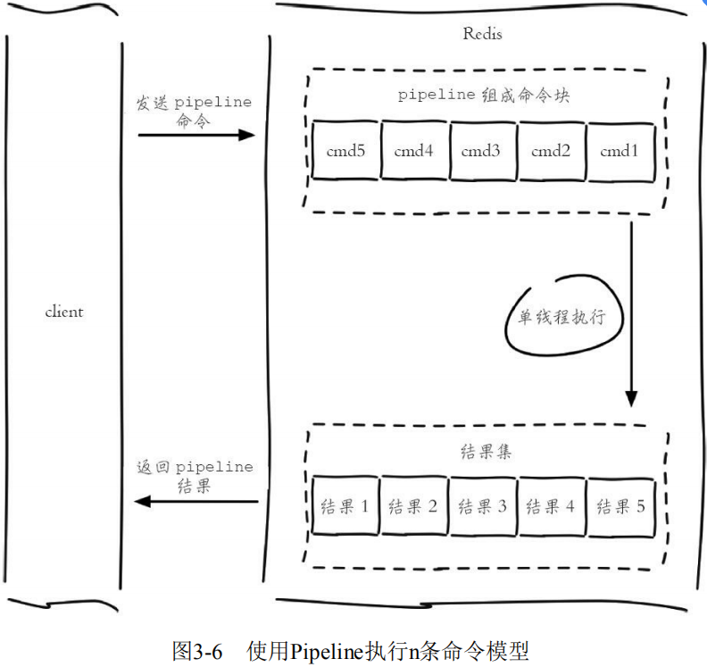
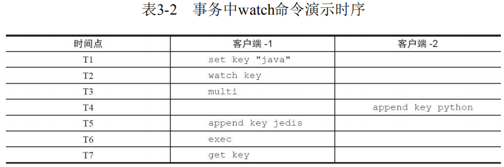
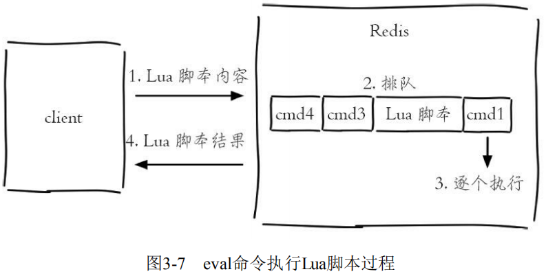

# 实用功能

### 实用功能

##### 慢查询分析

慢查询分析：**通过慢查询分析，找到有问题的命令进行优化。**

许多存储系统（例如MySQL）提供慢查询日志帮助开发和运维人员定位系统存在的慢操作。所谓慢查询日志就是系统在命令执行前后计算每条命令的执行时间，当超过预设阀值，就将这条命令的相关信息（例如：发生时间，耗时，命令的详细信息）记录下来，Redis也提供了类似的功能。

Redis客户端执行一条命令分为如下4个部分：


**需要注意的是，慢查询只统计步骤3，即命令的执行时间。**

**预设阈值命令 `slowlog-log-slower-than`** ：单位是微秒（1秒=1000毫秒=1000000微秒），默认值是10000，假如执行了一条“很慢”的命令（例如keys*），如果它的执行时间超过了10000微秒，那么它将被记录在慢查询日志中。

?> 如果 `slowlog-log-slower-than=0` 会记录所有的命令，`slowlog-log-slower-than<0` 对于任何命令都不会进行记录。

?> `slowlog-log-slower-than` 配置建议，默认值超过10毫秒判定为慢查询。

**慢查询日志长度 `slowlog-max-len`**：实际上是一个列表来存储慢查询日志，`slowlog-max-len` 就是列表的最大长度。

?> 当慢查询日志列表已处于其最大长度时，最早插入的一个命令将从列表中移出，这样可能会丢失部分慢查询命令，为了防止这种情况发生，可以定期执行 `slow get` 命令将慢查询日志持久化到其他存储中（例如MySQL）

?> `slowlog-max-len` 配置建议，设置为1000以上。

使用 `config set` 命令将 `slowlog-log-slower- than` 设置为20000微秒，`slowlog-max-len` 设置为1000，再执行 `config rewrite` 命令将配置持久化到本地配置文件：

```
config set slowlog-log-slower-than 20000 
config set slowlog-max-len 1000 
config rewrite
```


**获取慢查询日志**

```
slowlog get [n]
```

- 参数n可以指定条数

```
127.0.0.1:6379> slowlog get 
1) 1) (integer) 666
   2) (integer) 1456786500 
   3) (integer) 11615 
   4) 1) "BGREWRITEAOF" 
2) 1) (integer) 665 
   2) (integer) 1456718400 
   3) (integer) 12006 
   4) 1) "SETEX" 
      2) "video_info_200" 
      3) "300" 
      4) "2" ...
```

每个慢查询日志有4个属性组成，分别是**慢查询日志的标识 id、发生时间戳、命令耗时、执行命令和参数**：


**获取慢查询日志列表当前的长度**

```
slowlog len
```

当前Redis中有45条慢查询：

```
127.0.0.1:6379> slowlog len 
(integer) 45
```

**慢查询日志重置**

```
slowlog reset
```

实际是对列表做清理操作：

```
127.0.0.1:6379> slowlog len 
(integer) 45 
127.0.0.1:6379> slowlog reset 
OK
127.0.0.1:6379> slowlog len 
(integer) 0
```

##### Pipeline管道

Redis客户端执行一条命令分为如下四个过程： 

1）发送命令 

2）命令排队 

3）命令执行 

4）返回结果 

其中过程1和过程4称为Round Trip Time（RTT，往返时间）。

Redis提供了批量操作命令（例如 `mget`、`mset`等），有效地节约RTT。但大部分命令是不支持批量操作的，例如要执行n次 `hgetall` 命令，并没有 `mhgetall`命令存在，需要消耗n次RTT。

**Pipeline（流水线）机制能改善上面这类问题，它能将一组Redis命令进 行组装，通过一次RTT传输给Redis，再将这组Redis命令的执行结果按顺序返回给客户端。**




redis-cli的--pipe选项实际上就是使用Pipeline机制，例如下面操作将 `set hello world` 和 `incr counter` 两条命令组装：

```
echo -en '*3\r\n$3\r\nSET\r\n$5\r\nhello\r\n$5\r\nworld\r\n*2\r\n$4\r\nincr\r\ n$7\r\ncounter\r\n' | redis-cli --pipe
```

?> 大部分开发人员更倾向于使用高级语言客户端中的Pipeline。

在不同网络环境下非Pipeline和Pipeline执行10000次 `set` 操作的效果，可以得到如下两个结论：

- Pipeline执行速度一般比逐条执行要快。
- 客户端和服务端的网络延时越大，Pipeline的效果越明显。 


Pipeline与原生批量命令的区别：

- 原生批量命令是原子的，Pipeline是非原子的。
- 原生批量命令是一个命令对应多个key，Pipeline支持多个命令。
- **原生批量命令是Redis服务端支持实现的，而Pipeline需要服务端和客户端的共同实现。**

!> Pipeline虽然好用，但是每次Pipeline组装的命令个数不能没有节制，否则一次组装Pipeline数据量过大，一方面会增加客户端的等待时间，另一方面会造成一定的网络阻塞，可以将一次包含大量命令的Pipeline拆分成多次较小的Pipeline来完成。

##### 事务命令

**简单地说，事务表示一组动作，要么全部执行，要么全部不执行。**

Redis提供了简单的事务功能，将一组需要一起执行的命令放到 `multi` 和 `exec` 两个命令之间。**`multi` 命令代表事务开始，`exec` 命令代表事务结束，它们之间的命令是原子顺序执行的。**

```
127.0.0.1:6379> multi 
OK
127.0.0.1:6379> sadd user:a:follow user:b 
QUEUED 
127.0.0.1:6379> sadd user:b:fans user:a 
QUEUED
```

**可以看到 `sadd` 命令此时的返回结果是QUEUED，代表命令并没有真正执行，而是暂时保存在Redis中。只有当 `exec` 执行后，用户A关注用户B的行为才算完成，如下所示返回的两个结果对应 `sadd` 命令。**

```
127.0.0.1:6379> exec 
1) (integer) 1
2) (integer) 1 
127.0.0.1:6379> sismember user:a:follow user:b 
(integer) 1
```

如果要停止事务的执行，可以使用 `discard` 命令代替 `exec` 命令即可。

```
127.0.0.1:6379> discard 
OK
127.0.0.1:6379> sismember user:a:follow user:b 
(integer) 0
```

?> 语法错误，会造成整个事务无法执行。

?> 命令错误，语法正确，命令已经执行成功，Redis不支持回滚功能，开发人员需要自己修复这类问题。

`watch` 命令：展示了两个客户端执行命令的时序。



```
#T1：客户端
1 127.0.0.1:6379> set key "java" 
OK
#T2：客户端1 127.0.0.1:6379> watch key 
OK
#T3：客户端1 127.0.0.1:6379> multi 
OK
#T4：客户端2 127.0.0.1:6379> append key python 
(integer) 11 
#T5：客户端1
127.0.0.1:6379> append key jedis 
QUEUED 
#T6：客户端1 127.0.0.1:6379> exec 
(nil) 
#T7：客户端1 127.0.0.1:6379> get key 
"javapython"
```

### Lua脚本

Lua语言是在1993年由巴西一个大学研究小组发明，其设计目标是作为嵌入式程序移植到其他应用程序，**它是由C语言实现的**，虽然简单小巧但是功能强大，所以许多应用都选用它作为脚本语言，尤其是在游戏领域，例如大名鼎鼎的暴雪公司将Lua语言引入到“魔兽世界”这款游戏中，Rovio公司将Lua语言作为“愤怒的小鸟”这款火爆游戏的关卡升级引擎，Web服务器Nginx 将Lua语言作为扩展，增强自身功能。**Redis将Lua作为脚本语言可帮助开发者定制自己的Redis命令。**

Lua语言提供了如下几种数据类型：**booleans（布尔）、numbers（数值）、strings（字符串）、tables（表格**），和许多高级语言相比，相对简单。

##### 字符串

```lua
local strings val = "world"
```

**`local` 代表 `val` 是一个局部变量，如果没有 `local` 代表是全局变量。**

```lua
-- 结果是"world" 
print(hello)
```

**打印world，其中"--"是Lua语言的注释。** 

##### 数组

**在Lua中，如果要使用类似数组的功能，可以用tables类型。**

```lua
local tables myArray = {"redis", "jedis", true, 88.0} 
--true 
print(myArray[3])
```

##### `for` 循环

**定义了一个tables类型的变量 `myArray`，但和大多数编程语言不同的是，Lua的数组下标从1开始计算。使用 `for` 和 `while`，可以遍历这个数组。**

计算1到100的和，**关键字 `for` 以 `end` 作为结束符**：

```lua
local int sum = 0 
for i = 1, 100 
do 
    sum = sum + i 
end 
-- 输出结果为5050 
print(sum)
```

**遍历myArray，首先需要知道tables的长度，只需要在变量前加一个 `#` 号即可：**

```lua
for i = 1, #myArray 
do 
    print(myArray[i]) 
end
```

Lua还提供了内置函数 `ipairs`，使用 `for index，value ipairs(tables)` 可以遍历出所有的索引下标和值：

```lua
for index,value in ipairs(myArray) 
do 
    print(index) 
    print(value) 
end
```

##### `while` 循环

计算1到100的和，`while` 循环同样以 `end` 作为结束符。 

```lua
local int sum = 0 
local int i = 0 
while i <= 100 
do 
    sum = sum +i 
    i = i + 1 
end 
--输出结果为5050 
print(sum)
```

##### `if` 判断

**`if` 以 `end` 结尾，`if` 后紧跟 `then`。**

要确定数组中是否包含了jedis，有则打印 `true`：

```lua
local tables myArray = {"redis", "jedis", true, 88.0} 
for i = 1, #myArray 
do 
    if myArray[i] == "jedis" 
    then
        print("true") 
        break 
    else
        --do nothing 
    end 
end
```

##### 哈希

**使用类似哈希的功能，同样可以使用tables类型。**

定义了一个tables，每个元素包含了 `key` 和 `value`，其 `strings1..string2` 是将两 个字符串进行连接：

```lua
local tables user_1 = {age = 28, name = "tome"} 
--user_1 age is 28 
print("user_1 age is " .. user_1["age"])
```

遍历 `user_1`，可以使用 Lua的内置函数 `pairs`：

```lua
for key,value in pairs(user_1) 
do 
    print(key .. value) 
end
```

##### 函数定义

**在Lua中，函数以 `function` 开头，以 `end` 结尾，`funcName` 是函数名，中间部分是函数体：**

```lua
function funcName() 
    ... 
end 
contact函数将两个字符串拼接： 
function contact(str1, str2) 
    return str1 .. str2 
end 
--"hello world" 
print(contact("hello ", "world"))
```

##### Redis中使用Lua

在Redis中执行Lua脚本有两种方法：`eval` 和 `evalsha`。

```
eval 脚本内容 key个数 key列表 参数列表
```

使用 `key` 列表和参数列表来为Lua脚本提供更多的灵活性：

```
127.0.0.1:6379> eval 'return "hello " .. KEYS[1] .. ARGV[1]' 1 redis world "hello redisworld"
```

此时 `KEYS[1]="redis"`，`ARGV[1]="world"`，所以最终的返回结是 `"hello redisworld"`。 

**如果Lua脚本较长，还可以使用redis-cli--eval直接执行文件。** 

**`eval` 命令和 `--eval` 参数本质是一样的，客户端如果想执行Lua脚本，首先在客户端编写好Lua脚本代码，然后把脚本作为字符串发送给服务端，服务端会将执行结果返回给客户端。**



Redis还提供了 `evalsha` 命令来执行Lua脚本。

首先要将Lua脚本加载到Redis服务端，得到该脚本的SHA1校验和，`evalsha` 命令使用SHA1作为参数可以直接执行对应Lua脚本，避免每次发送Lua脚本的开销。这样客户端就不需要每次执行脚本内容，而脚本也会常驻在服务端，脚本功能得到了复用。


**加载脚本**：`script load` 命令可以将脚本内容加载到Redis内存中。

将 `lua_get.lua` 加载到Redis中，得到SHA1 为："7413dc2440db1fea7c0a0bde841fa68eefaf149c" 

```
# redis-cli script load "$(cat lua_get.lua)" 
"7413dc2440db1fea7c0a0bde841fa68eefaf149c"
```

**执行脚本**：`evalsha` 的使用方法如下，参数使用SHA1值，执行逻辑和 `eval` 一致。

```
evalsha 脚本SHA1值 key个数 key列表 参数列表
```

调用 `lua_get.lua` 脚本：

```
127.0.0.1:6379> evalsha 7413dc2440db1fea7c0a0bde841fa68eefaf149c 1 redis world "hello redisworld"
```

##### Redis中管理Lua

**`script load` 命令用于将Lua脚本加载到Redis内存中。**

```
script load script
```

**`script exists` 命令用于判断sha1是否已经加载到Redis内存中。返回结果代表sha1[sha1…]被加载到Redis内存的个数。**

```
127.0.0.1:6379> script exists a5260dd66ce02462c5b5231c727b3f7772c0bcc5 
1) (integer) 1
```

**`script flush ` 命令用于清除Redis内存已经加载的所有Lua脚本。**

```
127.0.0.1:6379> script exists a5260dd66ce02462c5b5231c727b3f7772c0bcc5
1) (integer) 1 
127.0.0.1:6379> script flush 
OK
127.0.0.1:6379> script exists a5260dd66ce02462c5b5231c727b3f7772c0bcc5 
1) (integer) 0
```

`script kill` 命令用于杀掉正在执行的Lua脚本。

```
script kill
```

!> 有一点需要注意，如果当前Lua脚本正在执行写操作，那么 `script kill` 将不会生效。要么等待脚本执行结束要么使用 `shutdown save` 停掉Redis服务。可见Lua脚本虽然好用，但是使用不当破坏性也是难以想象的。 

##### Lua的Redis API

Lua可以使用 `redis.call` 函数实现对Redis的访问。

```
redis.call("set", "hello", "world") 
redis.call("get", "hello")
```

放在Redis的执行效果如下：

```
127.0.0.1:6379> eval 'return redis.call("get", KEYS[1])' 1 hello 
"world"
```

Lua还可以使用redis.pcall函数实现对Redis的调用，`redis.call` 和 `redis.pcall` 的不同在于，如果 `redis.call` 执行失败，那么脚本执行结束会直接返回错误，而 `redis.pcall` 会忽略错误继续执行脚本，所以在实际开发中要根据具体的应用场景进行函数的选择。 

##### Lua脚本优势

Lua脚本功能为Redis开发和运维人员带来如下三个好处： 

- **Lua脚本在Redis中是原子执行的，执行过程中间不会插入其他命令。** 

- **Lua脚本可以帮助开发和运维人员创造出自己定制的命令，并可以将这些命令常驻在Redis内存中，实现复用的效果。** 

- **Lua脚本可以将多条命令一次性打包，有效地减少网络开销。**