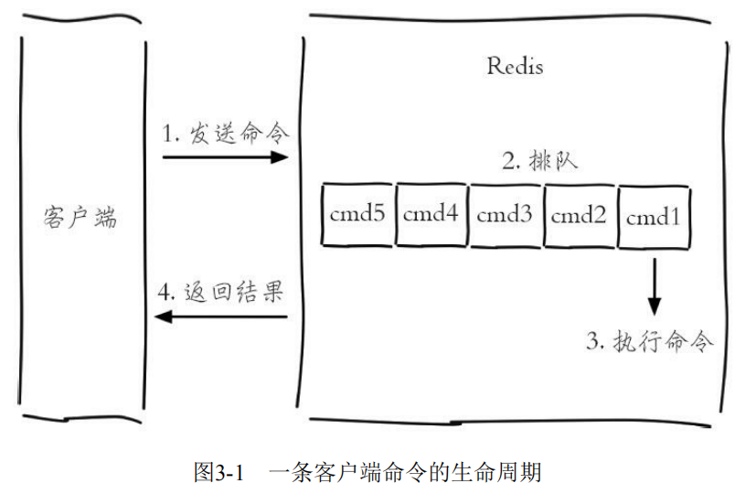
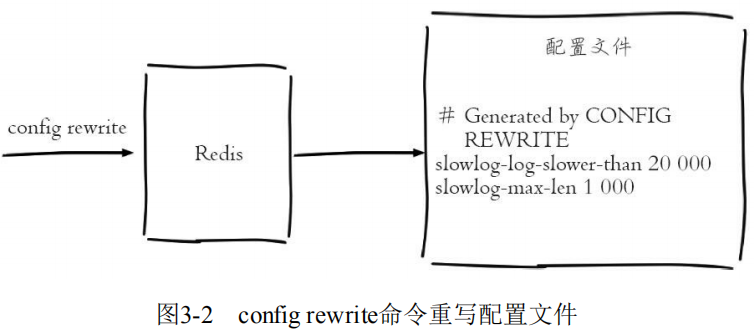

# 常用功能

### 常用功能

##### 慢查询分析

慢查询分析：**通过慢查询分析，找到有问题的命令进行优化。**

许多存储系统（例如MySQL）提供慢查询日志帮助开发和运维人员定位系统存在的慢操作。所谓慢查询日志就是系统在命令执行前后计算每条命令的执行时间，当超过预设阀值，就将这条命令的相关信息（例如：发生时间，耗时，命令的详细信息）记录下来，Redis也提供了类似的功能。

Redis客户端执行一条命令分为如下4个部分：



**需要注意的是，慢查询只统计步骤3，即命令的执行时间。**

**预设阈值命令 `slowlog-log-slower-than`** ：单位是微秒（1秒=1000毫秒=1000000微秒），默认值是10000，假如执行了一条“很慢”的命令（例如keys*），如果它的执行时间超过了10000微秒，那么它将被记录在慢查询日志中。

?> 如果 `slowlog-log-slower-than=0` 会记录所有的命令，`slowlog-log-slower-than<0` 对于任何命令都不会进行记录。

?> `slowlog-log-slower-than` 配置建议，默认值超过10毫秒判定为慢查询。

**慢查询日志长度 `slowlog-max-len`**：实际上是一个列表来存储慢查询日志，`slowlog-max-len` 就是列表的最大长度。

?> 当慢查询日志列表已处于其最大长度时，最早插入的一个命令将从列表中移出，这样可能会丢失部分慢查询命令，为了防止这种情况发生，可以定期执行 `slow get` 命令将慢查询日志持久化到其他存储中（例如MySQL）

?> `slowlog-max-len` 配置建议，设置为1000以上。

使用 `config set` 命令将 `slowlog-log-slower- than` 设置为20000微秒，`slowlog-max-len` 设置为1000，再执行 `config rewrite` 命令将配置持久化到本地配置文件：

```
config set slowlog-log-slower-than 20000 
config set slowlog-max-len 1000 
config rewrite
```



**获取慢查询日志**

```
slowlog get [n]
```

- 参数n可以指定条数

```
127.0.0.1:6379> slowlog get 
1) 1) (integer) 666
   2) (integer) 1456786500 
   3) (integer) 11615 
   4) 1) "BGREWRITEAOF" 
2) 1) (integer) 665 
   2) (integer) 1456718400 
   3) (integer) 12006 
   4) 1) "SETEX" 
      2) "video_info_200" 
      3) "300" 
      4) "2" ...
```

每个慢查询日志有4个属性组成，分别是**慢查询日志的标识 id、发生时间戳、命令耗时、执行命令和参数**：


**获取慢查询日志列表当前的长度**

```
slowlog len
```

当前Redis中有45条慢查询：

```
127.0.0.1:6379> slowlog len 
(integer) 45
```

**慢查询日志重置**

```
slowlog reset
```

实际是对列表做清理操作：

```
127.0.0.1:6379> slowlog len 
(integer) 45 
127.0.0.1:6379> slowlog reset 
OK
127.0.0.1:6379> slowlog len 
(integer) 0
```