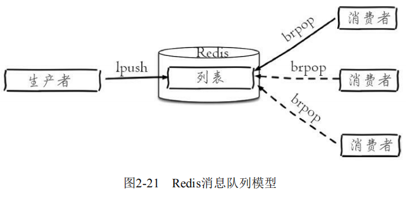

# 消息队列

Redis提供了两种方式来作消息队列。一个是使用生产者消费模式模式，另外一个是发布订阅者模式。

**生产消费模式**：让一个或者多个客户端监听消息队列，一旦消息到达，消费者马上消费，谁先抢到算谁的。

**发布订阅模式**：也是一个或多个客户端订阅消息频道，只要发布者发布消息，所有订阅者都能收到消息，订阅者都是ping的。

### 生产消费模式

##### FIFO消息队列

**FIFO（先进先出）队列是队列的基本形式，也是最简单的消息队列。使用一个列表和`LPUSH`、`RPOP`两个命令即可实现一条FIFO队列。**


生产者通过 `LPUSH` 将消息发送到Redis：

```
127.0.0.1:6379> LPUSH queue "message-1"
127.0.0.1:6379> LPUSH queue "message-2"
```

消费者使用 `RPOP` 从队列中依次获取消息，消息就会从队列中删除：

```
127.0.0.1:6379> RPOP queue
"message-1"
127.0.0.1:6379> RPOP queue
"message-2"

# 当队列为空时，RPOP会直接返回空
127.0.0.1:6379> RPOP queue
(nil)
```

##### 监听消息队列

FIFO消息队列有一个缺点：**消费者使用完队列中的消息，而生产者又没有及时补充时，就会直接返回为空，程序结束。**

**Redis的 `lpush+brpop` 命令组合即可实现监听队列，生产者客户端使用 `lpush` 从列表左侧插入元素，多个消费者客户端使用 `brpop` 命令阻塞式的“抢”列表尾部的元素，如果队列里没有消息，则消费者继续监听，直到队列接收到新的消息或超时，多个客户端保证了消费的负载均衡和高可用性。**



##### 可靠消息队列

FIFO消息队列、监听式消息队列都有一个共同的缺点：**队列中的消息一经发送出去，便从队列里删除。如果由于网络原因消费者没有收到消息，或者消费者在处理这条消息的过程中崩溃了，就再也无法还原出这条消息。也就是说，以上队列不能保证消息会传递成功。究其原因，在于队列缺乏消息确认机制，即消费者向队列报告消息已收到或已处理的机制。**

**利用Redis的 `RPOPLPUSH` 这一命令实现可靠队列，这个命令可以在从一个list中获取消息的同时把这条消息复制到另一个list里，并且这个过程是原子性的。**

?> 原子性是指一个操作是不可中断的，要么全部执行成功要么全部执行失败，不存在部分成功或者部分失败。


利用`RPOPLPUSH`实现的可靠队列由两个列表组成，一个存储**待处理**（`pending`）的消息，另一个存储**处理中**（`processing`）的消息。

生产者通过`LPUSH`将消息发送到待处理列表 `pending`：

```
127.0.0.1:6379> LPUSH pending "message"
```

消费者使用 `RPOPLPUSH` 从待处理列表 `pending` 获取消息，同时将它加入处理中列表 `processing`：

```
127.0.0.1:6379> RPOPLPUSH pending processing
"message"
```

此时这条消息已经从待处理列表 `pending` 中删除，并且复制到了处理中列表 `processing`：

```
127.0.0.1:6379> LRANGE pending 0 -1
(empty list or set)
127.0.0.1:6379> LRANGE processing 0 -1
1) "message"
```

消费者在收到消息或者处理完消息后，使用 `LREM` 命令从处理中列表删除这条消息，即完成了消息确认：

```
127.0.0.1:6379> LREM queue:processing 1 "message"
```

?> 使用 `LREM` 而不是 `RPOP` 的原因在于，在并发时，不能保证处理中的消息能按加入列表的先后顺序被确认，而`RPOP`会按顺序删除消息。

?> **但是使用可靠消息队列，又缺少了监听消息队列的监听功能，好在Redis提供了一个两全的命令：`BRPOPLPUSH` 命令从列表中取出最后一个元素，并插入到另外一个列表的头部； 如果列表没有元素会阻塞列表直到等待超时或发现可弹出元素为止。**

##### 延迟消息队列

延迟消息队列主要特性是：**进入队列的消息会被推迟到指定的时间才出队被消费。因此，延迟队列中除了消息本身外，还需要附加一个“何时出队”的信息**。因此，延迟队列非常适用于对消费次序或时间没有强一致性需要的场景。


**Sorted Set是一个有序的集合，集合内元素的排序基于其加入集合时指定的 `score`。通过 `ZRANGEBYSCORE` 命令，我们可以取得 `score` 在指定区间内的元素。将集合中的元素做为消息，`score` 视为延迟的时间，这便是一个延迟队列的模型。**

生产者通过`ZADD`将消息发送到队列中：

```
127.0.0.1:6379> ZADD delay-queue 1520985600 "publish article"
```

消费者通过`ZRANGEBYSCORE`获取消息。如果时间未到，将得不到消息；当时间已到或已超时，都可以得到消息：

```
127.0.0.1:6379> ZRANGEBYSCORE delay-queue -inf 1520985599
(empty list or set)
127.0.0.1:6379> ZRANGEBYSCORE delay-queue -inf 1520985600 WITHSCORES
1) "publish article"
2) "1520985600"
127.0.0.1:6379> ZRANGEBYSCORE delay-queue -inf 1520985601 WITHSCORES
1) "publish article"
2) "1520985600"
```

使用`ZRANGEBYSCORE`取得消息后，消息并没有从集合中删出。需要调用`ZREM`删除消息：

```
127.0.0.1:6379> ZREM delay-queue "publish article"
```

**美中不足的是，消费者组合使用 `ZRANGEBYSCORE` 和 `ZREM` 的过程不是原子的，当有多个消费者时会存在竞争，可能使得一条消息被消费多次。**此时需要使用Lua脚本保证消费操作的原子性：

```lua
local message = redis.call('ZRANGEBYSCORE', KEYS[1], '-inf', ARGV[1], 'WITHSCORES', 'LIMIT', 0, 1);
if message > 0 then
  redis.call('ZREM', KEYS[1], message[1]);
  return message;
else
  return {};
end
```

### 发布订阅模式

Redis提供了基于“发布/订阅”模式的消息机制，此种模式下，消息发布者和订阅者不进行直接通信，发布者客户端向指定的频道（channel）发布消息，订阅该频道的每个客户端都可以收到该消息。


**发布订阅模式和生产消费模式的根本不同在于：前者发布一条消息，每个订阅者都能收到；后者发布一条消息，只能有一个人收到。**

##### 发布消息

```
publish channel message
```

向 `channel：sports` 频道发布一条消息 `“Tim won the championship”`，返回结果为订阅者个数，若没有订阅，所以返回结果为0：

```
127.0.0.1:6379> publish channel:sports "Tim won the championship" 
(integer) 0
```

##### 订阅消息

**订阅者可以订阅一个或多个频道**：

```
subscribe channel [channel ...]
```

当前客户端订阅了 `channel：sports` 频道：

```
127.0.0.1:6379> subscribe channel:sports 
Reading messages... (press Ctrl-C to quit) 
1) "subscribe" 
2) "channel:sports" 
3) (integer) 1
```

当客户端发布一条消息：

```
127.0.0.1:6379> publish channel:sports "James lost the championship" 
(integer) 1
```

当前订阅者客户端会收到如下消息：

```
127.0.0.1:6379> subscribe channel:sports 
Reading messages... (press Ctrl-C to quit) 
... 
1) "message" 
2) "channel:sports" 
3) "James lost the championship"
```

如果有多个客户端同时订阅了 `channel：sports`：


!> 客户端在执行订阅命令之后进入了订阅状态，只能接收 `subscribe`、`psubscribe`、`unsubscribe`、`punsubscribe`的四个命令。

!> Redis不会对发布的消息进行持久化，因此，新开启的订阅客户端，无法收到该频道之前的消息。 

##### 取消订阅

```
unsubscribe [channel [channel ...]]
```

**客户端可以通过 `unsubscribe` 命令取消对指定频道的订阅，取消成功后，不会再收到该频道的发布消息。**

```
127.0.0.1:6379> unsubscribe channel:sports 
1) "unsubscribe" 
2) "channel:sports" 
3) (integer) 0
```

##### 模式订阅

Redis命令还支持glob风格的订阅命令 `psubscribe` 和取消订阅命令 `punsubscribe`：

```
127.0.0.1:6379> psubscribe it* 
Reading messages... (press Ctrl-C to quit) 
1) "psubscribe" 
2) "it*"
3) (integer) 1
```

##### 查询订阅

**查看活跃的频道**

```
pubsub channels [pattern]
```

所谓活跃的频道是指当前频道至少有一个订阅者，其中 `[pattern]` 指定具体的模式： 

```
127.0.0.1:6379> pubsub channels 
1) "channel:sports" 
2) "channel:it" 
3) "channel:travel" 
127.0.0.1:6379> pubsub channels channel:*r* 
1) "channel:sports" 
2) "channel:travel"
```

**查看频道订阅数** 

```
pubsub numsub [channel ...]
```

当前 `channel：sports` 频道的订阅数为2：

```
127.0.0.1:6379> pubsub numsub channel:sports 
1) "channel:sports" 
2) (integer) 2
```

**查看模式订阅数**

```
pubsub numpat
```

当前只有一个客户端通过模式来订阅：

```
127.0.0.1:6379> pubsub numpat 
(integer) 1
```

##### 使用场景

**聊天室、公告牌、服务之间利用消息解耦都可以使用发布订阅模式。**

图中有两套业务，上面为视频管理系统，负责管理视频信息；下面为视频服务面向客户，用户可以通过各种客户端（手机、浏览器、接口）获取到视频信息。


假如视频管理员在视频管理系统中对视频信息进行了变更，希望及时通知给视频服务端，就可以采用发布订阅的模式，发布视频信息变化的消息到指定频道，视频服务订阅这个频道及时更新视频信息，通过这种方式可以有效解决两个业务的耦合性。