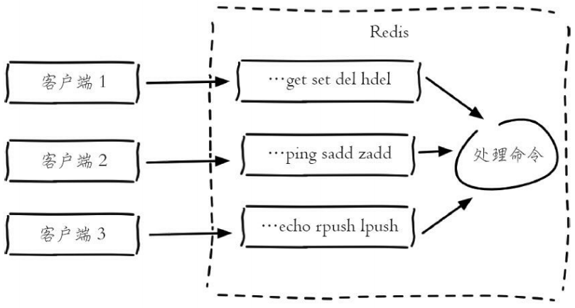
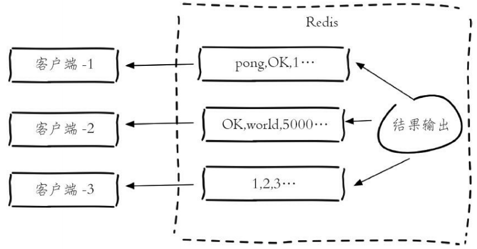
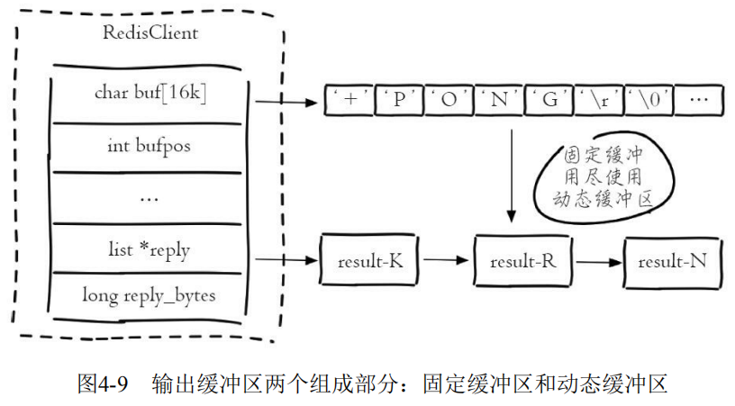
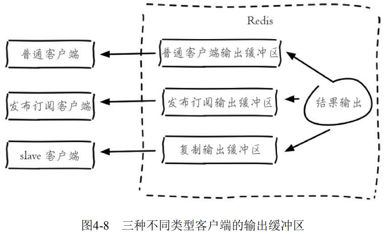

# 客户端管理、客户端限制

### 客户端管理

`client list`命令：**列出与Redis服务端相连的所有客户端连接信息，结果的每一行代表一个客户端的信息，每行包含了十几个属性，它们是每个客户端的一些执行状态。**

```
127.0.0.1:6379> client list 
id=254487 addr=10.2.xx.234:60240 fd=1311 name= age=8888581 idle=8888581 flags=N db=0 sub=0 psub=0 multi=-1 qbuf=0 qbuf-free=0 obl=0 oll=0 omem=0 events=r cmd=get 
id=7125109 addr=10.10.xx.101:58658 fd=140 name= age=241 idle=1 flags=N db=0 sub=0 psub=0 multi=-1 qbuf=0 qbuf-free=0 obl=0 oll=0 omem=0 events=r cmd=del 
...
```

##### 客户端标识

- id：客户端连接的唯一标识，这个id是随着Redis的连接自增的，重启Redis后会重置为0。

- addr：客户端连接的ip和端口。
- fd：socket的文件描述符，与 `lsof` 命令结果中的fd是同一个，如果 `fd=-1` 代表当前客户端不是外部客户端，而是Redis内部的伪装客户端。

- name：客户端的名字，后面的 `client setName` 和 `client getName` 两个命令会对其进行说明。

##### 输入缓冲区

**Redis为每个客户端分配了输入缓冲区，它的作用是将客户端发送的命令临时保存，同时Redis从会输入缓冲区拉取命令并执行，输入缓冲区为客户端发送命令到Redis执行命令提供了缓冲功能。**

Redis没有提供相应的配置来规定每个缓冲区的大小，输入缓冲区会根据输入内容大小的不同动态调整，只是要求**每个客户端缓冲区的大小不能超过1G，超过后客户端将被关闭。**



输入缓冲区不受maxmemory控制，假设maxmemory为4G，已经存储了2G数据，但是如果此时输入缓冲区使用了3G，已经超过maxmemory限制，可能会产生数据丢失、键值淘汰、OOM等情况。


**输入缓冲区过大主要是因为Redis的处理速度跟不上输入缓冲区的输入速度，并且每次进入输入缓冲区的命令包含了大量bigkey，从而造成了输入缓冲区过大的情况。还有一种情况就是Redis发生了阻塞，短期内不能处理命令，造成客户端输入的命令积压在了输入缓冲区，造成了输入缓冲区过大。**

监控输入缓冲区的方法有两种：

定期执行 `client list` 命令，收集qbuf和qbuf-free找到异常的连接记录并分析，最终找到可能出问题的客户端。

- qbuf：缓冲区的总容量。
- qbuf-free：缓冲区的剩余容量。

**`info clients` 命令：输出内容中 `client_biggest_input_buf` 代表最大的输入缓冲区。**可以设置最大的输入缓冲区超过10M就进行报警： 

```
127.0.0.1:6379> info clients 
# Clients 
connected_clients:1414 
client_longest_output_list:0 
client_biggest_input_buf:2097152 
blocked_clients:0
```


##### 输出缓冲区

**Redis为每个客户端分配了输出缓冲区，它的作用是保存命令执行的结果返回给客户端，为Redis和客户端交互返回结果提供缓冲。**



输出缓冲区由两部分组成：**固定缓冲区（16KB）和动态缓冲区，，其中固定缓冲区返回比较小的执行结果，而动态缓冲区返回比较大的结果，例如大的字符串、hgetall、smembers命令的结果等。**

**固定缓冲区使用的是字节数组，动态缓冲区使用的是列表。当固定缓冲区存满后会将Redis新的返回结果存放在动态缓冲区的队列中，队列中的每个对象就是每个返回结果。**



- obl：固定缓冲区的长度。
- oll：动态缓冲区列表的长度。
- omem：使用的字节数

当前客户端的固定缓冲区的长度为0，动态缓冲区有4869个对象，两个部分共使用了133081288字节=126M内存：

```
id=7 addr=127.0.0.1:56358 fd=6 name= age=91 idle=0 flags=O db=0 sub=0 psub=0 multi=-1 qbuf=0 qbuf-free=0 obl=0 oll=4869 omem=133081288 events=rw cmd=monitor
```

**输出缓冲区的容量可以通过参数 `client-output-buffer-limit` 来进行设置**，并且输出缓冲区做得更加细致，按照客户端的不同分为三种：普通客户端、发布订阅客户端、slave客户端。

对应的配置规则是：

```
client-output-buffer-limit <class> <hard limit> <soft limit> <soft seconds>
```

- `<class>`：客户端类型，分为三种。a）normal：普通客户端；b） 

  slave：slave客户端，用于复制；c）pubsub：发布订阅客户端。

- `<hard limit>`：如果客户端使用的输出缓冲区大于`<hard limit>`，客户端会被立即关闭。

- `<soft limit>`和`<soft seconds>`：如果客户端使用的输出缓冲区超过了`<soft limit>`并且持续了`<soft limit>`秒，客户端会被立即关闭。

Redis的默认配置是：

```
client-output-buffer-limit normal 0 0 0 
client-output-buffer-limit slave 256mb 64mb 60 
client-output-buffer-limit pubsub 32mb 8mb 60
```



**输出缓冲区也不会受到maxmemory的限制，如果使用不当同样会造成maxmemory用满产生的数据丢失、键值淘汰、OOM等情况。**

监控输出缓冲区的方法依然有两种：

**通过定期执行 `client list` 命令，收集obl、oll、omem找到异常的连接记录并分析，最终找到可能出问题的客户端。** 

**`info clients`命令：找到输出缓冲区列表最大对象`client_biggest_input_buf`。**

```
127.0.0.1:6379> info clients 
# Clients 
connected_clients:502 
client_longest_output_list:4869
client_biggest_input_buf:0 
blocked_clients:0
```

预防输出缓冲区出现异常：

1. 进行上述监控，设置阀值，超过阀值及时处理。
2. 限制普通客户端输出缓冲区的，把错误扼杀在摇篮中。

```
client-output-buffer-limit normal 20mb 10mb 120
```

3. 适当增大slave的输出缓冲区的，如果master节点写入较大，slave客户端的输出缓冲区可能会比较大，一旦slave客户端连接因为输出缓冲区溢出被kill，会造成复制重连。
4. 限制容易让输出缓冲区增大的命令，例如，高并发下的monitor命令就是一个危险的命令。 
5. 及时监控内存，一旦发现内存抖动频繁，可能就是输出缓冲区过大。

##### 存活状态

- age：当前客户端已经连接的时间。
- idle：当前客户端最近一次的空闲时间。

当前客户端连接Redis的时间为603382秒，其中 空闲了331060秒：

```
id=2232080 addr=10.16.xx.55:32886 fd=946 name= age=603382 idle=331060 flags=N db=0 sub=0 psub=0 multi=-1 qbuf=0 qbuf-free=0 obl=0 oll=0 omem=0 events=r cmd=get
```

### 客户端限制

##### 最大连接数

Redis提供了 `maxclients` 参数来限制最大客户端连接数，一旦连接数超过 `maxclients`，新的连接将被拒绝。`maxclients` 默认值是10000，可以通过`info clients`来查询当前Redis的连接数

```
127.0.0.1:6379> info clients 
# Clients 
connected_clients:1414 
...
```

通过 `config set maxclients` 对最大客户端连接数进行动态设置：

```
127.0.0.1:6379> config get maxclients 
1) "maxclients" 
2) "10000" 
127.0.0.1:6379> config set maxclients 50 
OK
127.0.0.1:6379> config get maxclients 
1) "maxclients" 
2) "50"
```

##### 最大空闲时间

为了防止存在大量idle(空闲)连接，Redis提供了 timeout（单位为秒）参数来限制连接的最大空闲时间，一旦客户端连接的idle时间超过了 timeout，连接将会被关闭。

```
#Redis默认的timeout是0，也就是不会检测客户端的空闲 
127.0.0.1:6379> config set timeout 30 
OK
```

?> 在实际开发和运维中，需要将timeout设置成大于0，例如可以设置为300秒，同时在客户端使用上添加空闲检测和验证等等措施，例如JedisPool使用common-pool提供的三个属性：`minEvictableIdleTimeMillis`、`testWhileIdle`、`timeBetweenEvictionRunsMillis`。

