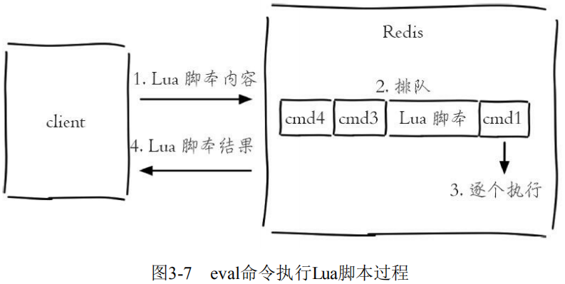
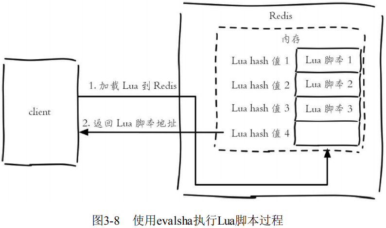

# Lua脚本

Lua语言是在1993年由巴西一个大学研究小组发明，其设计目标是作为嵌入式程序移植到其他应用程序，**它是由C语言实现的**，虽然简单小巧但是功能强大，所以许多应用都选用它作为脚本语言，尤其是在游戏领域，例如大名鼎鼎的暴雪公司将Lua语言引入到“魔兽世界”这款游戏中，Rovio公司将Lua语言作为“愤怒的小鸟”这款火爆游戏的关卡升级引擎，Web服务器Nginx 将Lua语言作为扩展，增强自身功能。**Redis将Lua作为脚本语言可帮助开发者定制自己的Redis命令。**

Lua语言提供了如下几种数据类型：**booleans（布尔）、numbers（数值）、strings（字符串）、tables（表格**），和许多高级语言相比，相对简单。

## 字符串

```lua
local strings val = "world"
```

**`local` 代表 `val` 是一个局部变量，如果没有 `local` 代表是全局变量。**

```lua
-- 结果是"world" 
print(hello)
```

**打印world，其中"--"是Lua语言的注释。** 

## 数组

**在Lua中，如果要使用类似数组的功能，可以用tables类型。**

```lua
local tables myArray = {"redis", "jedis", true, 88.0} 
--true 
print(myArray[3])
```

## `for` 循环

**定义了一个tables类型的变量 `myArray`，但和大多数编程语言不同的是，Lua的数组下标从1开始计算。使用 `for` 和 `while`，可以遍历这个数组。**

计算1到100的和，**关键字 `for` 以 `end` 作为结束符**：

```lua
local int sum = 0 
for i = 1, 100 
do 
    sum = sum + i 
end 
-- 输出结果为5050 
print(sum)
```

**遍历myArray，首先需要知道tables的长度，只需要在变量前加一个 `#` 号即可：**

```lua
for i = 1, #myArray 
do 
    print(myArray[i]) 
end
```

Lua还提供了内置函数 `ipairs`，使用 `for index，value ipairs(tables)` 可以遍历出所有的索引下标和值：

```lua
for index,value in ipairs(myArray) 
do 
    print(index) 
    print(value) 
end
```

## `while` 循环

计算1到100的和，`while` 循环同样以 `end` 作为结束符。 

```lua
local int sum = 0 
local int i = 0 
while i <= 100 
do 
    sum = sum +i 
    i = i + 1 
end 
--输出结果为5050 
print(sum)
```

## `if` 判断

**`if` 以 `end` 结尾，`if` 后紧跟 `then`。**

要确定数组中是否包含了jedis，有则打印 `true`：

```lua
local tables myArray = {"redis", "jedis", true, 88.0} 
for i = 1, #myArray 
do 
    if myArray[i] == "jedis" 
    then
        print("true") 
        break 
    else
        --do nothing 
    end 
end
```

## 哈希

**使用类似哈希的功能，同样可以使用tables类型。**

定义了一个tables，每个元素包含了 `key` 和 `value`，其 `strings1..string2` 是将两 个字符串进行连接：

```lua
local tables user_1 = {age = 28, name = "tome"} 
--user_1 age is 28 
print("user_1 age is " .. user_1["age"])
```

遍历 `user_1`，可以使用 Lua的内置函数 `pairs`：

```lua
for key,value in pairs(user_1) 
do 
    print(key .. value) 
end
```

## 函数定义

**在Lua中，函数以 `function` 开头，以 `end` 结尾，`funcName` 是函数名，中间部分是函数体：**

```lua
function funcName() 
    ... 
end 
contact函数将两个字符串拼接： 
function contact(str1, str2) 
    return str1 .. str2 
end 
--"hello world" 
print(contact("hello ", "world"))
```

## Redis中使用Lua

在Redis中执行Lua脚本有两种方法：`eval` 和 `evalsha`。

```
eval 脚本内容 key个数 key列表 参数列表
```

使用 `key` 列表和参数列表来为Lua脚本提供更多的灵活性：

```
127.0.0.1:6379> eval 'return "hello " .. KEYS[1] .. ARGV[1]' 1 redis world "hello redisworld"
```

此时 `KEYS[1]="redis"`，`ARGV[1]="world"`，所以最终的返回结是 `"hello redisworld"`。 

**如果Lua脚本较长，还可以使用redis-cli--eval直接执行文件。** 

**`eval` 命令和 `--eval` 参数本质是一样的，客户端如果想执行Lua脚本，首先在客户端编写好Lua脚本代码，然后把脚本作为字符串发送给服务端，服务端会将执行结果返回给客户端。**



Redis还提供了 `evalsha` 命令来执行Lua脚本。

首先要将Lua脚本加载到Redis服务端，得到该脚本的SHA1校验和，`evalsha` 命令使用SHA1作为参数可以直接执行对应Lua脚本，避免每次发送Lua脚本的开销。这样客户端就不需要每次执行脚本内容，而脚本也会常驻在服务端，脚本功能得到了复用。



**加载脚本**：`script load` 命令可以将脚本内容加载到Redis内存中。

将 `lua_get.lua` 加载到Redis中，得到SHA1 为："7413dc2440db1fea7c0a0bde841fa68eefaf149c" 

```
# redis-cli script load "$(cat lua_get.lua)" 
"7413dc2440db1fea7c0a0bde841fa68eefaf149c"
```

**执行脚本**：`evalsha` 的使用方法如下，参数使用SHA1值，执行逻辑和 `eval` 一致。

```
evalsha 脚本SHA1值 key个数 key列表 参数列表
```

调用 `lua_get.lua` 脚本：

```
127.0.0.1:6379> evalsha 7413dc2440db1fea7c0a0bde841fa68eefaf149c 1 redis world "hello redisworld"
```

## Redis中管理Lua

**`script load` 命令用于将Lua脚本加载到Redis内存中。**

```
script load script
```

**`script exists` 命令用于判断sha1是否已经加载到Redis内存中。返回结果代表sha1[sha1…]被加载到Redis内存的个数。**

```
127.0.0.1:6379> script exists a5260dd66ce02462c5b5231c727b3f7772c0bcc5 
1) (integer) 1
```

**`script flush ` 命令用于清除Redis内存已经加载的所有Lua脚本。**

```
127.0.0.1:6379> script exists a5260dd66ce02462c5b5231c727b3f7772c0bcc5
1) (integer) 1 
127.0.0.1:6379> script flush 
OK
127.0.0.1:6379> script exists a5260dd66ce02462c5b5231c727b3f7772c0bcc5 
1) (integer) 0
```

`script kill` 命令用于杀掉正在执行的Lua脚本。

```
script kill
```

!> 有一点需要注意，如果当前Lua脚本正在执行写操作，那么 `script kill` 将不会生效。要么等待脚本执行结束要么使用 `shutdown save` 停掉Redis服务。可见Lua脚本虽然好用，但是使用不当破坏性也是难以想象的。 

## Lua的Redis API

Lua可以使用 `redis.call` 函数实现对Redis的访问。

```
redis.call("set", "hello", "world") 
redis.call("get", "hello")
```

放在Redis的执行效果如下：

```
127.0.0.1:6379> eval 'return redis.call("get", KEYS[1])' 1 hello 
"world"
```

Lua还可以使用redis.pcall函数实现对Redis的调用，`redis.call` 和 `redis.pcall` 的不同在于，如果 `redis.call` 执行失败，那么脚本执行结束会直接返回错误，而 `redis.pcall` 会忽略错误继续执行脚本，所以在实际开发中要根据具体的应用场景进行函数的选择。 

## Lua脚本优势

Lua脚本功能为Redis开发和运维人员带来如下三个好处： 

- **Lua脚本在Redis中是原子执行的，执行过程中间不会插入其他命令。** 

- **Lua脚本可以帮助开发和运维人员创造出自己定制的命令，并可以将这些命令常驻在Redis内存中，实现复用的效果。** 

- **Lua脚本可以将多条命令一次性打包，有效地减少网络开销。**